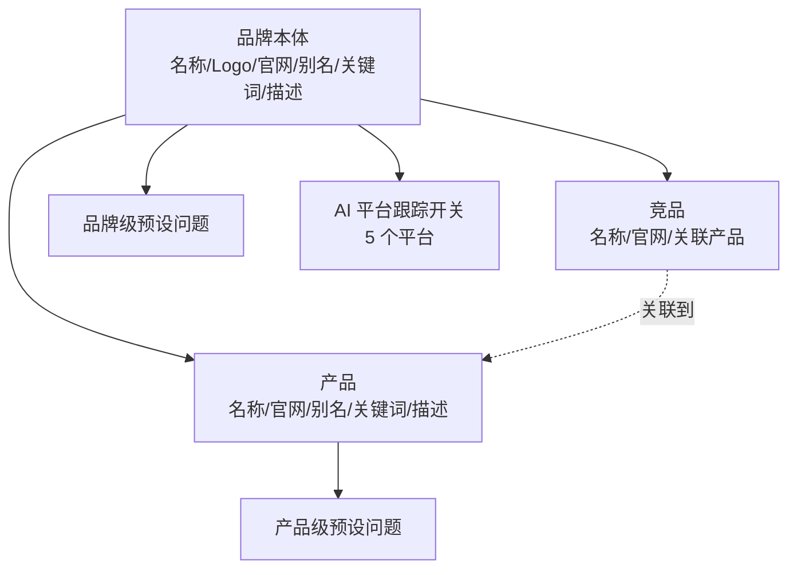

# 品牌模型

## 概述

GenAura 围绕「品牌」组织全部数据与 AI 洞察。一个品牌不只是一个名字，而是由**品牌本体、产品配置、竞品配置、预设问题、关键词、AI 平台跟踪**六类信息组合而成的完整画像。这些信息共同决定了 GenAura 如何在 5 个 AI 平台上检索你的品牌、Agent 如何理解你的品牌、洞察报告如何生成。

读完本文你将了解：

- 品牌画像由哪些信息构成，它们之间是什么关系。
- 为什么「创建品牌」只需要填几项，而完整画像要在右侧面板的「品牌配置」中维护。
- 关键词与别名有什么区别，预设问题应填在哪里。
- 各类信息的数量上限和长度限制。

## 前置条件

- 已登录 GenAura，并进入主工作区（参见 [界面总览](../getting-started/04-interface-overview.md)）。
- 建议先阅读 [品牌管理](../how-to/01-brand-management.md) 与 [品牌配置](../how-to/02-brand-config.md) 操作指南，本文重在解释概念模型，不涉及具体点击步骤。

## 品牌画像由哪些信息构成

一个完整的品牌画像包含以下六类信息，它们之间的关系如下：

- **品牌本体**：品牌的名称、Logo、官网链接、别名、品牌关键词、品牌描述。这是画像的根基。
- **产品配置**：品牌旗下的产品列表。每个产品有自己的名称、官网、别名、关键词、描述。
- **竞品配置**：你希望对标跟踪的竞品列表。每个竞品有名称、官网，并可以关联到该品牌下的若干产品。
- **预设问题**：你关心的问题，GenAura 会带着这些问题去 AI 平台检索。问题既可以绑定到品牌（品牌级问题），也可以绑定到某个产品（产品级问题）。
- **关键词**：用于在 AI 平台检索时进行核心匹配的词汇。品牌级关键词写在品牌本体上，产品级关键词写在产品上。
- **AI 平台跟踪**：一组开关，控制 5 个 AI 平台（DeepSeek、通义千问、豆包、Kimi、腾讯元宝）是否对该品牌执行搜索工作流。

它们之间的关系可以用下图概括：

> **关键词与别名**：
> - **关键词**：检索时的核心匹配词。品牌关键词是**必填项**，直接决定 GenAura 在 AI 平台上能否准确找到你的品牌。
> - **别名**：品牌或产品的其他称谓，用于扩大匹配范围，可选。

## 创建品牌与品牌配置

GenAura 把品牌的生命周期拆成两个阶段，让你能「先快速建档，再逐步完善画像」：

- **创建品牌**：只需四项轻量信息即可落地品牌记录，降低首次使用门槛。
- **品牌配置**：进入右侧面板的「品牌配置」Tab 后，再分区域补全完整画像。

### 创建品牌时填什么

创建品牌时只需填写以下四项：

| 字段 | 是否必填 | 说明 |
|---|:---:|---|
| 品牌名称 | 必填 | 品牌的唯一标识 |
| Logo | 可选 | 图片上传，支持拖拽或点击选择 |
| 官网链接 | 可选 | 标签式输入，支持回车、逗号、空格分隔，可一次粘贴多个链接自动拆分 |
| 素材文件上传 | 可选 | 支持 md、txt、docx、pdf 四种格式，单文件不超过 20MB；上传后会自动导入到该品牌的知识库中 |

> 创建品牌对话框**没有**「简介」「行业」等字段——这些信息要在品牌配置 Tab 中维护。

### 品牌配置 Tab 的四个分区

进入品牌配置 Tab 后，你会看到四个分区：

1. **基本信息**：品牌名称、官网链接、别名、品牌关键词、品牌描述、Logo。底部嵌入**品牌级问题矩阵**。
2. **产品配置**：产品列表，每个产品卡片展示名称、别名、官网、描述、关键词，并在卡片底部嵌入**产品级问题矩阵**。
3. **竞品配置**：竞品列表，展示名称、官网、关联产品。竞品**不嵌入问题矩阵**。
4. **AI 平台跟踪**：5 个 AI 平台的启用开关，决定该品牌在哪些平台上被检索。

### 字段差异对照

下表汇总了创建品牌与品牌配置各分区分别能填哪些字段：

| 字段 | 创建品牌 | 品牌配置·基本信息 | 品牌配置·产品 | 品牌配置·竞品 |
|---|:---:|:---:|:---:|:---:|
| 品牌名称 | ✓（必填） | ✓（必填） | — | — |
| Logo | ✓ | ✓ | — | — |
| 官网链接 | ✓ | ✓ | — | — |
| 品牌描述 | — | ✓ | — | — |
| 品牌别名 | — | ✓ | — | — |
| 品牌关键词 | — | ✓（必填） | — | — |
| 素材文件上传 | ✓（导入知识库） | — | — | — |
| 产品名称 / 官网 / 别名 / 关键词 / 描述 | — | — | ✓ | — |
| 竞品名称 / 官网 / 关联产品 | — | — | — | ✓ |
| AI 平台跟踪开关 | — | — | — | —（独立第 4 分区） |

## 预设问题填在哪里

预设问题不是独立分区，而是嵌在「基本信息」和「产品配置」两个分区里：

- **品牌级问题**：在「基本信息」分区底部，绑定到当前品牌。这类问题不针对具体产品，例如「这个品牌的核心优势是什么？」。
- **产品级问题**：在「产品配置」分区里**每个产品卡片**的底部，绑定到对应产品。这类问题针对具体产品，例如「这款产品的价格区间是多少？」。
- **竞品分区没有问题矩阵**——竞品仅作为对比参照对象，不需要预设问题。

问题类型分三类：

| 类型 | 典型场景 |
|---|---|
| 推荐类 | 「推荐一款适合……的产品」 |
| 对比类 | 「A 产品和 B 产品相比有什么区别」 |
| 评价类 | 「这款产品怎么样？用户评价如何？」 |

## 数量上限与长度限制

为了保证应用运行流畅、检索结果聚焦，GenAura 对各类信息设置了上限：

### 数量上限

| 项目 | 上限 |
|---|---|
| 产品数量 | 5 个 |
| 竞品数量 | 5 个 |
| 预设问题总数 | 30 个（品牌级 + 所有产品级合计） |

### 单字段长度上限

| 字段 | 最大长度 |
|---|---|
| 品牌名称 | 50 字符 |
| 品牌描述 | 2000 字符 |
| 品牌官网链接 | 200 字符 |
| 产品名称 | 50 字符 |
| 产品描述 | 2000 字符 |
| 关键词 | 64 字符 |
| 别名 | 64 字符 |
| 竞品名称 | 50 字符 |
| 竞品别名 | 128 字符 |
| 预设问题内容 | 500 字符 |

### 文件大小上限

| 项目 | 上限 |
|---|---|
| 单个素材文件 | 20MB |

## 常见问题

**Q1：为什么创建品牌时填的官网链接在品牌配置里看不到？**
创建品牌时填的官网链接会作为品牌记录的初始信息保存，进入品牌配置 Tab 的「基本信息」分区可以看到并编辑。Logo 同理——创建时上传的 Logo 会出现在基本信息中。

**Q2：创建品牌时上传的素材文件去哪了？**
素材文件会自动导入到该品牌的知识库的「原始物料与素材」目录下，可以在右侧面板的「知识库」Tab 中查看（参见 [知识库管理](../how-to/08-knowledge-base.md)）。素材文件**不会**出现在品牌配置 Tab 中。

**Q3：预设问题最多能加多少个？是每个品牌/产品各 30 个吗？**
不是。30 个是**品牌级问题 + 所有产品级问题的合计上限**。新增问题时如果超过这个上限，系统会拦截并提示。这个上限可以由部署方调整，但默认值是 30。

**Q4：竞品为什么不能加预设问题？**
预设问题的设计目标是「让 AI 平台回答你关心的品牌/产品问题」，竞品仅作为对比参照对象，因此竞品分区不嵌入问题矩阵。竞品与产品的关联通过「关联产品」字段来标记。

**Q5：关键词和别名有什么区别？**
- **关键词**：AI 平台搜索工作流检索时的核心匹配词，品牌关键词在基本信息中**必填**，决定了 GenAura 能否在 AI 平台上准确找到你的品牌。
- **别名**：用于扩大匹配范围的其他称谓，可选填。例如品牌的中英文别名、简称、曾用名等。

**Q6：竞品的「关联产品」字段存的是什么？**
存的是该品牌下产品的**名称**，仅用于在竞品卡片上展示关联关系，方便你直观看到这个竞品对标的是哪些产品。

## 相关文档

- 前置阅读：[界面总览](../getting-started/04-interface-overview.md)
- 操作指南：[品牌管理](../how-to/01-brand-management.md)、[品牌配置](../how-to/02-brand-config.md)
- 关联概念：[工作流原理](./02-workflow.md)、[洞察数据来源](./03-insight-data.md)
- 知识库：[知识库管理](../how-to/08-knowledge-base.md)

---

> 最后更新：2026-07-29 | 对应版本：v1.2.0
