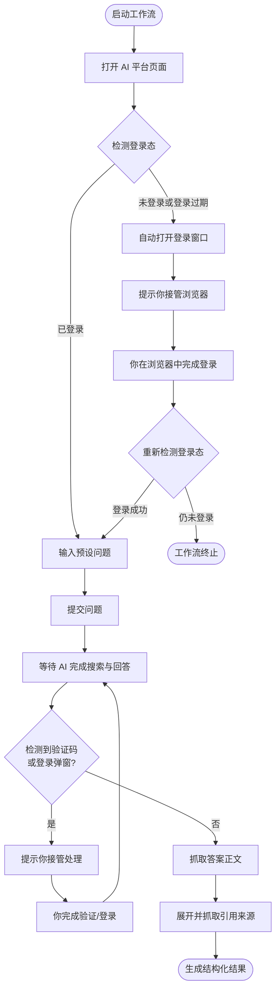

## 概述

GenAura 内置 5 个主流 AI 平台的搜索工作流：**DeepSeek、通义千问、豆包、Kimi、腾讯元宝**。每当你启动一次工作流，GenAura 会自动打开对应 AI 平台、登录你的账号、把你预设的问题发给 AI、等待 AI 回答、抓取答案与引用来源，最终生成可用于洞察分析的结构化结果。

读完本文你将了解：

- 工作流在后台做了哪些事，最终给你什么结果。
- 为什么必须先在 AI 平台上登录，GenAura 如何处理登录态过期。
- 当 AI 平台弹出验证码、登录弹窗时，你需要做什么。
- 工作流失败时如何排查。

## 前置条件

- 已创建至少一个品牌并配置了关键词（参见 [品牌模型](/concepts/01-brand-model)）。
- 已在 GenAura 内嵌浏览器中登录了对应 AI 平台（参见 [内嵌浏览器](/how-to/10-browser)）。
- 在品牌配置的「AI 平台跟踪」分区中打开了对应平台的开关。

## 5 个 AI 平台工作流

GenAura 为以下 5 个 AI 平台内置了搜索工作流：

| 平台 | 用途 |
| --- | --- |
| DeepSeek | 在 DeepSeek 上执行搜索 |
| 通义千问 | 在通义千问上执行搜索 |
| 豆包 | 在豆包上执行搜索 |
| Kimi | 在 Kimi 上执行搜索 |
| 腾讯元宝 | 在腾讯元宝上执行搜索 |

每个工作流的目标一致：把你的预设问题提交给 AI 平台，等 AI 完成联网搜索并返回答案后，同时抓取**答案正文**和**引用来源列表**（外部网页标题、链接、摘要等），用于后续的洞察分析。

## 工作流运行流程

一次完整的工作流运行会经历以下步骤：

### 启动与页面准备

工作流启动时，GenAura 会自动：

1. 打开对应 AI 平台的网页。
2. 等待页面加载完成。
3. 检查你当前在该平台上的登录状态。

### 为什么需要登录

AI 平台会根据账号身份个性化返回搜索结果，未登录状态下要么无法提交问题，要么会弹出登录弹窗打断工作流。因此 GenAura 在执行工作流前会**自动检测登录态**：

- 如果你在该平台已登录，工作流继续。
- 如果未登录或登录已过期，GenAura 会**自动点击页面上的「登录」按钮**弹出登录窗口，然后**暂停工作流并提示你接管浏览器**完成登录。
- 你完成登录后，GenAura 会重新检测登录态，确认成功后继续工作流。
- 如果你多次尝试仍未登录成功，工作流会终止并提示错误。

### 输入问题与等待答案

登录正常后，GenAura 会：

1. 把你的预设问题输入到 AI 平台的输入框。
2. 提交问题（按回车或点击发送按钮）。
3. 等待 AI 完成联网搜索与流式输出。
4. 等待页面内容稳定，确认 AI 已经答完。

### 异常处理：验证码与登录弹窗

在等待答案或执行过程中，AI 平台有时会弹出：

- **验证码**（图形验证、滑块、拼图、人机验证等）
- **登录弹窗**（会话过期、扫码登录提示等）

GenAura 会自动检测这些异常情况。一旦检测到：

1. 工作流**暂停执行**，并弹出接管提示。
2. 你在 GenAura 内嵌浏览器中完成验证码或重新登录。
3. 处理完毕后，GenAura 自动恢复工作流。

### 抓取答案与引用来源

AI 完成回答后，GenAura 会：

1. 抓取 AI 的**答案正文**。
2. 滚动到答案底部，找到「引用来源」按钮并点击展开。
3. 抓取引用列表中每条来源的**标题、链接、摘要、发布日期**（具体可用字段取决于平台本身的展示）。
4. 将答案与引用来源结构化保存，作为后续洞察分析、情感分析、偏好分析的输入。

## 工作流结果用在哪

工作流产出的「答案 \+ 引用来源」是 GenAura 所有数据洞察的源头：

- **AI 洞察 Tab**：汇总多次搜索结果，统计品牌提及次数、首位推荐率、前三推荐率等综合指标。
- **情感分析 Tab**：基于 AI 答案分析用户对品牌/产品的情感倾向。
- **偏好洞察 Tab**：分析 AI 在推荐时引用了哪些信源、哪些信源被反复引用。
- **机会与风险**：基于 AI 答案自动识别潜在的市场机会或品牌风险。

详见 [洞察数据来源](/concepts/03-insight-data)。

## 启动工作流的方式

GenAura 提供两种启动工作流的入口：

- **手动启动**：在右侧面板的「浏览器」Tab 中选择目标平台工作流并启动（参见 [AI 平台工作流](/how-to/11-ai-platform-workflows)）。
- **定时执行**：在右侧面板的「定时任务」Tab 中配置执行频率，GenAura 会按计划自动启动工作流（参见 [定时任务](/how-to/12-cron-tasks)）。

## 常见问题

**Q1：为什么 GenAura 要在内嵌浏览器里登录 AI 平台？为什么不让我用系统浏览器？** 工作流需要在 GenAura 内嵌浏览器中操作 AI 平台的网页。如果用系统浏览器，GenAura 无法读取页面内容、输入问题、抓取答案。因此首次使用前，请在内嵌浏览器中完成每个 AI 平台的登录（参见 [内嵌浏览器](/how-to/10-browser)）。

**Q2：工作流提示我「登录态过期」怎么办？** 说明该平台的登录已经过期。GenAura 会自动打开登录窗口并暂停工作流，请在弹出的内嵌浏览器中完成登录或扫码，GenAura 会自动恢复执行。

**Q3：工作流卡在「等待答案」很久没有进展？** 可能是 AI 平台本身响应慢，或弹出了验证码/登录弹窗。请打开内嵌浏览器查看页面状态：

- 如果是验证码，完成验证后工作流会自动继续。
- 如果是平台本身卡住，可以等待工作流超时或手动终止后重新启动。
- 如果一直反复出现，可能是登录态不稳定，建议在浏览器中重新登录后再试。

**Q4：工作流失败提示「未完成登录」，但我已经登录了？** GenAura 通过页面信号判断登录态，某些平台可能在登录后短暂展示中间页面。请确认：

- 登录后页面已跳转到主界面（不再是登录中状态）。
- 平台首页能看到你的头像或用户名。
- 重新启动工作流；若仍失败，请尝试在浏览器中退出后重新登录该平台。

**Q5：工作流跑完了但没抓到引用来源？** 原因通常是该次查询 AI 平台没有联网搜索（部分平台对某些查询不会触发联网）。GenAura 会尽量展开并抓取来源，但如果 AI 本身没有引用外部信源，本次结果就会缺少来源信息。可以尝试调整预设问题的措辞，引导 AI 触发联网搜索。

**Q6：可以同时运行多个平台的工作流吗？** 工作流之间会共用浏览器资源，建议按平台顺序串行执行，避免互相干扰。如果你配置了定时任务，GenAura 会自动按顺序调度。

## 相关文档

- 前置阅读：[品牌模型](/concepts/01-brand-model)、[界面总览](/getting-started/04-interface-overview)
- 操作指南：[内嵌浏览器](/how-to/10-browser)、[AI 平台工作流](/how-to/11-ai-platform-workflows)、[定时任务](/how-to/12-cron-tasks)
- 关联概念：[洞察数据来源](/concepts/03-insight-data)、[机会与风险机制](/concepts/05-opportunity-risk)

---

> 最后更新：2026-07-29 | 对应版本：v1.2.0