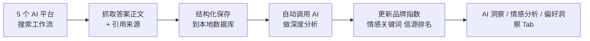

# 洞察数据来源

## 概述

GenAura 的所有洞察、情感分析、偏好洞察数据都不是凭空产生的，而是来自一个统一的数据源：**5 个 AI 平台搜索工作流抓取的搜索结果**。每完成一次工作流，GenAura 都会把 AI 的答案和引用来源结构化保存，并自动调用 AI 做深度分析，再以这些分析结果为基础汇总成你看到的「品牌指数」「情感倾向」「信源排名」等洞察指标。

这些能力共同构成了 GenAura 的 **GEO（生成式引擎优化，Generative Engine Optimization）** 核心闭环——通过持续采集 AI 平台的搜索结果，分析品牌在 AI 对话中的提及率、推荐率与情感表现，进而生成优化内容并监测效果，形成"**监测 → 分析 → 优化**"的完整循环。GEO 区别于传统 SEO（搜索引擎优化），其目标不是让网页在搜索结果中排名靠前，而是让品牌在 AI 的对话式回答中被优先提及和推荐。

读完本文你将了解：

- 洞察数据从哪里来，经过哪些处理步骤。
- 综合指标的 5 个数字分别代表什么、怎么算的。
- 数据多久更新一次、什么时机会触发更新。
- 为什么有时候数据看起来「不新鲜」。

## 前置条件

- 已完成品牌配置，并填好了品牌关键词（参见 [品牌模型](./01-brand-model.md)）。
- 已在 5 个 AI 平台中至少登录过一个（参见 [工作流原理](./02-workflow.md)）。
- 已经至少跑过一次 AI 平台搜索工作流。

## 数据从哪里来

GenAura 的洞察数据全部源自 AI 平台搜索工作流，流程如下：

具体来说，每次工作流完成后，GenAura 会保存以下三类原始信息：

- **AI 答案正文**：AI 给出的完整 Markdown 回答。
- **引用来源**：AI 在回答中引用的外部网页，包含标题、链接、摘要、发布日期（取决于平台本身的展示）。
- **命中的关键词与别名**：本次回答中出现了你配置的哪些品牌关键词或别名。

随后 GenAura 会**自动**把这些原始信息送给一个 AI 深度分析服务，由 AI 提取出：

- 答案摘要（便于在列表中预览）
- 命中的产品（如果你的产品被提及，AI 会判断是哪个产品、排名第几位）
- 情感倾向（正面 / 中性 / 负面）与情感关键词
- 信源渠道（引用来源所属的网站）

这些分析结果会汇总到品牌指数、情感指数等聚合表中，最终呈现在右侧面板的各个洞察 Tab。

## 综合指标含义

打开右侧面板的「AI 洞察」Tab，顶部会显示 5 个全局指标卡片。它们的含义如下：

| 指标 | 含义 | 计算口径 |
|---|---|---|
| **AI 对话总量** | 选定时间范围内，GenAura 在 5 个 AI 平台上累计执行的搜索对话次数 | 直接统计工作流完成的次数 |
| **提及数** | 这些对话中，AI 在回答里提到了你的品牌或产品的对话次数 | 命中关键词或别名的对话数 |
| **提及率** | 你的品牌被提及的对话占总对话的比例 | 提及数 ÷ AI 对话总量 × 100% |
| **首位推荐率** | 在你的品牌被提及的对话中，AI 把你的品牌或产品排在**第一位**的比例 | 首位提及数 ÷ 提及数 × 100% |
| **前三推荐率** | 在你的品牌被提及的对话中，AI 把你的品牌或产品排在**前三**的比例 | 前三提及数 ÷ 提及数 × 100% |

### 关于「提及」的判断

GenAura 通过你配置的**品牌关键词**和**别名**来判断 AI 是否提到了你的品牌。例如：

- 品牌关键词填了「GenAura」「生成式 aura」
- 别名填了「GA」「AuraGen」

只要 AI 回答中出现了这些词中的任意一个，这次对话就会被记为「品牌被提及」。

### 关于「排名」的判断

当 AI 在回答里同时推荐了多个产品（比如「推荐三款产品：A、B、C」），GenAura 的深度分析服务会判断你的品牌或产品排在第几位：

- 排第 1 → 计入「首位推荐」
- 排前 3 → 同时计入「前三推荐」

## 数据更新频率

GenAura 的洞察数据**不是实时刷新的**，更新节奏由以下两个时机决定：

### 1. 工作流完成时自动分析

每次 AI 平台搜索工作流跑完、抓取到答案与引用来源后，GenAura 会把这次结果**排队等待深度分析**。深度分析由后台服务异步执行：

- 后台服务每隔约 30 秒检查一次是否有待分析的任务。
- 取到任务后调用 AI 深度分析服务，将结果写回数据库。
- 如果分析失败，会按指数退避策略重试，最多重试 5 次，间隔从 1 分钟逐步延长到 16 分钟。

因此，**工作流跑完后，洞察数据通常会在 1–2 分钟内出现在 Tab 中**，但如果深度分析服务繁忙或网络异常，可能会延迟。

### 2. 切换筛选条件时实时聚合

AI 洞察 / 情感分析 / 偏好洞察 Tab 顶部的「时间范围」「平台」筛选器是**实时计算**的：切换筛选条件后，GenAura 会立刻按你选的范围从数据库聚合数据返回，不需要等待重新分析。其中「问题类型」筛选器仅 AI 洞察 Tab 具备，情感分析和偏好洞察 Tab 不包含该维度。

> **提示**：如果你刚跑完工作流但 Tab 里还没看到新数据，等 1–2 分钟后切换 Tab 或刷新筛选即可。

## 洞察数据的三个 Tab

洞察数据按视角不同分布在右侧面板的三个 Tab 中：

| Tab | 关注什么 | 数据来源 |
|---|---|---|
| **AI 洞察** | 品牌在 AI 平台上的「曝光度」与「推荐位次」 | 品牌指数聚合表 |
| **AI 情感** | AI 在提到你品牌时的情感倾向（正面 / 中性 / 负面），以及高频情感关键词 | 情感指数聚合表 |
| **AI 信源** | AI 在推荐时引用了哪些外部信源、哪些信源被反复引用 | 信源渠道聚合表 |

### AI 洞察 Tab 包含

- 5 个综合指标卡片
- 提及记录列表（每次被提及的对话详情，可点击查看 AI 答案全文）
- 行业竞品对比（你的品牌与配置的竞品在提及数、提及率、首位推荐率、前三推荐率上的对比）
- 时间趋势图（按日展示提及率、首位推荐率、前三推荐率的走势）

### AI 情感 Tab 包含

- 情感概览（正面 / 中性 / 负面对话占比）
- 情感趋势图（按日展示情感倾向变化）
- 关键词云（高频正面词、负面词，词越大表示出现次数越多）
- 平台情感对比（不同 AI 平台对你的品牌情感倾向差异）
- 问答列表与问答详情（点击可查看完整 AI 答案、引用数、情感关键词）

### AI 信源 Tab 包含

- 偏好概览（AI 引用的信源总数、最常被引用的信源）
- 信源分布（各信源被引用的次数占比）
- 信源排名（按引用次数排序的信源列表）
- 信源对比（多个信源之间的引用次数、覆盖对话数对比）

## 常见问题

**Q1：为什么 AI 对话总量增加了，但提及数没变？**
说明这段时间内 AI 平台虽然在回答你的问题，但没有提到你的品牌或产品。建议：
- 检查品牌关键词是否填得准确、是否覆盖了用户常用的称呼（参见 [品牌模型](./01-brand-model.md)）。
- 检查预设问题是否能引导 AI 提到你的品牌（例如「推荐一款……的产品」比「这个品牌怎么样」更容易触发提及）。

**Q2：提及率为什么有时候超过 100%？**
自身品牌的提及率最高 100%（提及数不会超过对话总量）。但**竞品对比**中的竞品提及率有可能超过 100%——因为分母用的是「你品牌的对话总量」，而某次对话里 AI 可能同时提到了多个竞品，所以竞品提及数可能大于你的对话数。这是正常的统计口径。

**Q3：刚跑完工作流，AI 洞察 Tab 里看不到新数据？**
工作流跑完后，GenAura 需要把结果送给 AI 做深度分析。通常 1–2 分钟内会出现，如果超过 5 分钟仍未出现，可能是深度分析服务异常。可以：
- 切换 Tab 或重新选择筛选条件触发重新查询。
- 检查应用是否在后台正常运行。
- 重启应用后再查看。

**Q4：情感分析显示「中性」是什么意思？**
中性表示 AI 在提到你的品牌时没有明显的正面或负面倾向，通常是客观陈述、参数罗列等。情感判断由 AI 自动完成，对于含糊的表述可能归为中性。

**Q5：偏好洞察里的「信源」是什么？**
信源就是 AI 在回答中引用的外部网页所属的网站（例如知乎、微博、某垂直行业站点）。GenAura 会统计 AI 在多次搜索中引用了哪些信源、各被引用多少次，帮助你判断「AI 在了解你品牌时主要参考了哪些渠道」，从而决定在哪些渠道做内容投放。

**Q6：数据会保留多久？可以删除吗？**
洞察数据是基于工作流搜索结果累计的，只要你不删除对应的对话或品牌，数据会一直保留。删除品牌会一并清除该品牌的所有搜索结果与聚合数据。

## 相关文档

- 前置阅读：[品牌模型](./01-brand-model.md)、[工作流原理](./02-workflow.md)
- 操作指南：[AI 洞察](../how-to/14-insight.md)、[情感分析](../how-to/15-emotion-analysis.md)、[偏好洞察](../how-to/16-preference-insight.md)、[AI 平台工作流](../how-to/11-ai-platform-workflows.md)、[定时任务](../how-to/12-cron-tasks.md)
- 关联概念：[AI Agent 协作模型](./04-ai-agent.md)、[机会与风险机制](./05-opportunity-risk.md)

---

> 最后更新：2026-07-29 | 对应版本：v1.2.0
