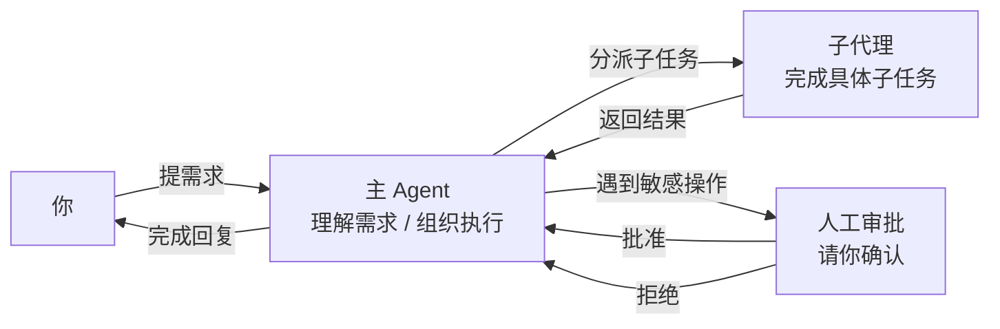
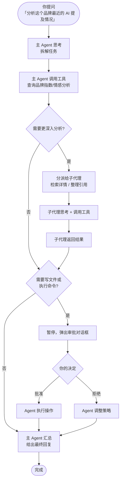

# AI Agent 协作模型

## 概述

在 GenAura 中，AI 不只是回答问题，而是像一个有团队、有流程的助手：**主 Agent** 负责理解你的需求并组织执行，必要时会把子任务**分派给子代理**完成，遇到敏感或不可逆的操作时**主动暂停**请你审批。整个过程在对话中以「思考 / 工具调用 / 子代理产出」分层折叠展示，既能看到全貌，也能展开看细节。

读完本文你将了解：

- 主 Agent、子代理、人工审批三者如何协作。
- 对话区里那些折叠的活动块分别代表什么、怎么操作。
- 什么时候你会被要求「批准」某个操作，应该怎么处理。

## 前置条件

- 已登录 GenAura，并进入某个品牌的工作区（参见 [界面总览](../getting-started/04-interface-overview.md)）。
- 建议先阅读 [对话与消息](../how-to/04-messaging.md) 与 [子代理与人工审批](../how-to/06-sub-agent-approval.md) 操作指南。

## 协作模型总览

GenAura 的 Agent 协作由三个角色组成：

### 主 Agent

主 Agent 是你直接对话的对象。它的职责：

- 理解你的自然语言请求或 `/` 命令、`@` 提及的内容。
- 决定需要做哪些事、按什么顺序做、哪些事自己做、哪些事交给子代理。
- 把各步骤的结果汇总后给你回复。

主 Agent 在云端执行，结果以流式方式逐步呈现在对话中，你可以一边等一边看它思考与行动。

### 子代理

当主 Agent 遇到需要更专注、更专业的子任务时（例如「检索某产品的市场反馈」「整理知识库内容」），它会把任务**分派给一个或多个子代理**。子代理的产出会**嵌在主 Agent 的回复中**展示，标题为「子代理」或子代理名称。

子代理内部也可能有「思考过程」和「工具调用」，展示方式与主 Agent 一致。

### 人工审批（Human-in-the-Loop）

主 Agent 和子代理在执行过程中，**遇到敏感或不可逆的操作会主动暂停**，弹出审批对话框请你确认。你可以选择「批准」或「拒绝」。

## Agent 活动如何展示

为了让对话区不被冗长的执行细节淹没，GenAura 把 Agent 的内部活动按**思考**和**工具调用**两类聚合展示，默认折叠，需要时再展开。

### 思考过程块

每当 Agent 在「思考」时，会以一个带脑图标的「思考过程」卡片展示：

- **默认状态**：Agent 正在思考时**自动展开**，你能看到它正在想什么。
- **思考完成**：Agent 给出结论后，思考块会**自动收起**，只保留一行标题。
- **手动展开**：点击卡片可以随时重新展开查看思考过程。
- 样式上以浅灰底、斜体字呈现，区别于最终回复。

### 工具调用聚合块

Agent 调用工具（如检索数据库、读写文件、调用工作流）时，相关的多次调用会被聚合为一个折叠块，顶部摘要告诉你这一组做了什么：

| 摘要文案 | 触发条件 |
|---|---|
| 思考中... | Agent 还没产出任何思考或工具调用，正在等待响应 |
| 已思考 X 次 | 仅产生了思考，未调用工具 |
| 已调用工具 X 次 | 调用了工具（思考次数为 1 时不再单独强调） |
| 已思考 X 次，调用工具 Y 次 | 同时有思考和工具调用 |

- **默认折叠**：点击摘要行可以展开查看每一步的具体调用与返回结果。
- **流式中只增不减**：Agent 正在执行时，思考次数和工具调用次数只会增加不会回退，避免因数据短暂切换造成抖动。
- **加载指示**：Agent 仍在执行时，摘要左侧会显示一个旋转的加载图标。

### 子代理产出块

子代理的产出会嵌在主 Agent 回复的对应位置，展示方式与主 Agent 一致：

- 子代理的思考过程、文本回答、错误信息都会原样呈现。
- 如果子代理自己又调用了工具或需要审批，会按相同规则聚合展示。

### 人工审批对话框

当 Agent 需要执行敏感操作时，对话区会出现一个带警告图标的橙色审批卡片，包含：

1. **操作类型**：例如「执行命令」「写入文件」「编辑文件」。
2. **操作详情**：具体要执行的命令或要写入的内容，以等宽字体展示方便核对。
3. **两个按钮**：
   - **批准**（绿色对勾）：允许 Agent 执行这次操作，工作流继续。
   - **拒绝**（红色叉号）：阻止这次操作，Agent 会根据拒绝结果调整后续行为。

> **重要**：审批对话框出现时，**Agent 处于暂停状态**，直到你点击批准或拒绝后才会继续。如果你长时间不响应，Agent 会一直等待。

## 典型协作流程

下面是一个典型的 Agent 协作流程示例：

## 哪些操作需要你审批

GenAura 默认对以下类型的操作触发人工审批：

- **执行命令**：Agent 想运行本地系统命令时。
- **写入文件**：Agent 想新建或覆盖本地文件时。
- **编辑文件**：Agent 想修改已有文件内容时。

这些操作因为会改变你的本地环境或文件，所以**默认需要你确认**。GenAura 不会在未经你批准的情况下执行这类操作。

## 常见问题

**Q1：审批对话框一直弹出来，能不能让它自动执行？**
目前所有写文件 / 执行命令类操作默认都需要审批，这是为了保护你的本地环境。如果你信任当前任务的执行路径，可以快速点击「批准」放行；如果不放心某个具体操作，可以「拒绝」，Agent 会改用其他方式或停下来询问你。

**Q2：子代理产出为什么有时很短？**
子代理只展示它的关键思考与最终产出，不重要的中间过程会被聚合折叠。如果你想看完整过程，点击子代理块上方的折叠摘要展开即可。

**Q3：思考过程有时显示中文有时显示英文？**
思考过程是 Agent 内部的原始推理内容，可能包含中英文混合，这是正常现象。最终给你的回复会按你的提问语言呈现。

**Q4：我拒绝了一次审批，Agent 不再继续了？**
拒绝审批后，Agent 通常会根据你的拒绝调整策略，例如改用其他方式完成任务，或直接告诉你「这个步骤无法完成」。如果 Agent 停在这里不再行动，可以发送一条新消息告诉它「跳过这步，继续」或「换种方式」。

**Q5：工具调用块里看到「已调用工具 5 次」，但展开后只有 3 条？**
聚合块中的次数统计了所有相关调用（包括内部子调用），展开后可能按聚合粒度显示。如果想看完整调用细节，可以再展开更深层级，或检查子代理块。

**Q6：多个子代理同时工作时怎么区分？**
每个子代理产出块会以独立卡片呈现，按完成顺序嵌入主 Agent 的回复中。你可以分别展开查看每个子代理的思考与产出。

## 相关文档

- 前置阅读：[界面总览](../getting-started/04-interface-overview.md)
- 操作指南：[对话与消息](../how-to/04-messaging.md)、[子代理与人工审批](../how-to/06-sub-agent-approval.md)、[命令与提及](../how-to/05-commands-mentions.md)
- 关联概念：[工作流原理](./02-workflow.md)、[机会与风险机制](./05-opportunity-risk.md)

---

> 最后更新：2026-07-29 | 对应版本：v1.2.0
