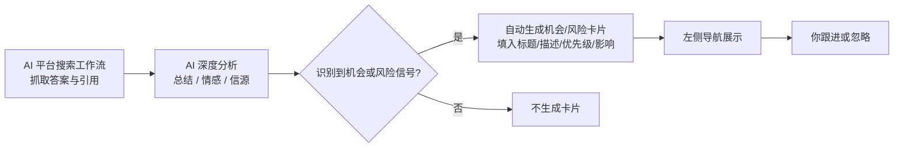
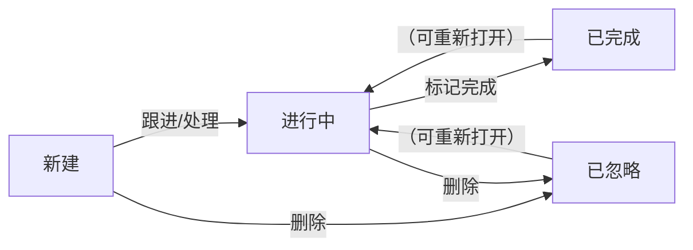

## 概述

GenAura 在分析 AI 平台搜索结果时，会**自动识别**出你可能值得关注的市场机会或品牌风险，并整理成「机会 / 风险」卡片展示在左侧导航。每条机会或风险都带有优先级、影响程度、场景、问题类型等关键信息，你可以一键跟进或处理，所有跟进记录会作为对话保留下来，方便回溯。

读完本文你将了解：

- 机会和风险是怎么被识别出来的，分别代表什么。
- 一条机会或风险有哪些状态、状态怎么流转。
- 优先级（紧急优先级 / 高优先级 / 中优先级 / 低优先级）与影响程度高 / 中 / 低分别意味着什么。
- 为什么左侧导航只能看到部分机会或风险，剩下的去哪了。

## 前置条件

- 已创建品牌并跑过至少一次 AI 平台搜索工作流（参见 [工作流原理](/concepts/02-workflow)）。
- 已有 AI 洞察数据沉淀（参见 [洞察数据来源](/concepts/03-insight-data)）。
- 建议先阅读 [机会与风险](/how-to/07-opportunities-risks) 操作指南。

## 机会与风险分别是什么

GenAura 把 AI 自动识别出的两类信号分别归入「机会」和「风险」：

| 类型 | 含义 | 典型场景 |
| --- | --- | --- |
| **机会** | AI 在搜索结果中发现的、你可以**抓住**的潜在正向信号 | 新市场空白、未被满足的用户需求、竞品薄弱环节、新兴使用场景等 |
| **风险** | AI 在搜索结果中发现的、可能**损害**你品牌或产品的潜在负向信号 | 用户集中抱怨的问题、负面情感聚集、竞品在某些场景已超越你、品牌认知偏差等 |

每条机会或风险都会附带以下关键信息：

- **标题**：一句话概括这条机会或风险。
- **描述**：详细说明背景与判断依据。
- **场景**：这条信号所属的应用场景（如「游泳健身」「企业办公」）。
- **问题类型**：信号的分类标签（如「market\_vacuum 市场空白」「negative\_sentiment 负面情感」）。
- **优先级**：AI 给出的处理紧迫程度（紧急优先级 / 高优先级 / 中优先级 / 低优先级）。
- **影响程度**：AI 评估的对你品牌的影响大小（高 / 中 / 低）。

## 机会与风险如何被识别

机会与风险不是你手动录入的，而是 **AI 在分析工作流搜索结果时自动产出**的：

也就是说，**只要工作流跑出了新的搜索结果，就有可能产出新的机会或风险**。识别完全由 AI 自动完成，你无需手动配置规则。

## 状态流转

每条机会或风险都有 4 种状态，状态会随着你的操作而流转：

| 状态 | 含义 | 何时进入这个状态 |
| --- | --- | --- |
| **新建** | 刚被 AI 识别出来，你还没有处理 | AI 自动创建时 |
| **进行中** | 你已开始跟进或处理 | 你点击「跟进机会」/「处理风险」后，或手动改状态 |
| **已完成** | 这条机会或风险已经处理完毕 | 你点击列表项上的对勾按钮标记完成 |
| **已忽略** | 这条信号不重要，暂时不处理 | 你点击删除按钮，或主动忽略 |

> **提示**：已忽略的卡片会显示删除线，提示这条已经被你处理过；你可以通过对话或后续操作把它重新打开。

## 优先级与影响程度

每条机会或风险都会被 AI 标注优先级和影响程度，帮助你判断处理的轻重缓急。

### 优先级

| 优先级 | 含义 |
| --- | --- |
| **紧急优先级** | 需要立即处理，例如突发的重大负面舆情 |
| **高优先级** | 优先处理，例如明显的市场机会或竞品威胁 |
| **中优先级** | 适时跟进，例如常规的产品改进建议 |
| **低优先级** | 可延后处理，例如长尾的小问题 |

### 影响程度

| 影响程度 | 含义 |
| --- | --- |
| **高影响** | 这条信号对你品牌有显著的正向或负向影响 |
| **中影响** | 影响有限，但值得关注 |
| **低影响** | 影响较小，了解即可 |

## 左侧导航的展示规则

左侧导航的「机会」和「风险」两个分组**只展示「新建」和「进行中」状态**的条目，已完成的和已忽略的不会出现在这里。此外，每个分组**最多展示 5 条**：

| 展示规则 | 说明 |
| --- | --- |
| 仅显示「新建」「进行中」 | 「已完成」「已忽略」不在左侧导航出现，需要查看历史请前往对应对话或品牌数据中检索 |
| 最多各 5 条 | 机会分组最多 5 条，风险分组最多 5 条，超过的会按排序规则截断 |
| 默认折叠状态 | 进入应用时，「机会」和「风险」两个分组默认是收起的，需要点击展开 |
| 有「进行中」时自动展开 | 如果你某个分组里有「进行中」的条目，该分组会默认展开，提醒你有未完成事项 |
| 排序规则 | 先按状态（进行中 \> 新建），再按优先级（紧急优先级 \> 高优先级 \> 中优先级 \> 低优先级），最后按创建时间倒序 |

> **提示**：左侧导航右上角的数字徽章显示当前该分组的条目数（受 5 条上限影响）。如果你看到「机会 5」，意味着实际可能还有更多机会未展示，建议尽快处理已有项以释放位置，或在对话中查询完整列表。

## 跟进与处理

### 跟进机会 / 处理风险

把鼠标悬停在某条机会或风险上：

- **卡片标题左侧的状态点**：颜色对应状态（蓝=进行中、黄=新建、绿=已完成、灰=已忽略）。
- **悬浮显示详情卡片**：在条目右侧停留约 0.5 秒会展开详细信息气泡，包含类型、优先级、影响、描述、场景、问题类型。
- **跟进按钮**：在详情卡片底部点击「跟进机会」（机会）或「处理风险」（风险），GenAura 会为你创建或打开一个关联的对话，让你和 Agent 一起深入处理这个问题。
- **完成按钮**（绿色对勾）：仅在「进行中」状态显示，点击后这条会标记为「已完成」并从左侧导航消失。
- **删除按钮**（红色叉号）：点击后这条会标记为「已忽略」并从左侧导航消失。

### 与对话的关联

每条机会或风险都会**关联到一个对话**：

- 第一次跟进时，GenAura 会**新建一个对话**专门处理这条机会或风险，对话里会带上机会/风险的完整上下文。
- 这个对话在「对话列表」中会显示对应的机会/风险图标，方便你识别。
- 再次跟进时，会重新打开这个对话；如果对话已经是当前活跃对话，按钮会变成「已在当前会话」并禁用。

## 常见问题

**Q1：为什么我看不到全部的机会和风险？** 左侧导航只展示「新建」和「进行中」状态，且每个分组最多 5 条。如果你想查看更多，可以：

- 把已处理或已忽略的项标记为「已完成」/「已忽略」释放位置。
- 在对话中直接询问 Agent：「这个品牌当前还有哪些机会和风险？」Agent 会查询完整列表给你。

**Q2：AI 识别出的机会/风险我不认可怎么办？** 你可以：

- 点击删除按钮忽略这条（标记为「已忽略」），它不会再出现在左侧导航。
- 在关联对话里和 Agent 讨论，让 Agent 重新评估或修正描述。

**Q3：紧急优先级和高优先级有什么区别？我该怎么处理？** 紧急优先级通常是负面舆情或重大风险，建议立即跟进处理；高优先级是值得尽快关注的机会或风险。处理顺序上紧急优先级 \> 高优先级 \> 中优先级 \> 低优先级。

**Q4：「已忽略」的项还能找回吗？** 可以。已忽略的项不会出现在左侧导航，但数据仍保留在品牌下。你可以通过对话询问 Agent 查询历史机会/风险，或在 Agent 的对话中重新激活某条已忽略的项。

**Q5：我标记完成了，但后来发现搞错了，能恢复吗？** 可以。已完成状态不是终点，你可以在原对话中让 Agent 重新打开这条机会或风险，状态会恢复为「进行中」。

**Q6：机会和风险会自动消失吗？** 不会自动消失。一条机会或风险只有在以下情况会从左侧导航消失：

- 你手动标记为「已完成」。
- 你手动删除（标记为「已忽略」）。
- 你跟进处理后状态变为「进行中」，且当前分组已经有 5 条更新或更优先的「新建 / 进行中」项把它挤出列表（但数据仍在）。

**Q7：为什么有些机会/风险没有「场景」或「问题类型」？** 这两个字段由 AI 在识别时给出。某些信号比较综合，AI 可能没有归入具体场景或类型，这两栏就会留空，属于正常现象。

## 相关文档

- 前置阅读：[工作流原理](/concepts/02-workflow)、[洞察数据来源](/concepts/03-insight-data)
- 操作指南：[机会与风险](/how-to/07-opportunities-risks)、[对话与消息](/how-to/04-messaging)
- 关联概念：[AI Agent 协作模型](/concepts/04-ai-agent)、[品牌模型](/concepts/01-brand-model)

---

> 最后更新：2026-07-29 | 对应版本：v1.2.0