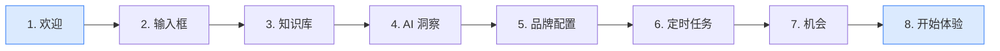

## 概述

GenAura 在你首次进入品牌工作区时，会自动启动一段 **8 步新手引导**，通过聚光灯高亮 \+ 浮层卡片的方式，带你快速认识核心功能区域。引导会按顺序点亮关键操作点，每一步都用产品语言告诉你「这里能做什么」。

本篇介绍：

- 新手引导的触发时机与完整流程
- 每一步引导对应的功能区域与价值
- 如何跳过、回看或重置引导

读完本篇后，你将能够清晰理解引导中每个区域的用途，避免在第一次使用时迷失。

## 前置条件

- 已完成 [安装指南](/getting-started/01-installation) 与 [登录与账户](/getting-started/02-login-account)
- 已创建第一个品牌（首次登录后通常会自动进入品牌初始化流程；如果没有品牌，引导不会启动）
- 引导仅在「品牌数据加载完成且未处于初始化中」时才会自动启动

## 操作步骤

### 1. 引导自动启动

当你首次登录并进入品牌工作区后，等待约 0.5 秒（用于让面板布局稳定），屏幕中央会自动弹出第一步引导卡片。此时背景会被一层半透明遮罩覆盖，当前要介绍的区域被聚光灯高亮，其余区域被压暗。

引导卡片包含以下元素：

- **顶部**：8 个进度圆点（当前步为加长的蓝色，已完成步为短蓝色，未到达步为灰色）\+ `当前步号 / 8` 文本 \+ 右上角关闭按钮（×）
- **中部**：步骤标题 \+ 描述说明
- **底部**：左侧「上一步」按钮（第一步时禁用），右侧「跳过引导」\+「下一步」按钮（最后一步变为「开始体验」）

### 2. 跟随 8 步引导

引导一共 8 步，按以下顺序进行。每一步会自动展开 / 切换对应的面板，确保要介绍的区域可见。

#### 步骤 1：欢迎

- **位置**：屏幕右下角浮层卡片
- **标题**：让品牌在 AI 搜索中被看见
- **说明**：GenAura 是你的品牌 GEO 助手，帮你诊断 GEO 表现、生成优化文章、管理品牌知识库。
- **价值**：建立对 GenAura 产品定位的整体认知

#### 步骤 2：输入框

- **位置**：高亮中间聊天区底部的输入框（气泡在输入框上方）
- **标题**：从这里向 Agent 提问
- **说明**：输入问题，或点击下方快捷指令，即可开始品牌 GEO 诊断、生成 GEO 文章。
- **价值**：告诉你 GenAura 的主要交互入口是对话

#### 步骤 3：知识库

- **位置**：高亮右侧面板的「知识库」Tab（气泡在 Tab 左侧）。引导会自动展开右侧面板并切换到知识库
- **标题**：让回答基于品牌真实资料
- **说明**：在知识库上传品牌文档与产品资料，Agent 生成的分析、报告和文章也会自动存储在这里。在文章标题上点击鼠标右键，即可一键发布到内容渠道。输入 @ 还可在对话中引用知识库内容。
- **价值**：知识库是 GenAura 一切回答的事实基础

#### 步骤 4：AI 洞察

- **位置**：高亮右侧面板的「AI 洞察」Tab。引导会自动切换到 AI 洞察 Tab
- **标题**：追踪品牌在 AI 中的表现
- **说明**：AI 洞察展示品牌提及率、首位推荐率与竞品对比；AI 信源分析哪些渠道和文章被 AI 引用最多；AI 情感则监测用户对品牌的正负面口碑。还可以直接让 Agent 基于这些数据给出优化建议。
- **价值**：三个数据洞察 Tab 是 GenAura 的核心价值产出

> 说明：这一步以「AI 洞察」Tab 作为高亮目标，同时介绍了「AI 洞察」「AI 信源」「AI 情感」三个相邻的 Tab，它们在引导中被合并为一步高亮。

#### 步骤 5：品牌配置

- **位置**：高亮右侧面板的「品牌配置」Tab。引导会自动切换到品牌配置 Tab
- **标题**：校准品牌基础信息
- **说明**：品牌初始化时 Agent 会自动写入品牌内容与提问矩阵。你可以在这里手动更新它们，这些调整都会影响后续的 AI 平台问答跟踪。
- **价值**：品牌配置直接决定后续追踪与生成的准确度

#### 步骤 6：定时任务

- **位置**：高亮右侧面板的「定时任务」Tab。引导会自动切换到定时任务 Tab
- **标题**：让 Agent 持续跟踪
- **说明**：定时任务中内置了 AI 平台问答跟踪任务。任务执行依赖于你的电脑保持开机，并且 GenAura 应用处于运行状态。
- **价值**：定时任务是持续获取 AI 洞察数据的前提

#### 步骤 7：机会

- **位置**：高亮左侧导航中的「机会」入口（气泡在机会入口右侧）。引导会自动展开左侧导航
- **标题**：跟进 AI 发现的机会与风险
- **说明**：Agent 会自动识别品牌增长机会与潜在风险，点击即可创建会话跟进。
- **价值**：将洞察转化为可执行的下一步行动

#### 步骤 8：开始体验

- **位置**：屏幕右下角浮层卡片
- **标题**：完成品牌初始化并开启首次追踪
- **说明**：品牌正在初始化，请留意 Agent 在对话中请求补充的信息，协助完善品牌资产。初始化完成后，建议先进入「品牌配置」确认或更新品牌信息与提问矩阵，再进入「定时任务」将「每日 AI 平台问答」调整为最近的执行时点。首次追踪结束后，即可在 AI 洞察、AI 信源、AI 情感三个标签中查看品牌 GEO 分析指标。
- **价值**：给出引导结束后的明确行动建议
- 按钮文案变为「开始体验」，点击后引导关闭，进入正式使用

### 3. 控制引导进度

引导过程中你可以：

- 点击「下一步」或「上一步」在步骤间切换
- 点击「跳过引导」或右上角「×」直接结束引导（标记为已完成，不会再自动弹出）
- 按下 `Esc` 键等同点击「跳过引导」
- 完成最后一步点击「开始体验」后，引导标记为已完成

## 进阶用法

### 引导完成标记

GenAura 会在本地记录"是否已完成新手引导"。一旦你完成引导（无论是走完所有步骤还是中途跳过），下次进入任何品牌工作区都不会再自动弹出引导。

### 重新触发引导

如果你希望重新观看引导（例如隔了一段时间忘记了各区域功能），目前 GenAura 没有提供"重新启动引导"的入口。你可以通过以下方式变通：

- 在浏览器开发者工具中清除应用本地存储中的引导完成标记（高级操作，普通用户不推荐）
- 等待后续版本在设置对话框中提供的"重新查看引导"入口

> 提示：引导内容本身只是产品功能的快速概览，详细功能说明请查阅 [操作指南](/how-to/01-brand-management) 系列文档。

## 常见问题

### Q1：我登录后没有看到新手引导怎么办？

可能的原因：

- **尚未创建品牌**：引导需要在品牌工作区中启动。如果没有品牌，请先在欢迎页创建第一个品牌（详见 [创建首个品牌](/tutorials/01-first-brand)）
- **之前已经完成过引导**：引导只在首次完成时弹出一次，已完成不会再自动启动（参见上文「重新触发引导」）
- **窗口过窄**：引导需要足够大的窗口才能正常展示，建议将窗口宽度调整到 1024 像素以上

### Q2：引导卡片挡住了我想看的区域，怎么办？

引导卡片会智能选择合适的位置（上下左右四个方向之一）。如果卡片遮挡了高亮区域附近的内容，可以：

- 点击「下一步」继续往下走，引导会切换到新的高亮目标
- 临时点击「跳过引导」结束引导，稍后通过文档了解各区域功能

### Q3：引导过程中切换了品牌或关闭了面板，引导卡住了怎么办？

引导会尝试自动展开 / 切换对应面板以呈现高亮目标。如果你手动操作导致目标元素不可见，引导可能找不到目标。此时请：

- 点击「下一步」或「上一步」让引导重新定位
- 或点击「跳过引导」结束本次引导

### Q4：引导中提到的「AI 信源」「AI 情感」和我看到的 Tab 名称不一致？

GenAura 右侧面板的 7 个 Tab 依次是：知识库、AI 洞察、AI 信源、AI 情感、品牌配置、定时任务、浏览器。引导第 4 步会同时介绍「AI 洞察」「AI 信源」「AI 情感」三个相邻 Tab。如果你看到 Tab 名字与本文描述略有出入，以应用实际显示为准（详见 [界面总览](/getting-started/04-interface-overview)）。

### Q5：引导说"任务执行依赖于电脑保持开机"，那我下班关机后还会追踪吗？

不会。GenAura 的定时任务运行在你本地电脑上，关机或退出应用后任务不会执行。如果你希望持续追踪，可以：

- 让电脑保持开机并最小化 GenAura（不要退出）
- 在 [设置](/reference/01-settings) 中开启"防止系统休眠"，避免系统进入睡眠导致任务中断
- 在下次开机后手动运行一次「每日 AI 平台问答」任务补齐数据

### Q6：跳过引导后还能找到那些操作建议吗？

引导第 8 步「开始体验」给出的建议是：先完善「品牌配置」→ 调整「定时任务」执行时点 → 等待首次追踪 → 查看 AI 洞察 / AI 信源 / AI 情感。即使跳过引导，你也可以按照这个顺序操作，详细步骤可参考 [创建首个品牌](/tutorials/01-first-brand) 教程。

## 相关文档

- 前置阅读：[安装指南](/getting-started/01-installation) —— 完成应用安装
- 前置阅读：[登录与账户](/getting-started/02-login-account) —— 完成账号登录
- 下一步：[界面总览](/getting-started/04-interface-overview) —— 详细认识三栏工作区与 7 个 Tab
- 教程：[创建首个品牌](/tutorials/01-first-brand) —— 从零配置第一个品牌的完整流程
- 操作指南：[品牌配置](/how-to/02-brand-config) —— 品牌配置 Tab 的详细使用
- 操作指南：[定时任务](/how-to/12-cron-tasks) —— 定时任务的配置与执行

> 最后更新：2026-07-29 | 对应版本：v1.2.0