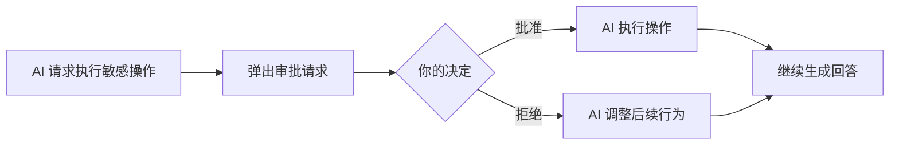

## 概述

GenAura 的 AI 助手在处理复杂任务时，会通过**子代理**拆分工作、调用工具，并在执行敏感操作前向你请求**人工审批**。为了不让这些中间过程淹没最终回答，GenAura 把 AI 的思考、工具调用、子代理活动**聚合折叠**展示，让你既能快速看到结论，又能随时展开查看过程。

本文介绍这三类内容在对话中的呈现方式与操作方法。

读完本文你将能够：

- 识别并展开/折叠「Agent 活动」聚合块，查看思考与工具调用过程。
- 理解子代理消息块的状态与内容。
- 在 AI 请求审批时做出批准或拒绝的决定。

---

## 前置条件

- 已按 [消息收发](/how-to/04-messaging) 了解基本的对话与消息渲染。
- 已创建对话并与 AI 进行过交互。

---

## 操作步骤

### 1. 查看聚合的 Agent 活动

当 AI 在回答过程中产生了连续的思考与工具调用时，这些中间过程会被聚合为一个**可折叠的活动块**，默认折叠显示为一行摘要。

1. 在 AI 回答区域，看到带箭头图标的摘要行（如「已调用工具 3 次」「2 次思考与 3 次工具调用」「思考中...」）。
2. 点击摘要行即可**展开**，查看其中每一步的思考过程与工具调用详情。
3. 再次点击可**折叠**回摘要态。

摘要文案会根据活动内容自动变化：

| 场景 | 摘要文案 |
| --- | --- |
| AI 正在思考但尚未调用工具 | 思考中...（带转圈图标） |
| 仅有思考 | 已思考 N 次 |
| 仅有工具调用 | 已调用工具 N 次 |
| 思考与工具调用并存 | N 次思考与 N 次工具调用 |

> 折叠态让你专注于最终回答；展开态则完整呈现 AI 的工作过程，便于你理解结论的推导逻辑。

### 2. 查看子代理消息块

当 AI 把部分任务委派给**子代理**执行时，每个子代理任务会以独立的可折叠块呈现。

1. 在 AI 回答中看到带机器人图标的子代理条目，标题格式为「子代理 · 任务名」。
2. 条目右侧会显示子代理的**状态图标**：
   - **转圈**：执行中
   - **勾号**：已完成
   - **感叹号**：出错
3. 点击条目展开，可查看子代理的：
   - **思考过程**：子代理的推理步骤，可单独折叠/展开。生成中默认展开，完成后默认折叠。
   - **文本输出**：子代理的最终结果，以 Markdown 格式渲染。
   - **错误信息**：若子代理执行失败，会以红色文字显示错误说明。

> 子代理是 AI 拆分复杂任务的手段。例如，AI 可能委派一个子代理专门检索知识库，另一个子代理负责整理结果，最终汇总给你。

### 3. 处理人工审批请求

当 AI 准备执行**敏感操作**（如执行命令、写入文件、编辑文件）时，会暂停并弹出**审批请求**，等待你确认。审批请求以黄色警告样式的卡片出现在聊天区底部。

1. 当出现审批请求时，卡片标题显示「需要审批」。
2. 卡片内会列出 AI 请求执行的操作，包括：
   - **操作类型**：执行命令 / 写入文件 / 编辑文件。
   - **操作参数**：具体的命令或文件内容，以代码块形式展示。
3. 仔细审阅操作内容后，点击底部按钮做出决定：
   - **批准**（绿色）：允许 AI 执行该操作，AI 会继续后续流程。
   - **拒绝**（红色）：阻止该操作，AI 会根据拒绝结果调整后续行为。

> 审批机制确保 AI 不会在你不知情的情况下执行可能有风险的操作。建议仔细核对操作参数后再批准，特别是涉及文件修改或命令执行的场景。

---

## 进阶用法

### 何时会出现审批请求？

并非所有操作都会触发审批。通常，AI 在需要执行**可能影响系统或文件**的操作时才会请求审批，例如：

- 执行系统命令
- 写入或修改文件

纯读取操作（如检索知识库、搜索信息）通常无需审批即可自动执行。这既保证了安全，又避免频繁打断你的工作流。

### 子代理与主代理的关系

主代理负责理解你的问题、规划任务并汇总结果；子代理则承担主代理委派的具体子任务。子代理的输出会回流给主代理，作为最终回答的依据。你看到的最终回答，通常是主代理综合各子代理结果后的总结。

### 折叠策略的选择

- **关注结论**：保持活动块折叠，只看最终回答，适合日常快速获取信息。
- **核查过程**：展开活动块，逐步检查 AI 的思考与工具调用，适合需要验证结论可靠性、或排查 AI 行为异常的场景。

---

## 常见问题

### Q1：为什么有时看不到「Agent 活动」块？

当 AI 的回答没有产生思考过程或工具调用（例如直接回答简单问题）时，不会出现活动块。活动块仅在 AI 执行了内部活动（思考、工具调用、子代理）时才会显示。

### Q2：审批请求会一直等待吗？

审批请求出现后，AI 会暂停等待你的决定。在你点击「批准」或「拒绝」前，AI 不会继续执行该操作。如果你长时间不响应，AI 将保持等待状态。

### Q3：批准了操作后能撤销吗？

批准后 AI 会立即执行该操作，已执行的操作无法在对话中撤销。因此建议在批准前仔细核对操作参数，特别是文件修改类操作。

### Q4：子代理出错会影响最终回答吗？

子代理出错时，主代理通常会感知到错误并调整策略（例如改用其他方式完成任务）。最终回答仍会生成，但可能不会包含出错子代理的预期结果。你可以在子代理块中查看具体错误信息。

### Q5：可以同时有多个子代理吗？

可以。AI 处理复杂任务时可能委派多个子代理，每个子代理独立执行各自的任务。它们会按完成顺序在回答中依次展示。

### Q6：活动块里的工具调用状态图标代表什么？

- **时钟**：待执行
- **转圈**：执行中
- **勾号**：完成
- **感叹号**：错误

涉及知识库文件的工具调用可点击跳转到对应文件。

---

## 相关文档

- 前置阅读：
  - [消息收发](/how-to/04-messaging)（消息渲染与操作基础）
  - [AI Agent 协作模型](/concepts/04-ai-agent)（主代理、子代理、审批的概念）
- 关联操作：
  - [命令与提及](/how-to/05-commands-mentions)（通过指令触发复杂任务）
  - [知识库管理](/how-to/08-knowledge-base)（工具调用涉及的知识库文件）

---

> 最后更新：2026-07-29 | 对应版本：v1.2.0