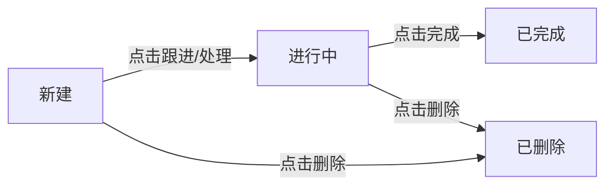

## 概述

GenAura 的 AI 助手在分析品牌数据时，会自动识别出值得关注的**机会**与**风险**，并将它们展示在左侧导航中，方便你持续跟进。机会代表可提升品牌表现的方向，风险代表需要警惕或处理的问题。

本文介绍机会与风险在左侧导航中的展示规则、状态流转、优先级含义，以及如何完成、删除、跳转跟进。

读完本文你将能够：

- 理解左侧导航中机会/风险的展示与排序规则。
- 查看机会/风险的详细信息（优先级、影响程度、描述等）。
- 完成或删除机会/风险。
- 从机会/风险跳转到关联的对话继续跟进。

---

## 前置条件

- 已按 [品牌管理](./01-brand-management.md) 创建并切换到某个品牌。
- 品牌已完成配置并产生过 AI 分析结果（机会/风险由 AI 在分析过程中自动识别）。
- 建议先了解 [对话管理](./03-chat-management.md)，因为机会/风险通常与对话关联。

---

## 操作步骤

### 1. 查看机会与风险列表

左侧导航中有两个独立的折叠区域：**机会**与**风险**。每个区域标题右侧会显示当前条目数量（如 `3`）。

- **机会**：趋势上升图标，展示 AI 识别到的品牌提升机会。
- **风险**：盾牌图标，展示 AI 识别到的需要警惕的问题。

点击区域标题可展开/折叠列表。当存在「进行中」的条目时，对应区域会默认展开，方便你及时跟进。

#### 展示规则

- 列表**仅显示「新建」与「进行中」状态**的条目，「已完成」与「已忽略」的条目不在列表中展示。
- 机会与风险**各自最多显示 5 条**。
- 排序规则：
  1. 「进行中」优先于「新建」。
  2. 同状态下按**优先级**排序（紧急优先级 \> 高优先级 \> 中优先级 \> 低优先级）。
  3. 同优先级下按创建时间倒序（最新的在前）。

每条条目显示一个**状态圆点**（颜色对应状态）和条目标题。当前选中的条目会高亮显示。

### 2. 查看详细信息

将鼠标悬停在某个机会或风险条目上（停留约 0.5 秒），会在右侧弹出**详情卡片**：

| 字段 | 说明 |
| --- | --- |
| 类型标签 | 「机会」或「风险」。 |
| 优先级 | 紧急优先级（红）/ 高优先级（橙）/ 中优先级（蓝）/ 低优先级（灰）。 |
| 影响程度 | 高影响 / 中影响 / 低影响。 |
| 标题 | 机会或风险的简要描述。 |
| 描述 | 详细说明，包括背景与建议。 |
| 场景 | 识别到该机会/风险的场景。 |
| 问题类型 | 对应的问题分类。 |

> 详情卡片会跟随鼠标悬停保持显示，移开鼠标后会自动收起。

### 3. 完成机会/风险

当某个机会或风险已处理完毕，可将其标记为完成：

1. 鼠标悬停在\*\*「进行中」状态\*\*的条目上，行右侧出现操作按钮。
2. 点击「完成」图标（勾号），该条目即被标记为已完成。
3. 完成后条目从列表中消失（已完成条目不在左侧导航展示）。

> 「完成」按钮仅对「进行中」状态的条目显示。「新建」状态的条目需先进入跟进（跳转到关联对话）转为「进行中」后才能完成。

### 4. 删除机会/风险

对于不需要的机会或风险，可以删除：

1. 鼠标悬停在目标条目上，行右侧出现操作按钮。
2. 点击「删除」图标（垃圾桶）。
3. 条目即被删除，从列表中消失。

> 删除后的条目不再出现在任何视图中。如需重新识别，可再次运行 AI 分析。

### 5. 跳转到关联对话

每个机会/风险通常关联着产生它的对话。从详情卡片可一键跳转：

1. 悬停在条目上显示详情卡片。
2. 点击卡片底部的按钮跳转到关联对话：
   - **机会**：按钮文案为「跟进机会」；若已有关联对话则为「查看跟进」。
   - **风险**：按钮文案为「处理风险」；若已有关联对话则为「查看处理」。
   - 若已在当前对话中，按钮显示「已在当前会话」并禁用。
3. 跳转后，中间聊天区会切换到关联对话，你可以在该对话中继续与 AI 探讨该机会/风险。

> 跳转到关联对话是跟进机会/风险的推荐方式，对话中保留了 AI 分析该问题的完整上下文。

---

## 进阶用法

### 状态流转

机会与风险的状态遵循以下流转：

- **新建**：AI 刚识别出，尚未开始跟进。
- **进行中**：你已开始跟进（跳转关联对话后通常转为该状态）。
- **已完成**：已处理完毕，不再显示在列表中。
- **已删除**：已删除，不再显示。

### 优先级含义

| 优先级 | 含义 | 建议处理时机 |
| --- | --- | --- |
| 紧急优先级 | 需立即关注的高影响问题 | 尽快处理 |
| 高优先级 | 重要且影响较大 | 优先安排 |
| 中优先级 | 值得关注，影响中等 | 适时跟进 |
| 低优先级 | 影响较小，可暂缓 | 有空时处理 |

### 机会与风险的来源

机会与风险由 AI 在分析品牌数据（如 AI 平台搜索结果、知识库内容）时自动识别，无需手动创建。每次运行品牌诊断或定时任务后，可能会产生新的机会/风险。详见 [AI Agent 协作模型](../concepts/04-ai-agent.md) 与 [机会与风险概念](../concepts/05-opportunity-risk.md)。

---

## 常见问题

### Q1：为什么列表里最多只看到 5 条？

左侧导航的机会与风险各自最多显示 5 条，且仅展示「新建」与「进行中」状态。这是为了避免列表过长影响查找。已完成与已忽略的条目不在列表中展示。如需查看更多，建议及时完成或删除已处理的条目。

### Q2：「新建」状态的条目怎么变成「进行中」？

点击详情卡片底部的「跟进机会」或「处理风险」按钮，跳转到关联对话后，条目通常会转为「进行中」状态。「进行中」状态下的条目才能使用「完成」按钮。

### Q3：完成的条目还能再看到吗？

已完成的条目不再出现在左侧导航中。如需回顾，可在关联的对话历史中查看相关分析内容。

### Q4：四个优先级是谁设定的？

优先级由 AI 在识别机会/风险时根据影响程度与紧急度自动判定，无需手动设置。你可根据优先级安排跟进顺序。

### Q5：删除条目会删除关联的对话吗？

不会。删除机会/风险仅移除该条目本身，关联的对话及其消息会保留。你仍可在对话列表中找到该对话。

### Q6：详情卡片一闪就消失了？

详情卡片在鼠标悬停约 0.5 秒后出现，移开鼠标约 0.15 秒后消失。请将鼠标保持在条目或卡片上。若移到卡片与条目之间的间隙，卡片也会保持显示。

---

## 相关文档

- 前置阅读：
  - [对话管理](./03-chat-management.md)（机会/风险与对话的关联）
  - [界面总览](../getting-started/04-interface-overview.md)
- 概念理解：
  - [机会与风险概念](../concepts/05-opportunity-risk.md)（识别机制与状态流转）
  - [AI Agent 协作模型](../concepts/04-ai-agent.md)
- 关联操作：
  - [消息收发](./04-messaging.md)（在关联对话中继续探讨）
  - [定时任务](./12-cron-tasks.md)（定期运行分析产生新机会/风险）

---

> 最后更新：2026-07-29 | 对应版本：v1.2.0