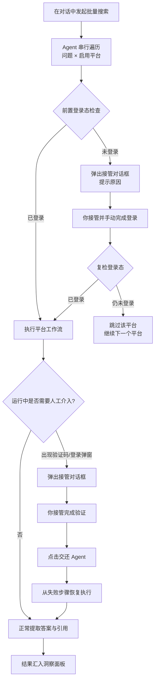

## 概述

GenAura 内置 5 个 AI 平台搜索工作流，覆盖 DeepSeek、通义千问、豆包、Kimi、腾讯元宝。每个工作流会自动在内嵌浏览器中导航到对应平台、输入品牌相关问题、等待 AI 回答完成，并提取「AI 回答正文 \+ 引用来源列表」结构化结果，最终汇入品牌指数、情感分析、偏好洞察等数据面板。

工作流运行过程中会持续检测登录态与验证码。一旦检测到登录态过期或人机验证，会暂停并向你请求接管浏览器——你在接管对话框中手动完成登录或验证后交还控制权，工作流会从失败步骤自动恢复执行。

读完本文，你将能够：

- 在品牌配置中启用或停用 AI 平台工作流，理解 5 个平台的差异
- 通过对话让 Agent 运行 5 个 AI 平台工作流进行批量搜索
- 在登录态过期或验证码弹出时完成接管与交还
- 查看工作流产出的「答案 \+ 引用来源」结果
- 通过定时任务周期性触发 5 个平台工作流

> 工作流的运行机制（运行流程、接管提示、异常处理）请先阅读 [工作流原理](/zh/concepts/02-workflow)。本文聚焦于「如何操作」。

## 前置条件

- 已登录 GenAura 账户并创建至少一个品牌（见 [登录与账户](/zh/getting-started/02-login-account)、[品牌管理](/zh/how-to/01-brand-management)）。
- 已在「品牌配置 → AI 平台跟踪」中启用至少一个 AI 平台（见 [品牌配置](/zh/how-to/02-brand-config)）。
- **首次运行某个 AI 平台工作流前，需确保该平台在内嵌浏览器中已登录**。工作流会在导航后自动检测登录态，未登录时将弹出接管对话框引导你完成登录。
- 已阅读 [内嵌浏览器](/zh/how-to/10-browser) 的接管对话框与登录态管理。

> 关于登录态存储：所有 AI 平台共用内嵌浏览器的同一份登录态存储。切换品牌无需重新登录，但在一台设备上登录的状态不会同步到另一台设备。

## 操作步骤

### 1. 启用 AI 平台工作流

5 个 AI 平台工作流在「品牌配置」Tab 的「AI 平台跟踪」分区中管理。

1. 切换到目标品牌，打开右侧面板「品牌配置」Tab。
2. 滚动到「AI 平台跟踪」分区，可见全部可跟踪平台列表。
3. 点击平台行右侧的开关启用或停用对应平台。

5 个平台均提供预定义工作流；「文心一言」暂未提供工作流，开关置灰并显示「敬请期待」徽标。

| 顺序 | 平台 | 是否支持工作流 |
| --- | --- | --- |
| 1 | DeepSeek | 是 |
| 2 | 豆包 | 是 |
| 3 | 通义千问 | 是 |
| 4 | Kimi | 是 |
| 5 | 腾讯元宝 | 是 |
| 6 | 文心一言 | 否（敬请期待） |

> 注意「通义千问」排在「Kimi」之前——这是为了让新品牌自动开启的前三个平台为 DeepSeek、豆包、通义千问。

#### 关键限制

- **同时启用数量上限为 3 个**。开启第 4 个平台时会提示已达上限。
- **新品牌自动开启前 3 个**：首次进入某个新品牌时，系统会按展示顺序自动启用 DeepSeek、豆包、通义千问。
- 全部关闭时会显示黄色警告，提示工作流将无平台可执行。

只有启用状态的平台，Agent 批量搜索与定时任务才会执行对应工作流。

### 2. 运行 AI 平台工作流

工作流统一遵循「打开页面 → 等待加载 → 输入问题 → 提交 → 等待 AI 回答 → 提取回答 → 展开引用 → 提取引用来源」的步骤模式，5 个平台的差异仅在编辑器类型、提交方式与引用来源提取方式上，由系统自动适配，你无需关心。

#### 2.1 通过对话让 Agent 执行批量搜索（推荐）

1. 在中间聊天区输入指令，例如：
   - 「对所有启用的平台执行一次品牌问答搜索」
   - 「用 DeepSeek 和通义千问搜索问题『{品牌} 的核心产品有哪些』」
2. Agent 会自动遍历所有「问题 × 启用平台」组合，逐个调用对应平台的工作流。
3. 执行完成后，Agent 会在对话中返回一份 Markdown 汇总报告，包含总计/成功/失败/跳过数量，以及失败详情（按平台分组）。

> 单次批量搜索最长可运行 120 分钟，可放心等待。也可通过定时任务周期性触发（见 [进阶用法](#进阶用法定时触发)）。

#### 2.2 5 个平台运行差异

5 个平台工作流均要求登录态，并支持失败后降级到 Agent 自愈模式。差异主要在编辑器类型与引用展开方式上，但最终都会产出统一的「答案 \+ 引用来源」结构，你无需关心具体差异。

| 平台 | 目标网址 |
| --- | --- |
| DeepSeek | [https://chat.deepseek.com/](https://chat.deepseek.com/) |
| 通义千问 | [https://www.qianwen.com/](https://www.qianwen.com/) |
| 豆包 | [https://www.doubao.com/](https://www.doubao.com/) |
| Kimi | [https://www.kimi.com/](https://www.kimi.com/) |
| 腾讯元宝 | [https://yuanbao.tencent.com/](https://yuanbao.tencent.com/) |

> 提示：工作流会自动将浏览器视口宽度调整为 500px，以触发各平台的「联网搜索」分支。这是经过验证的安全宽度，请勿干预。

### 3. 接管操作

工作流运行中遇到登录态过期或验证码时，会暂停并向你请求接管浏览器。接管是把浏览器控制权从 Agent 切换到你手中，让你手动完成登录或验证后再交还。

#### 3.1 何时会触发接管

| 触发场景 | 提示原因 | 说明 |
| --- | --- | --- |
| 前置登录态检查 | 「平台『X』未登录，请接管浏览器完成登录后交还控制权」 | 批量搜索前会逐个导航到各平台首页检测登录态，未登录时请求接管 |
| 工作流内登录态过期 | 「登录态过期，请重新登录（已自动打开登录窗口）」 | 工作流会在页面中自动点击登录按钮弹出登录窗口，再请求你接管扫码或输入账号 |
| 运行中弹出验证码 | 「检测到验证码，请接管完成验证」 | AI 平台检测到异常流量时弹出人机验证，需你手动完成滑块、拼图或点选验证 |
| 运行中弹出登录弹窗 | 「请接管完成登录」 | 部分平台未登录时提交问题会弹出登录遮罩，需你完成登录 |

#### 3.2 完成接管与交还

接管对话框位于内嵌浏览器 Tab 底部，不是独立弹窗。浏览器状态指示器会切换为「等待接管」（黄色脉冲）。

1. **接管**：底部提示条会显示具体接管原因，点击右侧「接管控制」按钮。状态切换为「用户控制」，此时你获得浏览器控制权。
2. **手动操作**：在浏览器中完成扫码登录、输入账号密码、滑块或拼图验证等操作。接管期间 Agent 不会操作浏览器。
3. **交还**：完成登录或验证后，点击底部提示条右侧的「交还 Agent」按钮，或按 `Esc` 键。状态切回「Agent 控制中」，工作流从失败步骤自动恢复执行。

> 提示：请等待页面跳转或登录完成后再点击「交还 Agent」，否则工作流复检登录态可能仍为未登录状态。

#### 3.3 工作流运行与接管流程

### 4. 查看结果（答案 \+ 引用来源）

每个工作流成功执行后，会从页面提取两类数据：

| 数据 | 说明 |
| --- | --- |
| **AI 回答正文** | AI 平台的回答内容，以 Markdown 格式保存 |
| **引用来源列表** | AI 回答中引用的网页来源，每条包含链接、标题、摘要（部分平台不提供摘要） |

#### 4.1 在界面中查看

落库后的结果通过右侧面板的三个数据洞察 Tab 查看：

| 查看场景 | 入口 | 说明 |
| --- | --- | --- |
| 查看单条问答的答案正文与引用来源 | 右侧面板「情感分析」Tab → 问答列表 → 点击某条问答打开「问答详情」对话框 | 对话框以 Markdown 渲染答案正文，并列出关联的引用来源（外链可在新窗口打开） |
| 查看品牌指数、AI 对话总量、提及率等综合指标 | 右侧面板「AI 洞察」Tab | 综合分析全局指标卡、品牌矩阵、行业竞品对比，可按时间/平台/问题类型筛选 |
| 查看信源分布、信源排名、信源对比 | 右侧面板「偏好洞察」Tab | 基于引用来源聚合的信源分析 |

详细查看操作见 [AI 洞察](/zh/how-to/14-insight)、[情感分析](/zh/how-to/15-emotion-analysis)、[偏好洞察](/zh/how-to/16-preference-insight)。

> 单次批量搜索的汇总报告（成功/失败/跳过计数、失败详情）由 Agent 直接在对话中返回，无需切换 Tab 即可看到本次执行结果。

## 进阶用法：定时触发

如需周期性监测多个 AI 平台（例如每天早上自动跑一遍品牌问答搜索），可配置定时任务，让系统按计划依次执行。

GenAura 为每个新品牌默认创建了「每日 AI 平台问答」定时任务（每天 10:30 自动执行），你可以在「定时任务」Tab 中查看与编辑。

1. 打开右侧面板「定时任务」Tab。
2. 找到「每日 AI 平台问答」任务，点击编辑可调整执行频率与任务内容。
3. 启用任务后，系统会按计划自动触发，走与手动触发相同的批量搜索流程。

> 注意：定时任务的执行依赖应用处于运行状态。若应用关闭或系统休眠，定时任务将无法自动执行——「定时任务」Tab 顶部会有黄色提示条说明此约束。如需避免系统休眠，可在「设置 → 通用」中开启防系统休眠开关（见 [设置](/reference/01-settings)）。

定时任务的完整配置（频率/时间、启用/停用/编辑/删除、运行状态）见 [定时任务](/zh/how-to/12-cron-tasks)。

## 常见问题

**Q1：工作流首次运行就弹出接管，提示需要登录？** A：5 个 AI 平台工作流均要求登录态。首次运行前请在 [内嵌浏览器](/zh/how-to/10-browser) 中手动访问该平台并完成登录。登录态会持久化保存，后续运行无需重复登录。

**Q2：批量搜索报告显示某平台被「跳过(未登录)」？** A：这是前置登录态检查的结果：该平台未登录，请求你接管后仍未登录，于是跳过该平台的所有任务。请在内嵌浏览器中重新登录该平台，下次执行时即可恢复。

**Q3：工作流运行中弹出「检测到验证码」怎么办？** A：这是正常的安全机制。AI 平台检测到异常流量时会弹出人机验证。点击接管提示条中的「接管控制」按钮，手动完成滑块/拼图/点选验证后点击「交还 Agent」，工作流会从失败步骤自动恢复执行。

**Q4：提示「用户未完成登录」但我在接管中确实登录了？** A：交还控制权后，工作流会重新检测登录态，若仍判定为未登录则抛出此错误。可能原因：

- 登录窗口未完全关闭或页面未完成跳转就点击了「交还 Agent」——请等待页面跳转完成后再交还。
- 平台登录态信号较弱——刷新页面后重新接管尝试。

**Q5：5 个平台的工作流能否同时运行？** A：不能。内嵌浏览器是单一浏览器实例，系统会串行遍历所有问题与平台组合。单次批量搜索中同一问题的所有平台会串行完成后再切到下一个问题，保证中途打断时已完成问题拥有全平台覆盖。如需周期性多平台监测，请配置定时任务。

**Q6：工作流失败后会自动重试吗？** A：工作流本身不自动重试。但 5 个 AI 平台工作流均支持失败后降级到 Agent 自愈模式：Agent 基于失败快照与失败步骤截图诊断原因，请求你接管修复，再精确重试失败的「问题 \+ 平台」组合（而非从头重跑所有平台）。

## 相关文档

- 前置阅读：[工作流原理](/zh/concepts/02-workflow) — 运行流程、接管提示、异常处理的详解
- 前置阅读：[品牌配置](/zh/how-to/02-brand-config) — 「AI 平台跟踪」分区位置
- 相关操作：[内嵌浏览器](/zh/how-to/10-browser) — 接管对话框、登录态管理
- 相关操作：[定时任务](/zh/how-to/12-cron-tasks) — 周期性触发工作流
- 概念解释：[洞察数据](/zh/concepts/03-insight-data) — 工作流结果如何汇入品牌指数与情感分析
- 数据查看：[AI 洞察](/zh/how-to/14-insight)、[情感分析](/zh/how-to/15-emotion-analysis)、[偏好洞察](/zh/how-to/16-preference-insight)

---

> 最后更新：2026-07-29 | 对应版本：v1.2.0