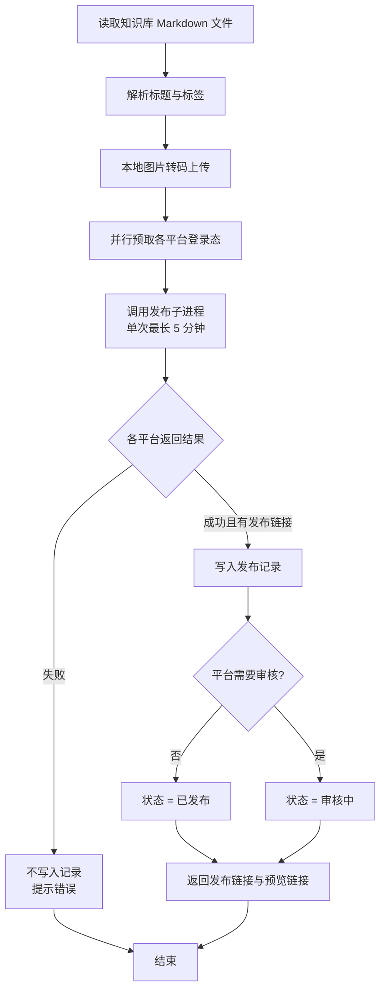
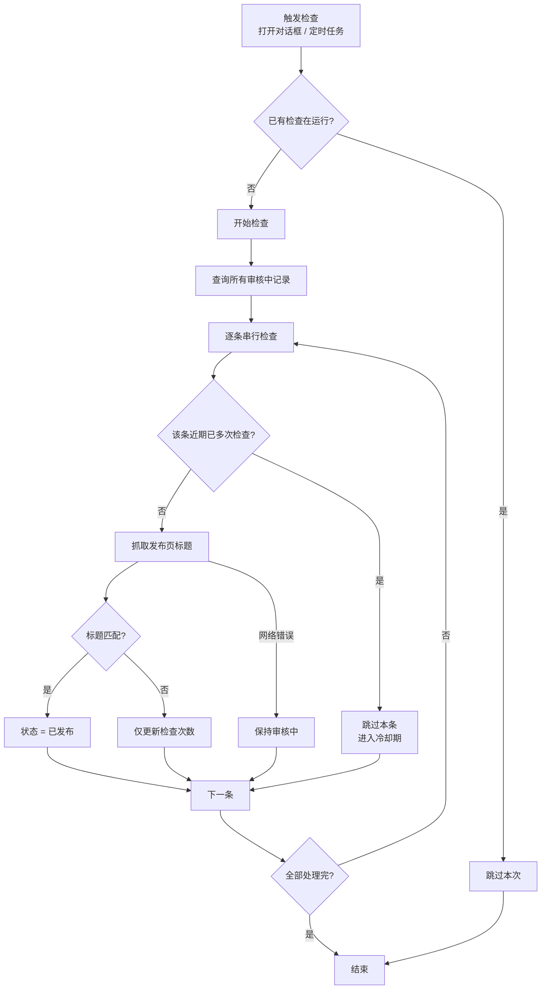

## 概述

GenAura 提供从知识库 Markdown 文章到多个内容平台的一键发布能力。在文件编辑器中打开一篇文章，点击「发布」按钮，系统会自动检测你在各平台的登录状态，并将文章投递到百家号、CSDN、搜狐号、掘金、知乎等内容平台。发布完成后，结果会记入发布记录，并根据平台是否需要审核自动跟踪发布状态。

读完本文，你将能够：

- 从文件编辑器进入发布对话框，识别各平台的登录状态
- 单平台或批量发布文章到百家号、CSDN、搜狐号、掘金
- 理解发布进度的四个阶段（校验登录 → 上传图片 → 发布中 → 完成）与 5 分钟超时兜底
- 查看发布记录、编辑/删除记录、人工标记状态
- 理解「审核中 / 已发布 / 已拒绝 / 未确认」四种状态及其自动检查机制
- 排查常见的发布失败原因（登录态过期、平台异常、超时等）

> 如果你想跑通「洞察 → 生成文章 → 编辑 → 发布」的完整端到端流程，请先阅读 [从洞察到发布文章](/tutorials/03-content-publish)。本文聚焦发布功能本身的操作细节。

## 前置条件

- 已登录 GenAura，并已在某个品牌工作区下打开知识库中的 Markdown 文件（`.md`）。发布入口仅在文件编辑器视图中可见，知识库列表或对话预览不提供发布按钮。
- 已在 GenAura 内嵌浏览器中登录过目标发布平台。GenAura 发布使用的是内嵌浏览器的登录态，与系统浏览器不共享。若未登录，可在发布对话框中点击「前往登录」补登。
- 当前文章位于知识库的某个系统目录下（如 GEO 内容、品牌画像等）。同一篇文章在不同路径下会被视为不同发布源，发布记录也会分别归档。

## 操作步骤

### 1. 进入一键发布入口

1. 在右侧面板切换到 **知识库** Tab，点击列表中的 `.md` 文件节点进入文件编辑器。
2. 在编辑器顶部操作区，点击带纸飞机图标的 **发布** 按钮。
3. 系统会先读取文件内容，再打开「发布文章到内容平台」对话框。如果文件读取失败，对话框不会打开。

### 2. 认识发布对话框

对话框打开后会并行完成三件事：

1. **加载平台列表**：仅展示当前可用的发布平台。
2. **检测登录状态**：对每个平台并行检测当前是否已登录，并返回登录账号名。
3. **统计发布记录数**：查询当前文章在各平台的历史发布记录数，展示为「发布记录 (N)」按钮。

同时，对话框打开时还会自动触发一次后台状态检查，刷新当前品牌下所有「审核中」记录的最新状态。

对话框布局：

- **标题栏**：显示「发布文章到内容平台」与当前文件的中文显示路径（如「GEO 内容/xxx.md」）。
- **平台列表区**：每个平台一张卡片。
- **底部操作区**：默认显示「批量发布」按钮；进入批量模式后切换为「暂不发布」\+「发布到 N 个平台」。

### 3. 选择目标平台

当前支持发布到以下 5 个平台：

| 平台 | 是否需要审核 | 发布成功后初始状态 |
| --- | --- | --- |
| 百家号 | 否 | 已发布 |
| CSDN | 否 | 已发布 |
| 搜狐号 | 是 | 审核中 |
| 掘金 | 是 | 审核中 |
| 知乎 | 是 | 审核中 |

每个平台卡片会展示以下登录状态标签之一：

- **正在检测登录状态...**（带旋转图标）：初次加载中。
- **已登录**（绿色）：若检测到账号名，则显示账号名（可点击打开平台首页）；否则显示「已登录」标签。
- **未登录**（琥珀色）：需先点击「前往登录」。
- **错误**（红色）：检测异常，会显示错误信息或回退为「未登录」。

#### 3.1 单平台发布

在非批量模式下，每张已登录的平台卡片右侧会显示两个按钮：

- **发布记录 (N)**：打开该平台对此文章的历史发布记录弹窗（见步骤 6）。
- **发布**（纸飞机图标）：触发单平台发布，会先弹出二次确认弹窗。

未登录或登录错误的卡片则显示 **前往登录** 按钮，点击后会打开平台登录页（标题为「{平台名} - 登录」）。登录成功后系统会自动关闭该登录窗口，并提示「{平台} 登录成功」。

#### 3.2 批量发布

1. 点击底部 **批量发布** 按钮进入批量模式。
2. 此时所有「已登录且非发布中」的卡片左侧会出现复选框，并默认全选。顶部出现 **全选 / 取消全选** 按钮。
3. 勾选或取消勾选单个平台后，底部主按钮文案动态变化：
   - 未选任何平台 → 「选择平台」（按钮禁用）
   - 已选 N 个 → 「发布到 N 个平台」
4. 点击主按钮触发批量发布，同样会先弹出二次确认弹窗。
5. 批量发布完成后会自动退出批量模式并清空选中。

### 4. 发布流程与预览链接

#### 4.1 二次确认

无论是单平台还是批量发布，点击发布按钮后都会先弹出 **发布确认** 弹窗：

- 标题：「发布确认」
- 单平台文案：「文章即将发布至以下平台：」
- 批量文案：「文章即将批量发布至 N 个平台：」
- 卡片内展示 **目标文件**（显示文件标题或中文路径）与 **目标平台**（平台图标 \+ 名称列表）
- 按钮：「确认并发布」/「暂不发布」

只有点击「确认并发布」后才会真正执行发布。

#### 4.2 发布执行流程

点击确认后，系统会按以下流程执行发布：

关键细节：

- **超时兜底**：单次发布最长等待 5 分钟。超时会提示「投放操作超时（5分钟）」，可重试。
- **进度推送**：发布过程中，平台卡片下方会实时显示进度条与阶段文案。进度阶段包括：
  - 「校验登录」
  - 「上传图片」
  - 「发布中」
  - 「完成」
- **本地图片处理**：Markdown 中引用的相对路径本地图片（支持 PNG / JPG / JPEG / GIF / WEBP / SVG / BMP）会被自动上传到目标平台图床。不支持的格式或文件缺失会提示「部分图片未上传（N 张）」。
- **标题解析**：优先解析文章开头的 YAML front matter 中的 `title` 字段；其次从第一个 `# 标题` 行提取；均无则使用「未命名文章」。`tags` 字段支持单行或多行两种格式。
- **预览链接**：对于需要审核的平台，系统会同时保存「发布链接」与「预览链接」。审核期间预览链接仍可访问，便于你在发布记录中查看文章内容。

### 5. 发布状态检查（进行中 / 成功 / 失败 / 审核中）

#### 5.1 发布瞬间的界面反馈

发布执行期间，相关平台卡片会进入发布中状态：

- **进行中**：卡片左侧显示旋转图标，下方显示进度条（阶段文案 \+ 百分比）。批量模式下底部主按钮显示「发布中...」。
- **成功**：提示「发布成功」；该平台卡片的「发布记录 (N)」计数会自动 \+1。
- **失败**：提示「{平台}: {错误信息}」；卡片状态回到「已登录」，可重试。**失败的发布不会写入发布记录**。

#### 5.2 发布记录的初始状态

只有发布成功且平台返回了发布链接时，记录才会被写入发布记录。初始状态由平台是否需要审核决定（见步骤 3 的表格）：

- 百家号、CSDN → 已发布
- 搜狐号、掘金 → 审核中

#### 5.3 自动状态检查机制

对于「审核中」的记录，系统会周期性地检查发布链接是否可达且标题是否匹配，匹配成功则自动转为「已发布」。检查机制遵循以下规则：

为避免对平台造成过大压力，系统采用串行检查并设有冷却机制：每条记录每检查若干次后会进入一段冷却期，期间跳过该条。当一条记录累计检查次数达到上限仍未确认发布结果时，系统会停止自动检查并将其标记为「未确认」，此时需要你人工核实。

触发检查的时机包括：

- 每次打开发布对话框时自动触发一次。
- 系统定时任务周期性触发。

#### 5.4 四种状态与文案

发布记录列表中每条记录的状态标签：

| 状态 | 文案 | 颜色 | 含义 |
| --- | --- | --- | --- |
| 已发布 | 已发布 | 绿色 | 文章已通过审核并正式发布 |
| 审核中 | 审核中 | 琥珀色 | 文章已提交，等待平台审核通过 |
| 已拒绝 | 已拒绝 | 红色 | 文章被平台拒绝发布 |
| 未确认 | 未确认 | 灰色 | 系统已多次检测但未确认发布结果，请人工核实 |

「未确认」状态下，悬浮状态标签会弹出气泡，内含两个操作按钮：「标记为已发布」、「标记为已拒绝」，便于你人工修正状态。

### 6. 查看发布记录

点击任意平台卡片的「发布记录 (N)」按钮，打开该平台对此文章的历史发布记录弹窗。

- 弹窗标题：「{平台名} 发布记录」。
- 弹窗内按当前文章 \+ 当前平台过滤，全量展示历史记录。

每条记录展示：

- **标题**（可点击）：有标题时显示标题（下方小字显示截断链接）；无标题时直接显示截断链接。点击行为：
  - 已发布 → 在系统默认浏览器打开正式发布链接。
  - 其他状态 → 在 GenAura 内嵌浏览器窗口打开（优先使用预览链接，回退到正式发布链接）。
- **状态标签**：见步骤 5.4。
- **渠道名**：从发布链接解析的域名（如 `juejin.cn`）。
- **发布日期**、**引用次数**、**最近引用时间**：引用次数用于评估文章被 AI 平台搜索结果引用的情况，是衡量 GEO 效果的重要指标。
- **操作按钮**（悬浮时显示）：
  - **编辑**（铅笔图标）：展开内联表单，修改发布链接。链接变更时会重新解析渠道、抓取新标题，并将状态重置为「已发布」。
  - **删除**（垃圾桶图标）：弹出删除确认弹窗，确认后删除该记录。

## 进阶用法

- **后台状态预热**：每次打开发布对话框时，系统会自动在后台检查当前品牌下所有「审核中」记录的最新状态，无需手动刷新。
- **基于已有素材迭代文章**：在知识库中选中已有 `.md` 文件，选中段落点击「添加至对话」，再输入 `/` 选择「生成 GEO 文章」，AI 会结合被引用片段生成新版本。详见 [命令与 @提及](/how-to/05-commands-mentions)。
- **front matter 自动解析**：文章若以 YAML front matter 开头（`---\ntitle: ...\ntags: [...]\n---`），发布时会自动解析 `title` 与 `tags` 字段并传入平台；若无 front matter，则从第一个 `# 标题` 行提取。
- **本地图片自动上传**：在 Markdown 中引用相对路径的本地图片，发布时系统会自动转码并上传到目标平台图床，无需手工处理。
- **发布源归档**：同一文件路径的多次发布会归集到同一发布源下，便于在「发布记录」中查看历史。文件移动路径后会视为新发布源。
- **人工干预状态**：当系统多次检查仍未确认发布结果时，记录会显示「未确认」，可在状态标签的气泡中手动「标记为已发布」或「标记为已拒绝」。
- **引用次数追踪**：发布成功后，系统会统计该文章被 AI 平台搜索结果引用的次数，可在发布记录中查看，用于评估 GEO 效果。

## 常见问题

**Q1：发布对话框里看不到任何平台卡片，显示「暂无可用平台」。** A：当前应用支持百家号、CSDN、搜狐号、掘金 4 个平台。如全部加载失败，可能是发布子进程启动异常，请重启应用后再试；如持续异常请联系管理员排查。

**Q2：平台显示「未登录」，但我在系统浏览器里已经登录过。** A：GenAura 发布使用的是内嵌浏览器的登录态，与系统浏览器不共享。请在发布对话框点击该平台的「前往登录」打开内嵌登录窗口，登录成功后窗口会自动关闭并提示「{平台} 登录成功」。

**Q3：发布卡在「发布中...」超过 5 分钟。** A：单次发布最长等待 5 分钟，超时会提示「投放操作超时（5分钟）」。常见原因是目标平台异常或网络不通，请重试；如持续失败请检查平台账号权限或更换网络环境。

**Q4：发布成功但状态显示「审核中」一直不变。** A：搜狐号、掘金这类需要审核的平台，文章需平台人工审核。GenAura 会周期性检查发布链接是否可达且标题匹配，匹配成功则自动转为「已发布」。为避免频繁请求，检查设有冷却期；累计检查达到上限仍未确认则显示「未确认」，此时可在发布记录的状态气泡中手动「标记为已发布」。

**Q5：发布失败后能在哪里看错误详情？** A：失败的发布不入记录，只在提示中显示「{平台}: {错误信息}」。常见错误：

- 登录态过期：需重新登录。
- 平台异常：平台 API 异常，请重试。
- 超时：5 分钟超时。
- 参数校验失败：如品牌信息异常，请检查品牌配置。

**Q6：能否发布到知乎、微博、微信公众号等其他平台？** A：当前版本支持百家号、CSDN、搜狐号、掘金、知乎 5 个平台，其余平台将在后续版本逐步开放。

**Q7：发布记录里的「未确认」状态是什么意思？** A：当一条「审核中」记录被系统检查多次仍未匹配到标题（可能平台审核未通过、页面无法访问或标题被改写），系统会停止自动检查并标记为「未确认」。此时需要人工核实后，在状态标签的气泡中手动「标记为已发布」或「标记为已拒绝」。

**Q8：编辑发布记录的链接后状态为什么变成了「已发布」？** A：修改发布链接时，系统会重新解析渠道、抓取新标题，并将状态重置为「已发布」（因为新链接对应新内容，默认视为已发布）。如需调整为其他状态，可在「未确认」状态下通过状态气泡手动修改。

## 相关文档

- 端到端教程：[从洞察到发布文章](/tutorials/03-content-publish) — 洞察 → 生成 → 编辑 → 发布的完整链路。
- 操作指南：
  - [08 知识库管理](/how-to/08-knowledge-base) — GEO 内容系统目录、文件导入与搜索。
  - [09 文件编辑器](/how-to/09-file-editor) — 编辑器能力、可编辑/预览类型、导出格式、自动保存与草稿恢复。
  - [10 内嵌浏览器](/how-to/10-browser) — 内嵌浏览器与登录态管理。
  - [05 命令与 @提及](/how-to/05-commands-mentions) — `/` 命令生成 GEO 文章。
- 故障排查：[troubleshooting.md](/troubleshooting) — 「发布失败」「登录态过期」相关章节。

---

> 最后更新：2026-07-29 | 对应版本：v1.2.0