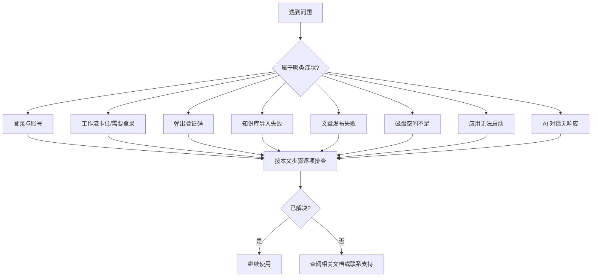

## 概述

本篇按**你能感知到的症状**组织 GenAura 使用过程中的常见故障，每个症状给出**可能原因**与**解决步骤**，便于在出现问题时快速对号入座并自助排查。

> 阅读建议：先按"症状"对号入座，再按"解决步骤"逐项操作；若仍无法解决，请参考末尾"相关文档"深入对应模块文档，或前往[常见问题](/faq)查看是否有同款疑问。

## 前置条件

- 已按 [安装指南](/getting-started/01-installation) 完成安装并首次启动。
- 已按 [登录与账号](/getting-started/02-login-account) 登录账号并进入工作区。
- 出现问题前应用处于正常工作状态（未提示磁盘空间不足、未崩溃）。
- 出现工作流相关问题时，请先确认内嵌浏览器中目标 AI 平台已登录（见 [内嵌浏览器](/how-to/10-browser) 的登录态管理）。

---

## 一、登录与账号

涉及登录入口的各类失败提示，包括登录页提示、登录回跳失败、登录态过期等。

### 症状 A：点击「使用网页登录」后浏览器没打开

**可能原因**：

- 系统未设置默认浏览器。
- 应用唤起浏览器时发生错误。
- 网络连接异常。

**解决步骤**：

1. 在系统设置中确认已指定默认浏览器。
2. 若登录页提示「无法打开登录页面，请检查默认浏览器设置」，重设默认浏览器后重试。
3. 若登录页提示「无法打开登录页面，请检查网络连接」，检查网络后重试。
4. 持续失败请重启 GenAura 后再次尝试。

### 症状 B：浏览器登录成功后桌面端没反应

**可能原因**：

- 应用专用回跳协议未注册成功，或被其他同名应用抢占。
- 浏览器询问"是否打开 GenAura"时被拒绝。
- 桌面端窗口未就绪。

**解决步骤**：

1. 在浏览器弹窗中允许打开 GenAura。
2. 检查是否有其他应用注册了同名回跳协议造成冲突。
3. 重启 GenAura，重新点击「使用网页登录」走一次完整流程。
4. 仍无反应时重新安装应用以修复协议注册。

### 症状 C：登录页提示「登录失败，请重试」

**可能原因**：登录回跳后换取登录凭证失败的兜底提示。具体原因会被映射为更精确的文案。

**解决步骤**：

1. 阅读登录页红色提示框中的具体文案：
   - 「登录码已过期，请重新登录」→ 登录流程耗时过长，请重新发起。
   - 「登录状态校验失败，请重新登录」→ 校验未通过，请重新发起。
   - 「网络连接错误」/「操作超时」→ 检查网络后重新发起。
2. 重新点击「使用网页登录」发起一次新的登录流程。

### 症状 D：提示「登录请求已失效，请重新发起登录」

**可能原因**：登录流程耗时过长导致应用重启过、或同时发起了多次登录请求。

**解决步骤**：重新点击「使用网页登录」即可发起一次新的登录流程。

### 症状 E：使用过程中突然提示「登录已过期，请重新登录」

**可能原因**：登录凭证过期后自动刷新失败。常见根因：

- 刷新凭证已过期或被服务端吊销。
- 网络长时间不可用。
- 在另一台设备退出登录导致凭证失效。

**解决步骤**：

1. 重新点击「使用网页登录」走完整登录流程。
2. 若持续出现，检查系统时间是否准确（影响凭证有效期判断）。
3. 若网络不稳定，先确认网络恢复后再重试。

> 进一步阅读：[登录与账号 - 常见问题](/getting-started/02-login-account#常见问题)。

---

## 二、工作流卡住或提示需要登录

5 个 AI 平台搜索工作流（DeepSeek / 通义千问 / 豆包 / Kimi / 腾讯元宝）执行过程中出现的卡顿、超时、中止、要求登录等问题。

### 症状 A：工作流长时间无响应，最终提示「等待超时」

**可能原因**：

- 目标平台页面加载缓慢或网络不通。
- AI 答案正在流式输出，长时间未稳定。
- 平台未触发联网搜索，导致引用来源按钮迟迟不出现（如通义千问的部分查询）。

**解决步骤**：

1. 查看错误信息中的等待条件，定位是哪个环节超时：
   - "等待页面加载"超时 → 检查网络，确认平台可正常访问。
   - "等待答案生成"超时 → 平台未响应或未触发搜索，可调整查询关键词后重试。
   - "等待内容稳定"超时 → 流式输出未稳定，可适当延长等待或重试。
2. 在内嵌浏览器中手动访问该平台，确认是否能正常搜索。
3. 通义千问若提示来源按钮未出现，说明该查询未触发联网搜索，可调整查询关键词后重试。
4. 工作流失败后会自动降级到 AI 助手自愈模式：AI 助手会基于失败快照诊断原因，通过接管让你修复后从失败步骤恢复执行，无需手动重跑前置步骤。

### 症状 B：工作流被中止，提示「用户正在接管浏览器，工作流执行中止」

**可能原因**：这是正常的冲突保护机制。当你已接管浏览器时，工作流会立即中止，避免 AI 助手与你同时操作浏览器。

**解决步骤**：

1. 在接管对话框中完成需要的操作（登录/验证码）后，点击「释放」将控制权交还。
2. 工作流中止后不会自动续跑，需重新发起（或由 AI 助手从失败步骤恢复）。

### 症状 C：工作流被中止，提示「执行已中止」

**可能原因**：工作流执行被主动取消（如你手动取消、或上层任务取消）。

**解决步骤**：重新发起工作流即可。

### 症状 D：步骤提示「未找到元素」

**可能原因**：

- 平台页面改版导致元素结构变化。
- 平台未触发预期交互（如未联网搜索导致来源按钮不出现）。

**解决步骤**：

1. 查看错误信息中附带的页面文本摘要，判断页面实际状态。
2. 若是平台改版导致，需等待 GenAura 更新工作流定义（由维护者处理）。
3. 失败后会自动截图并刷新页面快照，AI 助手可基于最新快照诊断后从失败步骤恢复。

### 症状 E：工作流首次运行就弹出接管，提示需要登录

**可能原因**：5 个 AI 平台工作流均要求登录态。首次运行前未在该平台登录过。

**解决步骤**：

1. 首次运行某个 AI 平台工作流前，先在「浏览器」Tab 中手动访问该平台并完成登录。
2. 登录态存储在内嵌浏览器的独立会话中，后续运行无需重复登录。
3. 若工作流运行时弹出接管对话框，点击「接管」手动登录后点击「释放」即可恢复执行。

> 进一步阅读：[AI 平台工作流](/how-to/11-ai-platform-workflows)、[工作流原理 - 接管机制](/concepts/02-workflow)。

---

## 三、弹出验证码或登录弹窗拦截

工作流执行中检测到页面需要人工干预（登录态过期、验证码），弹出接管对话框。

### 症状 A：接管对话框提示「页面跳转到了登录页面，登录态可能已过期」

**可能原因**：工作流检测到页面跳转到了登录页面（URL 或标题含"登录"字样，且页面存在密码输入框）。

**解决步骤**：

1. 在接管对话框点击「立即接管」，浏览器会自动切换到内嵌浏览器。
2. 在登录页面完成登录（账号密码或扫码）。
3. 等待页面跳转完成、登录窗口完全关闭后，点击「释放」交还控制权。
4. 工作流会从失败步骤自动恢复执行。

### 症状 B：接管对话框提示「检测到登录弹窗，登录态可能已过期或匿名使用次数已耗尽」

**可能原因**：工作流检测到页面中弹出了登录窗口（可能是浮层弹窗或嵌入式登录框）。常见于未登录状态下提交问题，平台弹出扫码登录或手机号登录浮层。

**解决步骤**：同症状 A——点击「立即接管」完成登录后点击「释放」。

### 症状 C：接管对话框提示「检测到验证码/人机验证页面，需要用户手动完成验证」

**可能原因**：AI 平台检测到异常流量时弹出人机验证（滑块、拼图、点选等）。

**解决步骤**：

1. 点击「立即接管」进入内嵌浏览器。
2. 手动完成滑块/拼图/点选等验证。
3. 验证通过后点击「释放」，工作流从失败步骤恢复执行。

> 说明：豆包平台的验证码检测规则额外覆盖了"拖拽/拖动/滑块/拼图/图形验证/安全验证"等中文关键词，识别更敏感。

### 症状 D：接管后提示「用户未完成登录」

**可能原因**：你接管后释放控制权时，工作流重新检测登录态仍未通过。常见原因：

- 登录窗口未完全关闭、页面未完成跳转就点击了「释放」。
- 平台登录态检测信号较弱。

**解决步骤**：

1. 重新接管，确保登录流程完整走完（页面跳转完成、用户头像或昵称出现）。
2. 若检测信号持续较弱，在内嵌浏览器中手动刷新页面后再释放。
3. 仍不行时，参考 [内嵌浏览器 - 登录态管理](/how-to/10-browser) 重新建立登录态。

> 进一步阅读：[内嵌浏览器 - 浏览器接管对话框](/how-to/10-browser)、[工作流原理 - 接管机制](/concepts/02-workflow#接管机制)。

---

## 四、知识库导入失败

知识库导入分为「本地文件导入」与「URL 导入」两条路径，错误提示各不相同。

### 症状 A：导入对话框提示「文件大小超过限制，请选择小于 20MB 的文件」

**可能原因**：单文件超过 20 MB 上限。

**解决步骤**：

1. 检查文件大小，确认超过 20 MB。
2. 拆分或压缩文件后重新选择（如把长 PDF 拆分为多个小 PDF，或把 docx 内容粘贴为 md）。
3. 重新发起导入。

### 症状 B：导入对话框提示「不支持的文件格式」

**可能原因**：选择了不支持的扩展名。当前**仅支持导入 4 种格式**：md / txt / docx / pdf。

> 注意：csv / xlsx / xls / 图片等格式只能在 [文件编辑器](/how-to/09-file-editor) 中**预览**，不能导入知识库。

**解决步骤**：

1. 确认文件扩展名为 md / txt / docx / pdf 之一。
2. 若为其他格式，先转换为支持的格式（如把 csv 转 md）。
3. 重新发起导入。

### 症状 C：导入 PDF 后弹出提示「目前暂不支持扫描件」

**可能原因**：PDF 是扫描件（图像型 PDF，没有文本层）。系统依赖文本层提取文字，扫描件无法识别。

**解决步骤**：

1. 改用文本型 PDF（可直接复制出文字的 PDF）。
2. 或先用 OCR 工具将扫描件转为 md/txt 后再导入。

### 症状 D：导入失败提示「文件已存在，请勿重复上传」

**可能原因**：当前品牌下已存在内容完全相同的文件，或已导入过相同的 URL。

**解决步骤**：

1. 在知识库列表中搜索是否已有该文件。
2. 若需重新导入，先删除原文件后再导入。

### 症状 E：导入 PDF/docx 提示「文件解析失败，请检查文件格式是否正确」

**可能原因**：文件已损坏或为加密 PDF。具体提示会区分：

- 加密 PDF：「无法解析加密的 PDF 文件，请先解除密码保护」
- 损坏文件：「文件已损坏，无法解析」

**解决步骤**：

1. 加密 PDF：先解除密码保护后重试。
2. 损坏文件：尝试重新下载或另存一份。
3. 仍失败时改为 md/txt 手动录入。

### 症状 F：批量导入汇总显示「N 个成功，M 个失败」

**可能原因**：批量导入对每个文件独立处理，单文件失败不影响后续。失败原因会在汇总区按文件列出。

**解决步骤**：

1. 在汇总区查看每个失败文件的具体错误，对照症状 A–E 排查。
2. 修正后可点击「重试」重新选择并导入失败的文件。

### 症状 G：URL 导入提示「URL 格式无效，请检查后重试」

**可能原因**：URL 不完整或协议不是 http/https。

**解决步骤**：

1. 检查 URL 是否完整（含 http:// 或 https:// 前缀）。
2. 若提示「不支持的 URL 协议，仅支持 http:// 和 https://」，将协议改为 http(s)。

### 症状 H：URL 导入提示「无法抓取网页内容，请手动粘贴正文」

**可能原因**：

- 目标站点返回错误（如 403 禁止访问、404 不存在、500 服务器错误）。
- 抓取超时（30 秒内未响应）。
- 网络中断或 DNS 解析失败。

**解决步骤**：

1. 在浏览器中手动访问该 URL 确认状态。
2. 若站点有反爬限制（403）或登录墙，改为手动复制正文到知识库新建 md 文件。
3. 检查网络连接是否稳定。

> 进一步阅读：[知识库 - 导入本地文件 / 导入 URL / 常见错误](/how-to/08-knowledge-base)。

---

## 五、文章发布失败

一键发布文章到百家号、搜狐号、CSDN、掘金等平台时的失败提示。

### 症状 A：发布卡在「发布中...」超过 5 分钟

**可能原因**：发布操作设置了 5 分钟超时兜底，超时会提示「投放操作超时（5分钟）」。常见根因为目标平台 API 异常或网络不通。

**解决步骤**：

1. 检查网络连接。
2. 重试发布；如持续失败请检查平台账号权限或换网络环境。

### 症状 B：发布失败提示「登录态过期」或「auth\_expired」

**可能原因**：平台登录态过期（Cookie 失效）。

**解决步骤**：

1. 在发布对话框中找到该平台卡片，点击「前往登录」打开内嵌登录窗口。
2. 完成登录后窗口会自动关闭并提示「{平台} 登录成功」。
3. 重新发布。

> 说明：GenAura 发布使用的是内嵌浏览器的独立会话，与系统浏览器不共享，必须在发布对话框内重新登录。

### 症状 C：发布失败提示「外部服务调用失败」或「external\_api\_error」

**可能原因**：目标平台 API 异常（如限流、服务端错误、参数被拒）。

**解决步骤**：

1. 稍后重试发布。
2. 若持续失败，检查文章内容是否触发平台审核策略（如包含敏感词）。
3. 可尝试换一个平台发布或手动登录平台网页端发布。

### 症状 D：发布失败提示「平台未注册」或「platform\_not\_registered」

**可能原因**：平台适配器加载失败。

**解决步骤**：

1. 重启应用看适配器是否正常加载。
2. 联系管理员排查发布子进程。

### 症状 E：发布成功但状态一直显示「审核中」

**可能原因**：搜狐号、掘金这类需要人工审核的平台，文章需平台审核完成后才会转为「已发布」。GenAura 会周期性检查发布链接是否可达且标题匹配，匹配成功则自动转为「已发布」。

**解决步骤**：

1. 耐心等待平台审核完成，状态会自动转为「已发布」。
2. 若系统多次检查仍未确认（状态显示「未确认」），可在发布记录中手动「标记为已发布」或「标记为已拒绝」。
3. 网络错误不会改变状态，恢复网络后会继续检查。

### 症状 F：发布失败的记录在哪里看？

**说明**：失败的发布**不会写入发布记录**，只在发布完成时的提示框中显示「{平台}: {错误信息}」。如需保留失败记录，请手动截图或记录。

> 进一步阅读：[文章一键发布 - 发布状态检查](/how-to/13-article-publish)。

---

## 六、磁盘空间不足

GenAura 内置磁盘空间守护机制，监测应用数据所在磁盘的可用空间。

### 症状 A：弹出系统通知或应用内提示「软件数据空间不足」

**可能原因**：数据目录剩余空间低于 1024 MB（警告级别）。

**解决步骤**：

1. 清理数据目录所在磁盘的空间（删除不需要的文件、清空回收站等）。
2. 重启应用后告警状态会自动重置（空间回到安全线后立即重置）。
3. 清理 GenAura 知识库中不再使用的文件（特别是大体积 PDF/DOCX 原件）。

### 症状 B：弹出系统通知或应用内提示「软件数据空间严重不足」

**可能原因**：数据目录剩余空间低于 500 MB（严重级别）。**此时本地数据库已有损坏风险**。

**解决步骤**：

1. **立即清理数据目录所在磁盘**，确保剩余空间回到 500 MB 以上。
2. 若数据库已损坏（应用启动异常、数据丢失），可能需要重建本地数据。
3. 严重级别告警会响铃，且自动更新下载会被暂停，避免下载占满磁盘。
4. 空间恢复到安全线后，自动更新下载会自动恢复。

### 症状 C：磁盘空间不足导致自动更新无法下载

**可能原因**：磁盘空间不足时，应用会自动暂停更新包的下载。

**解决步骤**：

1. 清理磁盘空间至安全线以上。
2. 应用会自动恢复更新下载。
3. 也可在「设置 → 关于 → 更新」中手动触发检查更新。

### 告警机制补充说明

- **检测频率**：默认每 10 分钟检测一次，启动时立即检测一次。
- **冷却**：告警后 24 小时内不重复弹窗，除非状态恶化升级（如警告 → 严重）。
- **提示方式**：应用在前台时通过应用内提示展示；在后台时通过系统通知（警告级别静音、严重级别响铃）。

> 进一步阅读：[更新与维护参考 - 磁盘空间告警](/reference/02-update-maintenance#磁盘空间告警)。

---

## 七、应用无法启动

### 症状 A：双击应用图标后没有反应

**可能原因**：

- 应用进程残留导致新实例无法启动。
- 系统资源不足。
- 应用数据损坏。

**解决步骤**：

1. 打开任务管理器（Windows）或活动监视器（macOS），结束所有 GenAura 进程后重试。
2. 重启电脑后再次尝试启动。
3. 若仍无法启动，可能是本地数据损坏，联系支持人员排查。

### 症状 B：macOS 提示"来自身份不明的开发者"或"已损坏"

**可能原因**：应用未经过 macOS 代码签名。

**解决步骤**：

1. **首次启动右键打开**：在「应用程序」中右键点击 GenAura →「打开」→ 确认框中点击「打开」（仅需一次）。
2. **系统设置放行**：「系统设置 → 隐私与安全性」→ 滚动到底部点击「仍要打开」。
3. 若 dmg 提示"映像已损坏"，通常是下载不完整，请重新下载并校验文件大小。

### 症状 C：Windows 安装时被 SmartScreen 拦截

**可能原因**：安装包未通过代码签名。

**解决步骤**：在 SmartScreen 弹窗中点击「更多信息」→「仍要运行」即可继续安装。

> 进一步阅读：[安装指南 FAQ](/getting-started/01-installation#常见问题)。

---

## 八、AI 对话无响应

### 症状 A：发送消息后长时间没有回复

**可能原因**：

- 网络连接异常。
- AI 服务繁忙或响应缓慢。
- 输入内容过长超出模型上下文限制。

**解决步骤**：

1. 检查网络连接是否正常。
2. 等待片刻后重试；AI 正在响应时发送按钮会变为红色停止按钮，点击可中断当前响应。
3. 若提示「输入内容超出模型上下文长度限制，请缩短输入后重试」，精简输入内容（如减少 @提及的知识库文件、缩短对话历史），或新建对话重新发起。

### 症状 B：AI 对话返回「AI 服务请求频率超限，请稍后再试或升级套餐」

**可能原因**：短时间内请求过多触发 AI 服务限流。

**解决步骤**：

1. 稍候片刻降低请求频率后重试。
2. 联系管理员检查套餐配额或升级套餐。

### 症状 C：AI 对话返回「AI 服务额度已用尽，请充值或检查账户余额」

**可能原因**：AI 服务账户余额不足。

**解决步骤**：联系管理员充值或检查账户余额。

### 症状 D：操作失败提示「网络连接错误」

**可能原因**：网络中断或请求被拦截。

**解决步骤**：

1. 检查网络连接是否正常。
2. 确认是否有防火墙或代理拦截了对 GenAura 服务端的请求。
3. 恢复网络后重试。

### 症状 E：操作失败提示「操作超时」

**可能原因**：请求超时。

**解决步骤**：

1. 稍后重试。
2. 若持续超时，检查网络稳定性。

### 症状 F：操作失败提示「操作失败，请稍后重试」

**可能原因**：这是通用兜底提示，用于隐藏技术细节。可能由后端内部错误等触发。

**解决步骤**：

1. 稍后重试。
2. 若持续出现，记录操作场景并联系管理员排查。

### 症状 G：浏览器 Tab 提示「浏览器已被关闭」/「浏览器崩溃或无响应」/「浏览器操作超时」/「浏览器导航失败」

**可能原因**：内嵌浏览器进程异常。

**解决步骤**：

1. 重启应用。
2. 若频繁崩溃，检查系统内存是否充足。
3. 浏览器导航失败时检查目标 URL 是否可访问。

> 进一步阅读：[消息发送 FAQ](/how-to/04-messaging#常见问题)。

---

## 相关文档

- 入门：
  - [安装指南](/getting-started/01-installation)
  - [登录与账号](/getting-started/02-login-account)（含登录常见问题）
  - [界面总览](/getting-started/04-interface-overview)
- 概念：
  - [工作流原理](/concepts/02-workflow)（异常检测、接管机制、工作流中止与恢复）
  - [AI Agent 协作模型](/concepts/04-ai-agent)（子代理与人工审批）
- 操作指南：
  - [知识库](/how-to/08-knowledge-base)（导入限制、URL 导入常见错误）
  - [文件编辑器](/how-to/09-file-editor)（可编辑/预览类型）
  - [内嵌浏览器](/how-to/10-browser)（接管对话框、登录态管理）
  - [AI 平台工作流](/how-to/11-ai-platform-workflows)（运行、接管、结果）
  - [定时任务](/how-to/12-cron-tasks)（周期性运行工作流）
  - [文章一键发布](/how-to/13-article-publish)（发布状态检查机制、常见问题）
- 参考：
  - [设置](/reference/01-settings)
  - [更新与维护](/reference/02-update-maintenance)（自动更新、磁盘空间告警）
  - [数据隐私](/reference/03-data-privacy)
- 常见问题：[faq.md](/faq)

---

> 最后更新：2026-07-29 | 对应版本：v1.2.0