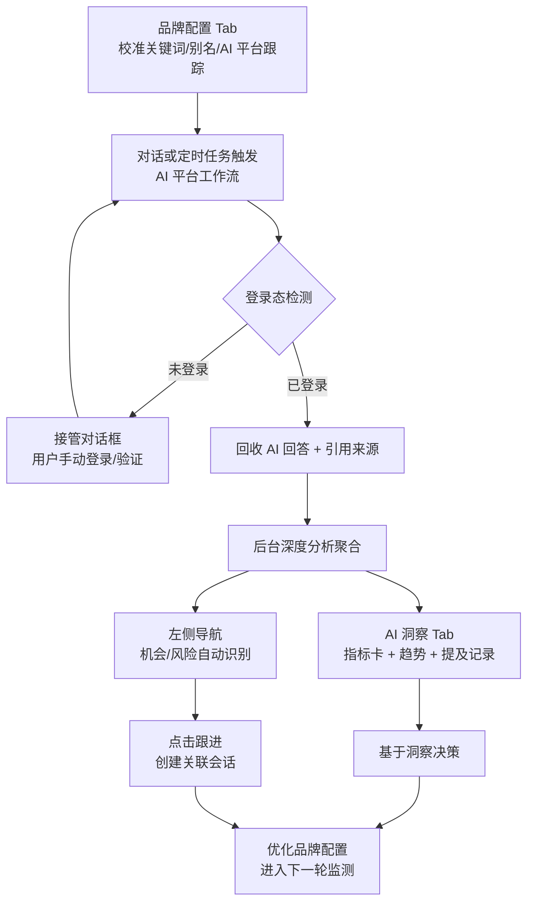

## 概述

品牌监测是 GenAura 的核心闭环：把品牌信息与预设问题投放到 5 个主流 AI 平台（DeepSeek、通义千问、豆包、Kimi、腾讯元宝）上执行搜索，回收 AI 回答与引用来源，再由后台深度分析服务聚合为品牌指数、情感、信源洞察，最终在「AI 洞察」面板与左侧导航的「机会/风险」中可视化呈现。

本教程将带你端到端跑通一次完整监测：

> **配置关键词与 AI 平台跟踪 → 运行 AI 平台工作流 → 查看 AI 洞察 → 跟进自动识别的机会与风险**

读完本文你将能够：

- 在「品牌配置」Tab 中校准关键词与 AI 平台跟踪开关；
- 通过对话或定时任务触发 AI 平台工作流，处理登录态接管；
- 在「AI 洞察」Tab 解读累计对话数、品牌提及数、品牌提及率、首位推荐率、前三推荐率等核心指标；
- 在左侧导航跟进 Agent 自动识别的机会与风险。

### 监测闭环

---

## 前置条件

- 已登录 GenAura 账户，并创建至少一个真实品牌。首次品牌配置请先完成 [首个品牌配置教程](./01-first-brand.md)。
- 品牌下**已配置至少一个产品**与若干**预设问题**——AI 平台工作流会以这些问题作为检索查询在各平台执行搜索。问题来源与字段约束见 [品牌模型概念](../concepts/01-brand-model.md)。
- 已在内嵌浏览器中登录至少一个目标 AI 平台。各平台登录态独立持久化，首次运行前请通过「浏览器」Tab 完成登录（见 [内嵌浏览器](../how-to/10-browser.md)）。
- 应用处于登录状态，且本机处于开机/非休眠状态——定时任务依赖应用运行（见 [定时任务](../how-to/12-cron-tasks.md)）。

---

## 操作步骤

### 步骤 1：在「品牌配置」校准关键词与 AI 平台跟踪

1. 在左侧导航顶部通过品牌选择器切换到目标品牌。
2. 点击右侧面板 Tab 栏的「**品牌配置**」Tab。
3. 在「**基本信息**」分区点击「编辑」按钮，校准以下字段：
   - **品牌官网**：品牌官网，供 Agent 在分析时引用；
   - **品牌别名**：AI 回答中可能使用的别名（如「小米」/「MI」/「Redmi」），用于品牌提及匹配；
   - **品牌关键词**：监测时优先匹配的关键词；
   - **品牌介绍**：品牌定位、卖点等背景信息。
4. 在「**产品配置**」「**竞品配置**」分区确认产品与竞品信息完整——这两类数据会作为深度分析的候选集，缺失会导致分析任务报错。
5. 滚动到最底部的「**AI 平台跟踪**」分区。

#### AI 平台跟踪开关

AI 平台跟踪决定了哪些平台会参与批量搜索。可跟踪的 5 个 AI 平台为：DeepSeek、豆包、通义千问、Kimi、腾讯元宝。

**关键限制**：

- 同一品牌**最多同时开启 3 个**平台。
- 新品牌首次打开时，自动开启前 3 个平台：DeepSeek、豆包、通义千问。
- 已配置过的品牌直接使用上次保存的配置，不会自动覆盖。
- 切换开关即时保存。
- 文心一言平台会显示「敬请期待」徽章，开关不可点击。

> 配置完成后，建议在「基本信息」分区下方的「**提问矩阵**」子区域确认预设问题清单（最多 30 条）。这些问题就是工作流要在 AI 平台上提问的内容。

### 步骤 2：运行 AI 平台工作流

GenAura 的 AI 平台工作流可以通过两种方式触发：

#### 方式 A：在对话中触发（适合手动跑一次）

1. 点击左侧导航「**新对话**」按钮创建一个会话。
2. 在输入框中用自然语言告诉 Agent，例如：
   - 「请执行一次平台问答搜索，覆盖所有已开启的 AI 平台」
   - 「在 DeepSeek 和通义千问上跑一遍提问矩阵」
3. Agent 会自动调用平台问答搜索工具：
   - **不指定平台** → 处理所有已开启跟踪的平台 × 提问矩阵中的所有问题；
   - **指定平台** → 仅处理指定平台；
   - 工作流在内嵌浏览器中**串行**执行（单窗口约束，不可并行）。Agent 会在对话中实时汇报进度。

#### 方式 B：用定时任务触发（适合周期性监测，推荐）

新品牌创建时，系统会自动播种 4 个默认定时任务，其中与品牌监测直接相关的是：

| 任务名称 | 默认状态 | 执行时点 | 含义 |
| --- | --- | --- | --- |
| **每日 AI 平台问答** | 运行中 | 每天 09:00 | 对所有已开启平台执行问答采集 |
| 每周品牌诊断 | 运行中 | 每周一 10:00 | 基于过去 7 天洞察做品牌健康度诊断 |
| 每日舆情监测 | 已暂停 | 每天 08:00 | 媒体与社交舆情监测（默认关闭） |
| 每周舆情报告 | 已暂停 | 每周一 09:00 | 周度舆情汇总（默认关闭） |

> 系统内置任务不可删除，但可以暂停、编辑执行时点与提示词。首次跑通监测建议把「每日 AI 平台问答」的执行时点调整为最近的下一个整点，便于立即观察结果。

切换到「**定时任务**」Tab 即可查看与编辑。

#### 处理登录态接管

5 个 AI 平台工作流均要求登录态。工作流运行时会主动检测登录态：

- 检测到未登录时，会弹出接管对话框「需要您接管浏览器」，提示文案为：「Agent 需要您手动完成当前操作。操作完成后，请点击「交还 Agent」按钮以便 Agent 继续执行后续任务。」
- 点击「**立即接管**」→ 浏览器控制权切换为用户控制，工作流暂停；
- 在内嵌浏览器中手动扫码 / 账密登录后，点击「**交还 Agent**」→ 控制权交回 Agent，工作流恢复执行；
- 接管状态下提示文案为：「您已接管浏览器，操作完成后请点击「交还 Agent」，以便 Agent 继续执行后续任务」。

> 各 AI 平台的登录态存储在内嵌浏览器的独立空间中，互不干扰，无需切换 GenAura 账户。首次运行前在「浏览器」Tab 中访问目标平台完成一次登录，后续运行无需重复。

#### 运行中异常

- **验证码 / 人机验证**：检测到验证码时会触发接管对话框。接管后手动完成滑块/拼图/点选验证，再「交还 Agent」即可恢复。
- **部分 (问题, 平台) 组合失败**：Agent 会自动诊断失败原因，并通过接管对话框请你修复，修复后精确重试失败的组合，最多 2 轮自愈重试。

### 步骤 3：查看 AI 洞察

工作流回收的答案与引用来源写入后台后，深度分析服务会以约 30 秒的周期处理分析任务，并聚合为品牌指数、情感、信源三类指标。

切换到右侧面板的「**AI 洞察**」Tab 即可查询。该 Tab 标题为「AI 洞察」，副标题为「深度感知品牌声量脉搏，分析量化品牌真实影响力」。

#### 筛选维度

页面顶部提供三个筛选器：

- **时间范围**：默认近 7 天，可选近 7 / 15 / 30 / 90 天；
- **平台**：可选「全部平台」或具体平台；
- **问题类型**：固定为「推荐类」，不可切换。

#### 全局指标卡

仪表盘标题区展示 **累计对话数**，下方为 5 张可点击指标卡：

| 指标 | 含义 |
| --- | --- |
| **累计对话数** | 时间范围内目标产品被提问过的搜索次数 |
| **品牌提及数** | 上述对话中 AI 回答提及本品牌/产品的次数 |
| **品牌提及率** | 提及数 ÷ 对话总量 |
| **首位推荐率** | 在已提及的回答中，本品牌排第 1 位的占比 |
| **前三推荐率** | 在已提及的回答中，本品牌排前 3 位的占比 |

点击任一指标卡可切换下方趋势图的主指标。指标计算口径详见 [洞察数据来源与品牌指数](../concepts/03-insight-data.md)。

#### 提及记录与竞品对比

仪表盘下方为「**提及记录**」表格，列出每条搜索结果的日期、问题、模型、别名、关键词、引用文章数等。点击行右侧「**查看**」按钮可打开「AI 回答详情」对话框，展示该条搜索结果的 AI 回答原文与引用来源。

仪表盘同时渲染「**行业竞品对比**」数据。竞品提及率以**本品牌对话数**为分母，**可能超过 100%**（衡量「竞品在本品牌对话中被提及的频率」），这是设计行为。

> **数据延迟提示**：刚跑完工作流看不到新数据是正常现象。常见原因：分析任务正在排队处理、任务处于重试中、或任务进入死信（如登录态过期、产品列表为空等）。请等待 1–2 分钟后刷新 AI 洞察 Tab。详见 [洞察数据概念](../concepts/03-insight-data.md)。

### 步骤 4：跟进机会与风险

在品牌分析过程中，Agent 会自动识别**商业机会**与**潜在风险**，以结构化条目展示在左侧导航。每条目包含：标题、描述、场景、问题类型、优先级（紧急优先级 / 高优先级 / 中优先级 / 低优先级）、影响程度（高影响 / 中影响 / 低影响）、状态。

#### 左侧导航展示规则

左侧导航的「机会」「风险」两个折叠区有以下展示限制：

- **仅显示待处理与进行中状态**：已完成与已放弃的条目从导航区移出（数据库中仍保留）；
- **最多各 5 条**：机会与风险列表分别独立排序后截取前 5 条；
- **排序规则**：进行中条目优先于待处理条目 → 同状态按优先级（紧急 \> 高 \> 中 \> 低）→ 同优先级按创建时间倒序；
- **默认展开**：若该类型下存在进行中条目，对应折叠区默认展开，否则默认折叠；
- **徽章计数**：折叠区头部右侧显示当前可见条目数（仅当数量 \> 0 时）。

#### 跟进操作

每个条目的交互：

1. **鼠标悬停约 0.5 秒**自动弹出右侧详情卡片，展示类型徽章、优先级徽章、影响徽章、标题、描述、场景、问题类型；
2. **点击条目**或点击详情卡片底部按钮：
   - 机会条目按钮文案：未关联会话显示「**跟进机会**」、已关联非当前会话显示「**查看跟进**」、已在当前会话显示「**已在当前会话**」（禁用）；
   - 风险条目按钮文案对应为「**处理风险**」/「**查看处理**」/「**已在当前会话**」；
   - 点击后系统自动创建一个新会话（标题前缀为「跟进」或「处理」），并把条目状态置为进行中、关联到该会话；
3. **悬浮操作按钮**（鼠标悬浮时显示在条目右侧）：
   - 「**完成**」按钮：**仅进行中状态显示**，点击后状态置为已完成，条目从导航区移出；
   - 「**删除**」按钮：任意状态都显示，**物理删除，不可恢复**，需二次确认。

机会与风险机制的完整说明（含状态流转图、写入链路）见 [机会与风险机制](../concepts/05-opportunity-risk.md)。

---

## 进阶用法：用定时任务自动化监测

手动跑通一次监测后，建议把周期性采集交给定时任务自动完成。

### 调整「每日 AI 平台问答」执行时点

1. 切换到「**定时任务**」Tab；
2. 找到内置任务「**每日 AI 平台问答**」（默认每天 09:00 执行）；
3. 点击任务行的调度按钮或右侧「编辑」按钮，打开任务详情；
4. 修改执行周期（如每 6 小时执行一次、每天 09:00 与 21:00 各一次等）；
5. 保存后调度器会重新注册任务。

> 系统内置任务不可删除，但可以暂停、编辑执行周期与提示词。

### 关键注意事项

- **应用必须运行**：定时任务的执行依赖应用的运行状态。如果应用关闭或电脑处于关机/休眠状态，定时任务将无法自动执行——「定时任务」Tab 顶部会显示警示横幅提醒：「定时任务只有在电脑开机且本软件正在运行时才会自动执行。若关闭本软件，或者电脑处于关机、休眠状态，任务将无法按时运行。」
- **串行约束**：5 个 AI 平台工作流共享单一浏览器窗口，工具内部串行执行。一个监测周期内 5 个平台 × N 个问题会依次跑完，耗时较长。
- **配合品牌配置变更**：在「品牌配置」中关闭某平台跟踪后，下次定时任务执行时该平台会被跳过；新增预设问题后下次执行会自动覆盖。

### 自定义监测任务

除了内置的「每日 AI 平台问答」，也可以在「定时任务」Tab 点击右上角「**新建**」按钮创建自定义任务，或直接在对话中告诉 Agent：「每天晚上 8 点跑一次平台问答搜索并基于结果给我一份洞察简报」——Agent 会自动创建对应的定时任务。详见 [定时任务操作指南](../how-to/12-cron-tasks.md)。

---

## 常见问题

### Q1：工作流首次运行就卡住，提示需要登录？

5 个 AI 平台工作流均要求登录态。首次运行前请在「浏览器」Tab 中手动访问该平台并完成登录，登录态会持久化在独立空间中。工作流运行时若检测到未登录会弹出接管对话框，点击「立即接管」手动登录后「交还 Agent」即可恢复。详见 [工作流原理 — 为何需要登录态](../concepts/02-workflow.md)。

### Q2：AI 平台跟踪最多能开启几个平台？

同时最多开启 **3 个**。系统中有 5 个可工作流平台（DeepSeek、豆包、通义千问、Kimi、腾讯元宝）和 1 个未开放平台（文心一言，显示「敬请期待」）。如需监测更多平台，请在「品牌配置」中先关闭一个再开启另一个。

### Q3：刚跑完工作流，AI 洞察里的数据没变化？

后台深度分析服务以约 30 秒周期轮询处理分析任务，单实例串行处理。高峰期会积压，且远程 LLM 服务偶发超时会触发重试。请等待 1–2 分钟后刷新 AI 洞察 Tab。若仍无数据，可能是分析任务进入死信（如登录态过期、「产品列表不能为空」），需检查品牌配置或重新登录。

### Q4：左侧导航看不到 Agent 刚识别的机会？

左侧导航最多各显示 5 条待处理/进行中状态的条目。若已有 5 条更高优先级或同优先级但更新的条目，新的会被挤出可见范围。同时检查折叠区是否处于折叠状态——若无进行中条目，折叠区默认收起。已完成与已放弃的条目从导航区移出，但数据库中仍保留。

### Q5：5 个平台的工作流能否同时运行？

不能。内嵌浏览器是单一窗口实例，工作流串行执行。如需周期性监测多平台，请配置定时任务，调度器会按计划依次执行。

### Q6：工作流失败后会自动重试吗？

工作流本身不自动重试，但失败后会降级到 Agent 自愈模式：Agent 基于失败快照诊断原因，通过接管对话框请你修复，再精确重试失败的 (问题, 平台) 组合，最多 2 轮自愈重试。

### Q7：内置的「每日 AI 平台问答」任务能删除吗？

不能。系统内置任务删除按钮被禁用（悬停提示「系统内置任务不可删除」），但可以暂停、编辑执行周期、修改提示词。如不想使用，将其切换为暂停状态即可。

---

## 相关文档

- 前置教程：[首个品牌配置](./01-first-brand.md)
- 概念解释：
  - [品牌模型](../concepts/01-brand-model.md)（品牌/产品/竞品/关键词/预设问题的关系）
  - [工作流原理](../concepts/02-workflow.md)（5 平台工作流机制、接管、异常检测）
  - [洞察数据来源与品牌指数](../concepts/03-insight-data.md)（指标计算口径、数据更新频率）
  - [机会与风险机制](../concepts/05-opportunity-risk.md)（状态流转、排序规则）
- 操作指南：
  - [品牌配置](../how-to/02-brand-config.md)（四个分区详解）
  - [AI 平台工作流](../how-to/11-ai-platform-workflows.md)
  - [内嵌浏览器](../how-to/10-browser.md)（接管对话框、登录态管理）
  - [AI 洞察](../how-to/14-insight.md)
  - [机会与风险](../how-to/07-opportunities-risks.md)
  - [定时任务](../how-to/12-cron-tasks.md)
- 下一步教程：[从洞察到发布文章](./03-content-publish.md)

---

> 最后更新：2026-07-29 | 对应版本：v1.2.0