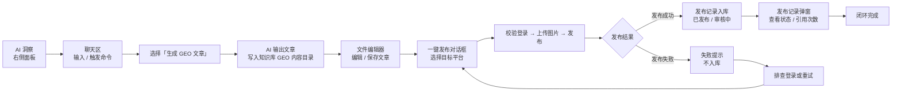

## 概述

本教程带您跑通简曜的内容生产发布闭环：从右侧面板的 **AI 洞察** 出发，在中间聊天区用 `/` 命令**生成 GEO 文章**，在知识库的文件编辑器里**编辑与保存**，再通过**一键发布**将文章同步到多个内容平台，并查看发布的**审核中 / 已发布 / 已拒绝**状态。

读完本篇，您能完成下面这条完整链路：

> 洞察 → 对话生成文章 → 知识库编辑 → 一键发布 → 状态跟踪

### 端到端流程

---

## 前置条件

- 已安装并登录简曜（参考 [安装指南](https://docs.genaura.bianjie.ai/zh/getting-started/01-installation)、[登录与账户](https://docs.genaura.bianjie.ai/zh/getting-started/02-login-account)）。
- 已创建至少一个品牌，并跑过至少一次 AI 平台工作流监测，**右侧面板 → AI 洞察** 中能看到品牌指数、提及记录等数据。如果洞察页显示「暂无品牌数据 / 请先在品牌管理中创建或选择一个品牌」，请先回到 [教程 02：执行一次品牌监测](https://docs.genaura.bianjie.ai/zh/tutorials/02-brand-monitoring)。
- 已在简曜内嵌浏览器中**登录过目标发布平台**（百家号 / 搜狐号 / CSDN / 掘金）。首次发布时也可在发布对话框中点击「前往登录」补登（详见步骤 4）。
- 文章以 Markdown 形式存放在知识库的 **GEO 内容** 系统目录下；如果对应目录为空，需要先通过本教程步骤 2 由 AI 生成，或在 [知识库](https://docs.genaura.bianjie.ai/zh/how-to/08-knowledge-base) 中手动导入。

---

## 操作步骤

### 步骤 1：从 AI 洞察进入工作状态

1. 在左侧导航切换到目标品牌。
2. 点击右侧面板的 **AI 洞察** Tab。
3. 通过顶部筛选条选择时间范围与 AI 平台（当前洞察页仅展示「推荐类」问题，问题类型不可切换）。
4. 浏览「品牌提及数 / 品牌提及率 / 首位推荐率 / 前三推荐率」等指标卡与提及记录表格，定位本次要生产文章的主题（例如某条记录显示品牌在某 AI 平台被提及率偏低，需要补内容）。
5. 在提及记录行点击问题打开「AI 回答详情」对话框，可作为后续生成文章的素材参考。

### 步骤 2：在聊天区用命令生成 GEO 文章

1. 切换到中间聊天区，新建或打开一个对话。
2. 在输入框中输入 `/`，弹出命令面板，列出五条快捷命令：
   - **品牌 GEO 诊断**
   - **生成 GEO 文章** ← 本教程使用此命令
   - **优化品牌知识库**
   - **AI平台问答搜索**
   - **品牌初始化分析**
3. 用鼠标点击或键盘上下键选中 **生成 GEO 文章**，命令面板会将对应的提示词模板插入输入框：
   > 请基于过去 7 天的 AI 洞察、情感、信源数据，分析性价比最高的发布渠道、文章风格，并基于当前知识库的内容生成一篇针对当前品牌的 GEO 文章
4. 直接回车发送，AI 会自动读取过去 7 天的洞察数据与知识库内容，生成一篇 Markdown 文章，并写入知识库的 **GEO 内容** 目录。

### 步骤 3：在文件编辑器中编辑文章

1. 切换到右侧面板的 **知识库** Tab，进入 **GEO 内容** 系统目录，找到上一步生成的 Markdown 文件并打开。
2. 直接在编辑器内修改正文、标题、列表、代码块等。Markdown 文件采用所见即所得编辑器，支持标题大纲联动。
3. 编辑过程会**自动保存**。底部状态栏会显示当前状态：
   - "编辑中..." — 编辑器正获得焦点
   - "保存中..." — 正在写入磁盘
   - "已保存 HH:MM:SS" — 上次保存时间
4. 如果异常退出导致未保存，下次打开同文件时顶部会出现**草稿恢复**横幅（提示「检测到本地有未保存的草稿」），可选择「恢复草稿」或「放弃草稿」。
5. 在编辑器中**选中文本**会浮现「**添加至对话**」按钮，可将选中片段作为引用带回聊天区继续追问或迭代

> 编辑器顶部工具栏还提供「下载（导出为 Markdown / Word / PDF）」、「打开来源链接」、「删除」等操作。本教程主要使用「发布」按钮。

### 步骤 4：一键发布到目标平台

1. 在文件编辑器顶部工具栏点击 **发布** 按钮（图标为纸飞机）。系统会读取当前文章内容，打开「**发布文章到内容平台**」对话框，并显示当前文件路径。
2. 对话框打开后会并行完成：
   - 加载可发布平台列表（当前支持百家号、CSDN、搜狐号、掘金 4 个平台）；
   - 检测每个平台的登录态；
   - 统计当前文章在各平台的历史发布记录数。
3. 平台卡片会展示三种登录态之一：
   - **已登录**（绿色标签，显示用户名）— 可直接发布。
   - **未登录**（琥珀色标签）— 需先点「前往登录」。
   - **正在检测登录状态...** / **检测失败** — 自动重试或查看错误。
4. **单平台发布**：直接点击该卡片右侧的「发布」按钮。
5. **批量发布**：点击底部「批量发布」进入批量模式，可「全选 / 取消全选」或勾选多个已登录平台，再点击「发布到 N 个平台」。
6. 点击发布后会弹出**二次确认弹窗**（标题「发布确认」，提示「文章即将发布至以下平台：」或「文章即将批量发布至 N 个平台：」），点击「**确认并发布**」才会真正执行。
7. 发布执行过程中，平台卡片下方显示进度条，进度阶段文案依次为：
   - **校验登录** → **上传图片** → **发布中** → **完成**
8. 文章中引用的本地图片（PNG / JPG / GIF / WebP / SVG / BMP）会自动上传到目标平台图床；不支持的扩展名或文件缺失会通过提示告知「部分图片未上传（N 张）」。

> 发布功能使用的是简曜内嵌浏览器的登录态，与系统浏览器不共享。若平台显示「未登录」，可在发布对话框点击「前往登录」打开内嵌登录窗口，登录成功后窗口会自动关闭并提示「平台登录成功」。

### 步骤 5：查看发布状态（审核中 / 已发布 / 已拒绝）

发布完成后，结果分两种情况呈现：

**A. 单平台结果（直接体现在平台卡片上）**

- **发布中**：卡片显示旋转图标 \+ 进度条；底部按钮区进入「发布中...」状态。
- **成功**：提示「发布成功」；卡片「发布记录 (N)」计数自动 \+1。
- **失败**：提示「平台: 错误信息」；卡片状态会回到「已登录」，可重试。

**B. 发布记录入库（仅成功时）**

发布成功后，系统会自动记录发布信息。部分平台发布的文章需要审核，审核通过后会自动更新为「已发布」状态：

| 平台 | 是否需要审核 | 入库状态 |
| --- | --- | --- |
| 百家号 | 否 | 已发布 |
| CSDN | 否 | 已发布 |
| 搜狐号 | 是 | 审核中 |
| 掘金 | 是 | 审核中 |

**C. 发布记录弹窗**

点击任意平台卡片的「**发布记录 (N)**」按钮，打开该平台对此文章的历史发布记录弹窗（标题「平台发布记录」）：

- 每条记录展示标题、渠道、发布日期、引用次数、最近引用时间、状态。
- **状态枚举与显示文案**：
  - **已发布** — 文章已通过审核并正式发布
  - **审核中** — 文章已提交，等待平台审核通过
  - **已拒绝** — 文章被平台拒绝发布
  - **未确认** — 系统已多次检测但未确认发布结果，请人工核实
- 状态非「已发布」的记录可手动「标记为已发布」或「标记为已拒绝」。
- 标题可点击在内嵌浏览器中打开发布链接（审核中记录优先打开预览链接）。

---

## 进阶用法

- **基于已有素材迭代文章**：在知识库中选中已有 Markdown 文件，选中段落点击「添加至对话」，再输入 `/` 选择「生成 GEO 文章」，AI 会结合被引用片段生成新版本。
- **多平台并行发布**：进入批量模式后可一次勾选所有已登录平台（含百家号、CSDN、搜狐号、掘金），并发执行发布。
- **本地图片自动上传**：在 Markdown 中引用相对路径的本地图片，发布时会自动上传到目标平台图床，无需手工处理。
- **文章标题与标签**：文章若以 YAML front matter 开头（形如 `--- title: ... tags: [...] ---`），发布时会自动解析 title 与 tags 字段并传入平台；若无 front matter，则从第一个 `# 标题` 行提取。
- **引用次数追踪**：发布成功后，系统会通过发布链接关联 AI 平台搜索结果的引用数据，便于在发布记录中评估 GEO 效果。
- **预热发布状态检查**：每次打开发布对话框时，系统会自动检查当前品牌下所有「审核中」记录的最新状态。

---

## 常见问题

### Q1：发布对话框里看不到任何平台卡片，显示「暂无可用平台」。

当前应用仅支持百家号、CSDN、搜狐号、掘金 4 个平台。如果全部平台卡片都不显示，可能是平台适配器加载失败，请重启应用；如持续异常请联系管理员排查。

### Q2：平台显示「未登录」，但我在浏览器里已经登录过。

发布使用的是简曜内嵌浏览器的登录态，与系统浏览器不共享。请在发布对话框点击该平台的「前往登录」打开内嵌登录窗口，登录成功后窗口会自动关闭并提示「平台登录成功」。

### Q3：发布卡在「发布中...」超过 5 分钟。

发布操作有 5 分钟超时保护，超时会提示「投放操作超时（5分钟）」。常见原因是目标平台 API 异常或网络不通，请重试；如持续失败请检查平台账号权限或更换网络环境。

### Q4：发布成功但状态显示「审核中」一直不变。

搜狐号、掘金这类需要审核的平台，文章需平台人工审核。简曜会周期性检查发布链接是否可达且标题匹配，匹配成功则自动转为「已发布」。若系统多次检测仍未确认发布结果，状态会显示为「未确认」，此时可在发布记录里手动「标记为已发布」。

### Q5：发布失败后能在哪里看错误详情？

失败的发布**不入库**，只在提示中显示「平台: 错误信息」。常见错误：登录态过期（需重新登录）、平台 API 异常、平台未注册、5 分钟超时。

### Q6：能否发布到知乎、微博、微信公众号等其他平台？

当前版本仅启用了百家号、CSDN、搜狐号、掘金 4 个平台适配器，其余平台已预留，后续版本将逐步开放。

---

## 相关文档

- 前置教程：[02 执行一次品牌监测](https://docs.genaura.bianjie.ai/zh/tutorials/02-brand-monitoring) — 了解如何产生 AI 洞察数据。
- 操作指南：
  - [05 命令与 @提及](https://docs.genaura.bianjie.ai/zh/how-to/05-commands-mentions) — `/` 命令与 @ 知识库提及的完整说明。
  - [08 知识库管理](https://docs.genaura.bianjie.ai/zh/how-to/08-knowledge-base) — GEO 内容系统目录、文件导入与搜索。
  - [09 文件编辑器](https://docs.genaura.bianjie.ai/zh/how-to/09-file-editor) — 编辑器能力、可编辑/预览类型、导出格式。
  - [13 文章发布](https://docs.genaura.bianjie.ai/zh/how-to/13-article-publish) — 发布对话框与发布记录的操作细节。
- 概念：[03 洞察数据](https://docs.genaura.bianjie.ai/zh/concepts/03-insight-data) — 洞察指标的计算口径与数据来源。
- 故障排查：[troubleshooting.md](https://docs.genaura.bianjie.ai/zh/troubleshooting) — 「发布失败」相关章节。

---

> 最后更新：2026-08-07 | 对应版本：v1.2.0