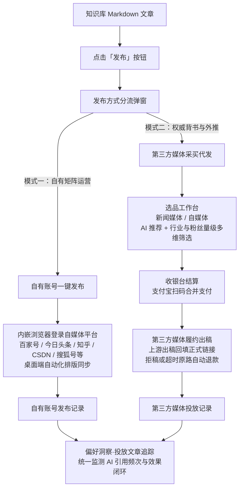
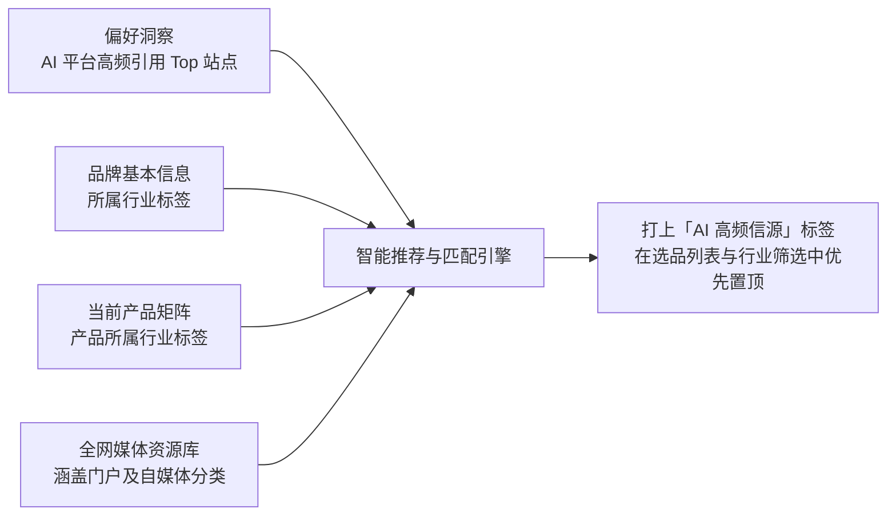
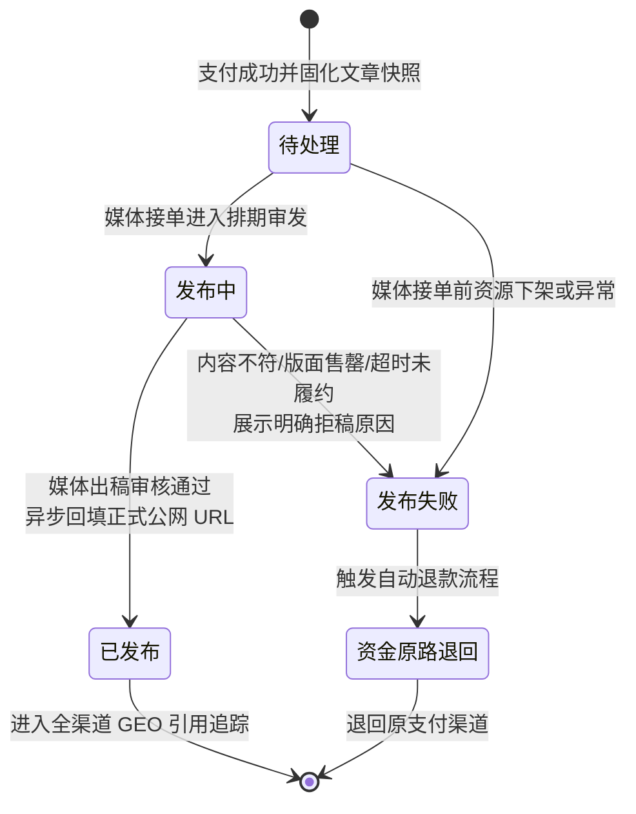

## 概述

在生成式 AI 搜索（GEO，Generative Engine Optimization）时代，仅依靠官网或少数自有媒体账号往往难以全面覆盖各大 AI 平台的算法引用。AI 模型在回答用户咨询或生成行业推荐时，高度依赖来自全网多渠道的高权重、权威内容源。

简曜 引入了**双轨发布机制**与**全渠道投放模型**：一方面支持将文章快速同步至企业自有的媒体账号矩阵；另一方面对接了覆盖全国主流门户与行业垂直阵地的第三方媒体资源网络，帮助企业以极低门槛采买高权重媒体发布服务，并通过「AI 信源偏好智能推荐」算法，将内容精准投放至最容易被 AI 搜索高频引用的信源阵地。

读完本文，你将了解：

- 为什么 GEO 需要「自有账号发布」与「第三方媒体代发」双轨驱动。
- AI 信源偏好推荐算法的底层逻辑（偏好洞察高频引用域名与行业标签的匹配原理）。
- 全渠道发布的数据架构与三种渠道来源划分。
- 第三方媒体发布的履约生命周期模型（待处理 → 发布中 → 已发布 / 发布失败）与资金保障机制。
- 发布结果如何形成端到端闭环，反哺 AI 搜索收录与引用效果追踪。

---

## 前置条件

- 已完成简曜的安装与账号登录（参见 [快速入门](/zh/getting-started/01-installation)）。
- 已在工作区中配置品牌基本信息与所属行业（参见 [品牌配置](/zh/how-to/02-brand-config)）。
- 建议先了解 [洞察数据来源](/zh/concepts/03-insight-data) 与 [偏好洞察](/zh/how-to/16-preference-insight)，有助于更好地理解 AI 引用偏好与推荐算法。

---

## 核心机制详解

### 1. 双轨发布机制：自有账号 vs 第三方媒体

简曜 在知识库与文件编辑器中提供了统一的发布入口，但在底层根据发布主体的不同，清晰地划分为两种发布路径：

下表对比了两种发布模式的核心定位与特征：

| 维度 | 自有账号发布 | 第三方媒体代发 |
| :--- | :--- | :--- |
| **运营定位** | 品牌官方矩阵日常运营，沉淀自主数字资产与粉丝 | 借助权威外媒与行业大号背书，提升 AI 引用权重与全网声量 |
| **账号要求** | 需用户在简曜内嵌浏览器中登录自己的各平台账号 | **无需自备账号**，由平台对接的优质媒体代发 |
| **平台范围** | 今日头条、百家号、知乎、搜狐号、CSDN、掘金等开放平台 | 覆盖全网数千家权威新闻门户（如各大网媒、行业垂直站）与自媒体大号 |
| **成本构成** | 零通道采买成本，消耗企业自有运营人力 | 按选定媒体明码标价采买，支持单篇/批量合并结算 |
| **出稿时效** | 即时发布或受平台内置机器审核（通常数分钟内） | 由各媒体编辑人工或系统排期审发，通常当日或 1-3 个工作日出稿 |
| **出稿保障** | 受平台账号自身发文权限与违禁词规则限制 | 提供**履约兜底机制**：若媒体拒稿或超时未出稿，系统自动全额退款 |

---

### 2. AI 信源偏好智能推荐算法

在第三方媒体选品工作台中，你常会看到带有闪烁星标的 **「AI 高频信源」** 标签。这一推荐并非随机展示，而是简曜基于品牌的 GEO 诊断数据计算得出的最优信源：

推荐算法的核心逻辑包含两个维度的交叉验证：

1. **信源引用验证（Domain Matching）**：
   简曜 会自动分析当前品牌在 DeepSeek、通义千问、豆包、Kimi、腾讯元宝等主流 AI 平台上执行搜索时，AI 模型在生成回答时引用频率最高的前 20 个根域名或知名媒体站点。如果媒体资源库中的某个媒体属于这些高频引用站点或对应主站，则获得高权重加分。
2. **行业标签宽匹配（Industry Alignment）**：
   系统会提取品牌当前在「品牌配置」中设定的所属行业，以及所涉及产品的行业分类，与媒体资源的行业标签进行多级交叉匹配。即使某些新兴垂直站点尚未进入全局 Top 榜单，但只要与品牌行业高度吻合，依然会被系统识别并推荐。

**推荐价值**：
通过该算法，企业能够将有限的预算集中投放到最容易被主流 AI 算法拾取、引用的高价值阵地，从而有效提升品牌在 AI 搜索中的提及率与权威度。

---

### 3. 全渠道统一数据架构

为了让企业清晰掌握所有内容的传播效果，简曜 构建了统一的投放数据模型。无论内容通过何种途径发布，均会汇总至统一的发布追踪档案中：

| 渠道来源标识 | 来源类型 | 产生方式 | 典型代表 |
| :--- | :--- | :--- | :--- |
| **自有账号** | 自有渠道 | 在简曜中登录自有自媒体账号一键直发 | 百家号、今日头条、知乎等自有账号文章 |
| **第三方媒体** | 付费采买 | 通过选品工作台采购的第三方媒体资源 | 新闻门户发布、垂直科技媒体、自媒体号代发 |
| **手工录入** | 外部沉淀 | 用户自主在外部媒介或历史渠道投放后手动登记的链接 | 企业历史公关稿链接、外部 KOL 合作文章 |

这三类数据统一汇聚到「偏好洞察」Tab 下方的**投放文章追踪**面板，支持统一的排序、筛选、状态查阅以及 AI 引用效果追踪。

---

### 4. 第三方媒体履约状态机与保障机制

第三方媒体发布涉及外部媒介人工审校与排期，其履约过程遵循严密的状态流转模型：

#### 关键保障机制：

1. **文章快照固化**：
   在收银台完成支付的一瞬间，系统会将当前提交的文章标题、Markdown 正文及配图在云端生成不可变快照。即使后续你在本地知识库中继续修改该文件，也不会影响已提单的媒体审发内容，保证采买与审稿的一致性。
2. **履约状态自动化流转**：
   - **待处理**：支付已确认，系统正在向媒体方同步订单与稿件。
   - **发布中**：媒体方已接收稿件，编辑正在审核。
   - **已发布**：稿件已在目标媒体公开上线，系统自动拉取正式 URL 并回填到发布记录中。
   - **发布失败**：媒体方因敏感词、内容风格不合或排期冲突退回稿件，或超过承诺时效未出稿。
3. **拒稿自动退款机制**：
   若发生媒体拒稿或出稿失败，系统会**全额原路退还**该媒体对应的采买款项（如通过支付宝扫码支付，款项将直接原路退回支付账号），并在界面展示媒体给出的明确原因（如「文章营销性质过强，建议增加行业分析内容」），最大程度保障企业的资金安全与投放权益。

---

## 常见问题

### Q1：为什么第三方媒体采买需要签署《媒体发布服务协议》？
A：第三方媒体发布涉及知识产权合规、内容真实性承诺、广告法合规以及媒体采买结算标准。在收银台采买前签署服务协议，能够明确各方的权责边界，保障发布内容符合公网传播合规要求。

### Q2：同一篇文章可以既发自有账号，又采买第三方媒体吗？
A：完全可以。推荐的组合策略是：将品牌官方视角的深度稿件通过「自有账号」沉淀在企业主阵地，同时提炼具有行业普适价值、客观中立的公关科普稿，通过「第三方媒体代发」投放到权威新闻网站与行业垂直媒体，形成矩阵互补。

### Q3：已发布的正式文章多久能被 AI 平台收录并引用？
A：AI 搜索引擎对新内容的收录取决于各家平台的抓取周期与更新机制（通常在数小时至数天不等）。文章在权威高权重站点出稿后，一旦被 AI 爬虫抓取，简曜 的定时监测工作流便会在后续运行中自动捕获其引用记录，并在「偏好洞察」中体现。

---

## 相关文档

- 动手实操：[第三方媒体采买与履约发布](/zh/how-to/17-media-delivery)
- 矩阵运营：[自有账号一键发布](/zh/how-to/13-article-publish)
- 效果跟踪：[偏好洞察与投放追踪](/zh/how-to/16-preference-insight)
- 关联配置：[品牌配置与行业设置](/zh/how-to/02-brand-config)
- 端到端教程：[从洞察到发布文章](/zh/tutorials/03-content-publish)

---

> 最后更新：2026-09-17 | 对应版本：v1.7.0
