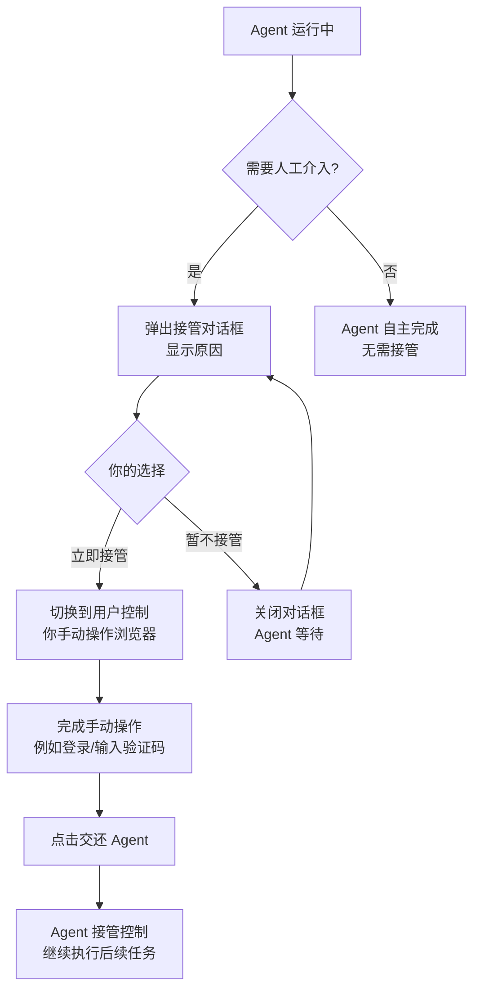

## 概述

GenAura 内置了一个浏览器，让你无需切换到外部浏览器即可在应用内访问任意网站。它常用于：

- **登录 AI 平台**：DeepSeek、通义千问、豆包、Kimi、腾讯元宝等。登录一次后，应用会保留登录态，后续运行工作流或一键发布时无需再次登录。
- **手动浏览与排查**：当 Agent 自动化操作遇到登录、验证码、风控等需要人工介入的场景时，可接管浏览器手动完成。
- **采集资料**：直接在内嵌浏览器中阅读网页，必要时复制正文到知识库。

读完本文，你将能够：

- 在应用内打开任意网站并使用前进、后退、刷新等基本操作
- 了解浏览器在不同状态下的表现与含义
- 在 Agent 运行时按提示接管浏览器，完成手动操作后交还控制
- 管理 AI 平台登录态，理解一次登录长期生效的机制

## 前置条件

- 已登录 GenAura，并已创建或切换到某个品牌工作区（参见 [品牌管理](/zh/how-to/01-brand-management)）。
- 已打开右侧面板「浏览器」Tab（参见 [界面概览](/zh/getting-started/04-interface-overview)）。
- 需访问外网；首次访问部分 AI 平台需要手动登录账号。

## 操作步骤

### 1. 打开浏览器

打开右侧面板「浏览器」Tab，进入内置浏览器界面：

- **顶部控件栏**：从左到右依次是后退、前进、刷新按钮、网址输入框、状态指示器、接管/交还按钮、关闭按钮。
- **欢迎页**：未打开任何网页时，欢迎页提供 6 个 AI 平台的快捷入口（豆包、DeepSeek、腾讯元宝、通义千问、Kimi、文心一言 `https://chat.baidu.com/`），点击即可直接跳转。
- **网页区域**：打开网页后展示页面内容，与普通浏览器体验一致。

### 2. 网址导航

#### 输入网址访问

1. 在顶部网址输入框中输入完整网址（如 `https://www.example.com`）。
2. 按回车键，或点击输入框右侧的「×」按钮可清空当前输入。
3. 若输入时省略了 `http://` 或 `https://`，会自动补全为 `https://`。
4. 仅支持 `http` / `https` 协议；输入 `file:` 或 `javascript:` 等协议会提示「不支持该协议，仅允许 http/https 地址」。

#### 快捷入口

欢迎页提供 6 个 AI 平台快捷入口按钮，点击对应图标即可直接打开该平台。

#### 前进 / 后退 / 刷新

- **后退**：回到上一个浏览过的页面。
- **前进**：在已经使用过后退的情况下，再向前一步。
- **刷新**：重新加载当前页面。

> 提示：浏览器空闲状态下，导航按钮不可用；只有打开网页后才会启用。

### 3. 浏览器状态说明

浏览器在不同场景下会显示不同的状态指示器与底部状态条，便于你了解当前控制权归属。

| 状态 | 含义 | 表现 |
| --- | --- | --- |
| 加载中 | 正在打开网页 | 状态指示器显示蓝色「加载中」 |
| Agent 控制中 | AI Agent 正在自动操作浏览器 | 状态指示器显示绿色「Agent 控制中」，底部提示「Agent 正在操作浏览器...」，并提供「接管控制」按钮 |
| 等待接管 | Agent 检测到需要人工介入，提示你接管 | 状态指示器显示黄色「等待接管」，底部与中央对话框均提示接管原因并提供「接管控制」按钮  上图所示：中央对话框 |
| 用户已接管 | 你已接管浏览器，可手动操作 | 状态指示器显示黄色「用户控制」，底部提示「您已接管浏览器，操作完成后请点击『交还 Agent』...」，并提供「交还 Agent」按钮 |

> 提示：浏览器空闲时无状态指示器。打开网页后到 Agent 接管前属于加载中或 Agent 控制中状态。

### 4. 接管浏览器

当 AI Agent 运行 [AI 平台工作流](/zh/how-to/11-ai-platform-workflows) 或 [文章一键发布](/zh/how-to/13-article-publish) 时，若遇到登录、验证码、风控等场景，会暂停并请求你接管浏览器。

#### 接管流程

#### 操作步骤

1. **接收接管请求**：Agent 检测到需要人工介入时，会弹出对话框「需要您接管浏览器」，并显示具体原因（如「平台『腾讯元宝』未登录」「需要验证码」等）。
2. **选择立即接管**：点击「立即接管」按钮，浏览器切换到「用户控制」状态，此时你可以像使用普通浏览器一样手动操作页面。
   - 若暂时无法接管，可点击「暂不接管」关闭对话框，但 Agent 会一直等待，直到你接管并交还。
3. **完成手动操作**：在浏览器中完成所需操作，例如：
   - 在 AI 平台登录页输入账号密码登录
   - 完成滑块验证码或图形验证码
   - 处理平台风控弹窗
4. **交还 Agent**：完成操作后，点击底部状态条或顶部控件栏的「交还 Agent」按钮，浏览器控制权交回 Agent，自动继续执行后续任务。

> 提示：接管期间可使用键盘 Escape 键快速退出接管状态。

### 5. 关闭浏览器

点击顶部控件栏最右侧的「×」按钮可关闭当前浏览器会话：

- 浏览器回到欢迎页状态。
- 登录态会保留，下次打开同一平台仍处于登录状态。
- 若 Agent 正在运行，关闭浏览器可能导致 Agent 任务中断，请谨慎操作。

## 进阶用法

### A. 登录态长期保留

GenAura 内嵌浏览器对登录态做了持久化处理：

- 在内嵌浏览器中登录过的 AI 平台账号会保留登录态。
- 后续 Agent 运行工作流或执行一键发布时，会自动复用该登录态，无需重复登录。
- 即使关闭浏览器或重启应用，登录态依然有效，除非你在平台官网主动退出账号或清除应用数据。

> 提示：若 Agent 提示某平台未登录，可先在内嵌浏览器中手动打开该平台完成登录，再重新运行任务。

### B. 与文章发布共享登录态

[文章一键发布](/zh/how-to/13-article-publish) 功能会复用内嵌浏览器的登录态，因此发布到百家号、CSDN、搜狐号、掘金等平台前，请先在内嵌浏览器中登录对应平台，避免发布时被拦截到登录页。

### C. 复制网页正文到知识库

部分反爬严格的站点（如付费墙、登录墙内容）无法通过 URL 导入 直接抓取。可：

1. 在内嵌浏览器中打开该网页，必要时登录账号。
2. 手动复制所需正文内容。
3. 在知识库中新建一个 Markdown 文件并粘贴，保存后即可作为 AI 检索信源。

## 常见问题

**Q1：Agent 运行时浏览器一直显示「Agent 控制中」，我需要做什么吗？** A：这是正常状态，表示 Agent 正在自主完成页面操作（如点击、输入、读取结果）。除非出现「等待接管」提示或弹窗，否则无需干预。强行接管可能会打断 Agent 的工作流。

**Q2：接管对话框弹出后，我可以暂时不接管吗？** A：可以点击「暂不接管」关闭对话框，但 Agent 会一直等待你接管并完成操作。建议尽快接管，否则任务会卡住无法继续。

**Q3：我已经在内嵌浏览器登录了 DeepSeek，为什么 Agent 运行工作流时还是提示未登录？** A：可能原因：① 上次登录会话已过期；② 平台风控导致登录态失效；③ 你在其他浏览器登录后退出过账号。请重新在内嵌浏览器中打开该平台登录一次，再重试任务。

**Q4：内嵌浏览器和系统浏览器（如 Chrome）的登录态是共享的吗？** A：不共享。内嵌浏览器是 GenAura 内部的独立浏览器环境，登录态只在内嵌浏览器中保留。若你想在系统浏览器中访问同一账号，需要重新登录。

**Q5：浏览器可以打开任何网站吗？** A：可以打开任意 `http` / `https` 网址。但部分网站可能因反爬、风控等机制在自动化场景下表现异常，此时 Agent 会请求你接管手动处理。

**Q6：接管状态下，键盘快捷键还能用吗？** A：接管状态下，大部分键盘事件会直接传递给网页，可正常输入。Escape 键用于快速退出接管状态；Cmd/Ctrl\+K 等全局搜索快捷键会被拦截以避免与应用快捷键冲突。

**Q7：关闭浏览器后再次打开同一网页，登录态还在吗？** A：在。GenAura 会持久化保存登录态，关闭浏览器只是结束当前会话，不会清除 Cookie。下次打开同一平台仍处于登录状态。

## 相关文档

- 前置阅读：[界面概览](/zh/getting-started/04-interface-overview) — 了解右侧面板与浏览器 Tab 位置
- 关联功能：[AI 平台工作流](/zh/how-to/11-ai-platform-workflows) — 工作流运行中的接管场景
- 关联功能：[文章发布](/zh/how-to/13-article-publish) — 发布流程共享浏览器登录态
- 关联功能：[知识库](/zh/how-to/08-knowledge-base) — 手动复制网页正文入库
- 概念背景：[AI Agent 协作模型](/zh/concepts/04-ai-agent) — Agent 与人工协作机制
- 故障排查：[故障排查](/zh/troubleshooting) — 浏览器接管失败、登录态丢失等问题

---

> 最后更新：2026-07-29 | 对应版本：v1.2.0