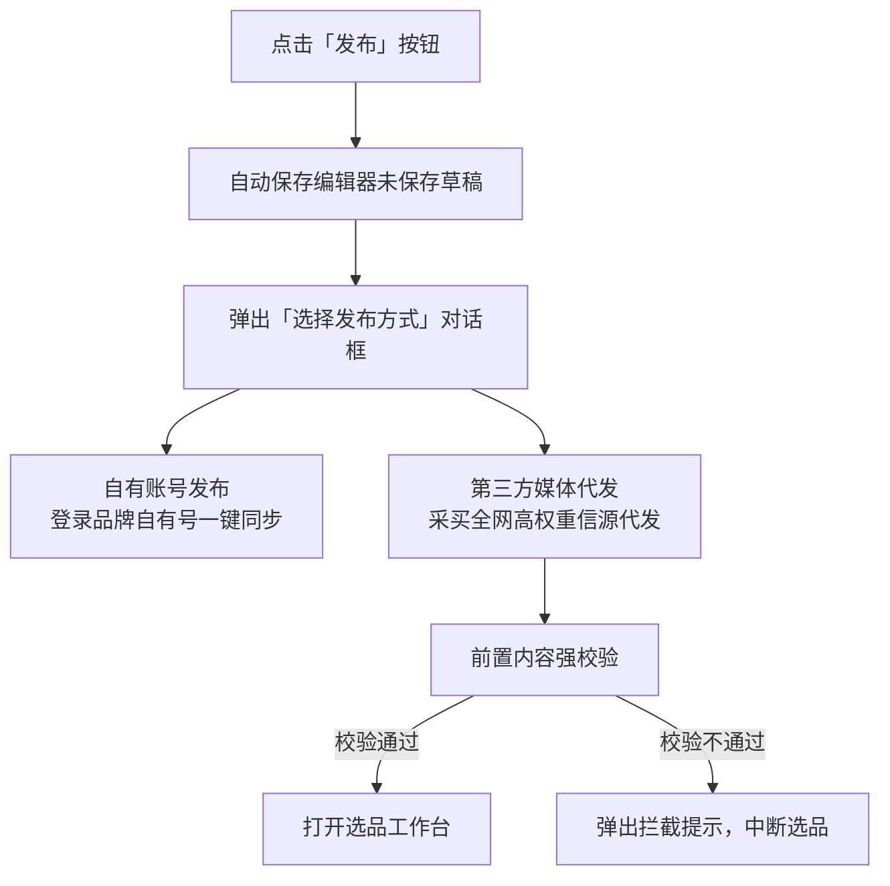
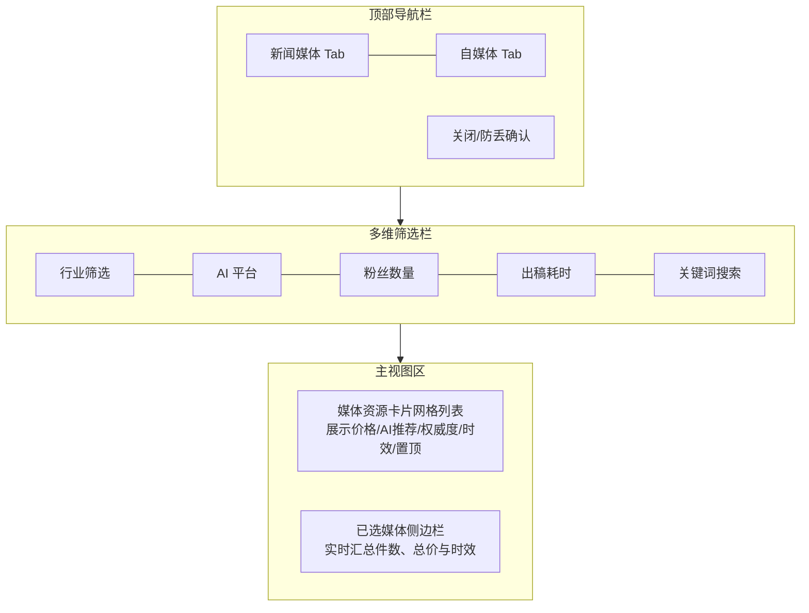
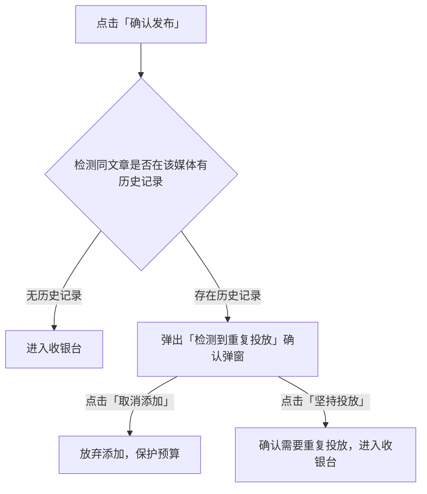
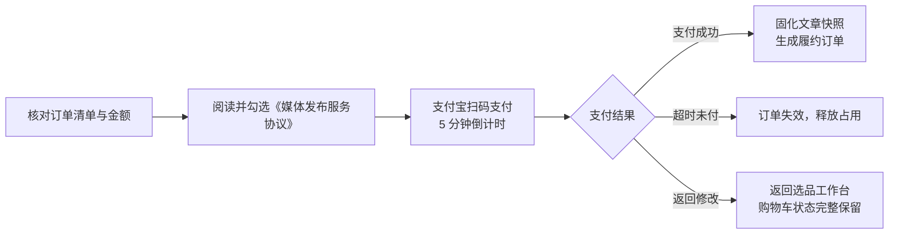

## 概述

简曜 提供覆盖全国主流权威新闻门户与优质行业垂直号的第三方媒体发布服务。用户无需自行注册或维护外部媒体账号，即可直接在选品工作台中一键采买高权重媒体资源，通过支付宝扫码完成结算。系统将自动进行稿件快照固化、同步审发、出稿链接回填，并在媒体拒稿或超时未出稿时提供全额原路自动退款保障。

<Frame>
  
</Frame>

读完本文，你将能够：

- 通过发布分流弹窗进入第三方媒体选品工作台；
- 掌握文章前置强校验规则（标题 ≤ 200 字，正文 ≤ 200,000 字）；
- 熟练使用选品工作台的多维筛选（行业、AI 推荐平台、粉丝量级、出稿时效、关键词）；
- 识别带有「AI 高频信源」星标的高价值信源，结合偏好洞察提升投放性价比；
- 处理历史防重确认弹窗，避免同一篇文章重复采买产生额外成本；
- 使用跨媒体购物车核对明细，并在收银台通过支付宝扫码完成合并支付；
- 跟踪订单履约进度（待处理 → 发布中 → 已发布 / 发布失败），查阅回填链接与拒稿退款明细。

> 如果你希望了解通过企业自有账号进行免费分发，请阅读 [自有账号一键发布](/zh/how-to/13-article-publish)。若需了解底层数据模型与推荐算法，请阅读 [媒体发布与全渠道投放模型](/zh/concepts/06-media-delivery)。

---

## 前置条件

1. **登录状态**：已登录简曜客户端，且账户处于有效可用状态。
2. **知识库文档**：已在右侧面板的「知识库」中准备好待发布的 Markdown 文章（`.md` 格式）。
3. **品牌行业设置**：建议在「品牌配置」中已完善品牌及产品的**所属行业**。系统将据此为你提供更精准的行业媒体（参见 [品牌配置](/zh/how-to/02-brand-config)）。
4. **支付准备**：准备好手机支付宝 App，用于收银台扫码支付采买费用。

---

## 操作步骤

### 1. 进入发布入口与分流选择

你可以在以下两处入口触发发布流程：

- **入口 A（编辑器顶部）**：在知识库中打开一篇 Markdown 文件进入编辑器，点击顶部操作栏右侧带纸飞机图标的 **「发布」** 按钮。
- **入口 B（文件列表操作菜单）**：在知识库文件树或列表视图中，右键点击文章或点击右侧操作图标，在弹出的菜单中选择 **「发布」**。

点击后，系统会弹出 **「选择发布方式」** 对话框：

在对话框中，系统提供两个选项卡片：
1. **自有账号发布**：适用于品牌官方账号矩阵日常维护（参见 [自有账号一键发布](/zh/how-to/13-article-publish)）；
2. **第三方媒体代发**：展示「信源覆盖全网数千家优质信源」与「精准匹配 GEO 高引用信源」特色。点击该卡片下方的 **「进入选品」** 按钮，启动第三方媒体采买流程。

---

### 2. 前置内容强校验规则

在正式开启选品工作台前，简曜 会自动确保编辑器最新内容落盘保存，并对文章进行**前置合规强校验**。若文章未达标，系统将直接弹出警告拦截并阻止进入后续选品，避免在选品或付款后因格式不符被上游拒单：

| 校验项 | 限制规则 | 超限拦截提示文案 | 解决办法 |
| :--- | :--- | :--- | :--- |
| **文章标题** | 不能为空且去除首尾空格后有内容 | 「文章标题不能为空，请完善内容后再进行第三方媒体发布」 | 在编辑器顶部一级标题 (`# 标题`) 或元数据中补充文章标题 |
| **标题长度** | 字符数必须 **≤ 200 字** | 「文章标题长度不能超过 200 个字符（当前 X 字），请精简后再试」 | 删减过长的修饰语或副标题，控制在 200 字以内 |
| **文章正文** | 不能为空且有实质 Markdown 内容 | 「文章正文不能为空，请完善内容后再进行第三方媒体发布」 | 充实文章主体段落后再尝试发布 |
| **正文长度** | 字符数必须 **≤ 200,000 字** | 「文章正文长度不能超过 200,000 个字符（当前 X 字），超出媒体发布限制」 | 将长篇巨著拆分为系列文章，或精简超长附录与数据表 |

> **提示**：系统提取标题时，优先读取知识库文件元数据中的标题；若无元数据，则自动抓取正文第一行一级标题（`# 标题内容`）；若正文无一级标题，则使用文件名（去除 `.md` 后缀）作为默认标题。

---

### 3. 选品工作台界面与分类

校验通过后，系统将打开全屏 **「媒体选品工作台」**。工作台由四大区域组成：

#### 3.1 媒体分类 Tab
工作台顶部提供两大媒体类型切换：
- **新闻媒体**：包含综合门户（如腾讯网、新浪网、网易等）、各省市地方重点新闻网、垂直行业权威新闻站点。特点是公信力强、AI 引擎索引收录率极高，适合用于权威品牌背书与官方公关声明。
- **自媒体**：包含百家号、今日头条、知乎、微信公众号等平台的优质专栏大号与行业 KOL。特点是内容传播形式活泼、行业垂直渗透深，支持查看粉丝量级与阅读受众画像。

---

### 4. 多维筛选与智能推荐选品

为了帮助你在海量资源库中快速定位高性价比媒体，筛选栏提供了丰富的组合条件：

#### 4.1 行业领域筛选
点击 **「行业」** 按钮展开下拉面板：
- **智能推荐置顶**：系统根据当前品牌的「品牌配置」行业分类，以及近期偏好洞察中高频引用的行业，将最匹配的行业候选标签置顶展示（带有推荐徽标）。
- **行业分类搜索**：支持在输入框中输入行业关键词（如「金融」「科技」「医疗」「美妆」等）快速检索并勾选对应行业，支持多选。

#### 4.2 AI 推荐平台匹配
点击 **「AI 平台」** 按钮，可勾选目前主流的 5 个大模型搜索引擎：
- DeepSeek
- 通义千问
- 豆包
- Kimi
- 腾讯元宝

勾选后，系统将优先筛选在对应 AI 平台回答中被引用频次较高的媒体资源。

#### 4.3 粉丝量级（自媒体专属）
切换至「自媒体」Tab 后激活此选项，支持按号主粉丝规模分层筛选：
- 0 - 1000
- 1001 - 5000
- 5001 - 1万
- 1万 - 5万
- 5万 - 10万
- 10万 - 100万
- 100万 - 500万
- 500万+

#### 4.4 出稿时效
支持按媒体的平均审发周期筛选：
- 1 小时内
- 3 小时内
- 24 小时内
- 24 小时以上
- 以媒体实际出稿时间为准

#### 4.5 关键词检索与重置
在右侧搜索框中输入媒体名称（如「36氪」「IT之家」）支持 300 毫秒防抖即时检索；点击 **「重置筛选」** 按钮可一键清空所有已设过滤项。

---

### 5. 媒体卡片操作与防重检查

#### 5.1 识别「AI 高频信源」星标与置顶
- **AI 推荐标签**：符合品牌所属行业且在 AI 搜索高频引用域名池中的媒体，其卡片会显示醒目的闪烁星标 **「AI 高频信源」**。
- **置顶收藏**：点击媒体卡片上的图钉图标，可将常用媒体置顶在当前列表最上方，方便后续批量操作。
- **查看详情**：点击卡片可查看媒体详细信息

#### 5.2 历史防重确认弹窗（防误投机制）
当你点击购物车的 **「确认发布」** 时，系统会查询该文章在当前媒体的历史采买与发布记录：

- 若检测到该文章曾在该媒体成功发布过（或正在发布中），系统会立即弹出 **「检测到重复投放」** 对话框，明确展示该文章上次在选定媒体发布的日期、状态及出稿链接。
- 你可以点击 **「取消添加」** 避免不必要的资金浪费；若确因矩阵补量需要再次投放，可点击 **「坚持投放」** 进入发布页。

---

### 6. 跨媒体购物车与侧边栏结算

选中的媒体会实时汇入右侧的 **「已选媒体」** 侧边栏：
- **实时统计**：显示已选媒体总数（例如「已选 3 个媒体」）、预计最快与最迟出稿时效跨度。
- **总价汇总**：实时计算各项明细单价之和，清晰展示待结算总金额（例如「合计：¥ 460.00」）。
- **微调列表**：点击单项右侧的删除图标可将其从购物车移出；点击顶部 **「清空」** 可重置选品。
- **去结算**：确认选品无误后，点击底部的 **「去结算」** 按钮，进入收银台。

> **防误触退出提示**：若侧边栏已存在挑选好的媒体，在点击关闭工作台时，系统会弹出「确认离开选品工作台？」提示，防止因手滑退出导致辛劳挑选的媒体列表丢失。

---

### 7. 收银台与支付宝扫码支付

点击「去结算」后，界面打开二级 **收银台** 弹窗：

1. **核对明细**：
   - 查看本次采买的文章标题；
   - 查看媒体名称、分类、单价明细与订单实付金额。
2. **签署《媒体发布服务协议》**：
   - 采买时必须勾选 **「我已阅读并同意《媒体发布服务协议》」**。
   - 可点击链接打开协议查看法律权责、内容真实性保证与退款规范。
3. **支付宝扫码合并支付**：
   - 收银台右侧自动呈现专属动态支付宝收款二维码。
   - 打开手机支付宝 App 扫描屏幕二维码完成支付。
   - **15 分钟有效倒计时**：订单二维码具有 15 分钟安全有效期，倒计时结束后二维码将自动失效以防止价格变动或重复扣费。若超时，点击「刷新二维码」即可重新生成。
4. **返回修改（保活机制）**：
   - 若在扫码前发现媒体选错了或想调整预算，可随时点击收银台左下角的 **「返回修改」** 按钮。系统采用层叠保活机制，你的选品列表、筛选条件与已选项目将完整保留，无需重新选品。

---

### 8. 提单成功与文章快照固化

当手机端支付成功后，客户端收银台将在 1-2 秒内自动感知并切换至 **「提交成功」** 界面：
- **快照固化**：系统已将当前文章内容与提单参数在云端建立不可变版本快照。后续无论本地文章如何修改，媒体审稿均以付款瞬间的快照为准。
- **生成履约记录**：所有采买的媒体均已生成对应的履约订单，状态置为 **「待处理」**。
- 你可以点击 **「查看投放追踪」** 直接跳转至右侧的 **「AI 信源」** Tab，查看发布记录面板，或点击 **「关闭」** 关闭弹窗回到工作区。

---

### 9. 履约进度跟踪、链接回填与自动退款

提单后，你可以在右侧面板切换到 **「AI 信源」** Tab，在下方的 **「投放文章追踪」** 面板中实时查看履约进度：

#### 9.1 状态流转解读
在列表中，第三方媒体记录卡片会显示专属主题与水印，并展示以下状态标签：

| 履约状态 | 状态含义 | 用户操作与系统动作 |
| :--- | :--- | :--- |
| **待处理** | 订单已提交，媒体编辑正在接单调度 | 耐心等待媒体排期处理 |
| **发布中** | 媒体方已接单并进入内容审校、排版与刊发流程 | 通常在媒体承诺的出稿时效内完成 |
| **已发布** | 审核通过且文章已公开发布上线 | 列表中自动回填**正式出稿 URL**；点击可一键复制链接或在系统默认浏览器中打开原文查看 |
| **发布失败** | 因媒体版面变动、敏感内容受限或超时未出稿 | 状态显示为红色「发布失败 / 已拒绝」，点击可查阅**具体拒稿理由** |

#### 9.2 拒稿全额自动退款
若因文章敏感词、媒体版面临时下架或超过最长时效导致履约失败：
1. 系统会自动将该项标记为 **「发布失败」**；
2. 系统**自动发起原路退款**，采买该媒体的费用将全额原路返还至你的支付宝账户，通常即刻或数分钟内到账；
3. 无需手动提交任何退款申请或联系人工客服。

#### 9.3 桌面系统通知
当采买的媒体出稿成功（或发生拒稿）时，简曜 桌面客户端会自动弹出系统桌面通知（例如「【简曜】您的文章《xxx》已在【36氪】成功出稿」）。

---

## 进阶技巧与最佳实践

### 1. 基于「偏好洞察」的精准选品策略
在进行媒体采买前，建议先进入 **AI 信源** Tab 查看当前品牌的「信源引用排名」：
- 查看过去 7 天在 DeepSeek 或通义千问等平台上引用量排名前列的信源；
- 在选品工作台中优先挑选这些站点的对应频道进行采买；
- 这种「先洞察 AI 喜欢看什么，再精准投放什么」的打法，能以最低的成本获得极高的 AI 搜索收录率。

### 2. 梯队式矩阵发布组合
- **第一梯队（权威站定基调）**：选择 1-2 个带有「AI 高频信源」标签的国家级或行业门户新闻媒体，用于树立权威专业度与主引用源；
- **第二梯队（垂类号扩声量）**：搭配 3-5 个行业高粉自媒体专栏，增加多维度内容视角与长尾关键词覆盖，形成立体化引用网络。

### 3. 避免拒稿的写作指南
- **保持中立客观**：媒体编辑对纯广告推销稿较为敏感。建议以「行业趋势分析」「选型指南」「技术解析」为切入点，自然植入品牌与产品优势；
- **规范联系方式**：大部分新闻媒体禁止在正文内留下个人微信号、直接购买二维码或夸大性联系方式；
- **注意图文合规**：文章配图建议清晰、无第三方水印且符合公网版权规范。

---

## 常见问题

### Q1：为什么我的文章会被提示标题或正文长度超限？
A：外部媒体审发系统对文章长度有严格的版面规范。简曜 在前端前置了与媒体网络完全对齐的强校验规则（标题 ≤ 200 字，正文 ≤ 200,000 字）。如果收到超限拦截警告，请精简多余段落或副标题后再点击发布。

### Q2：收银台的支付二维码失效了怎么办？
A：为确保媒体资源与价格的准确性，每个收银台二维码的有效期为 15 分钟。若超时失效，直接点击屏幕上的「刷新二维码」即可重新生成并继续完成支付，无需重新选品。

### Q3：同一篇文章被拒稿后，修改后还能再次投递该媒体吗？
A：可以。根据媒体返回的拒稿原因（如「建议删减过度营销词汇」）在知识库编辑器中对文章进行针对性修改保存后，重新进入发布流程并再次选择该媒体提交即可。

### Q4：第三方媒体采买支持开具发票吗？
A：支持。在简曜客户端左下角点击头像，进入 **Web 账户中心**，在「账单与发票」模块中可以查询到所有的媒体采买订单流水并申请开具增值税发票。

### Q5：为什么出稿后在 AI 搜索中暂时还没有看到引用？
A：媒体出稿后，文章已正式发布在公网上。但各大 AI 平台爬虫对新网页的抓取、索引及大模型知识库的更新存在一定的周期（通常在数小时至数天不等）。你可以通过配置定期运行的 AI 平台监测任务（参见 [定时任务](/zh/how-to/12-cron-tasks)），持续观察 AI 引用率的提升。

---

## 相关文档

- 机制解析：[媒体发布与全渠道投放模型](/zh/concepts/06-media-delivery)
- 免费分发：[自有账号一键发布](/zh/how-to/13-article-publish)
- 效果监测：[偏好洞察与投放追踪](/zh/how-to/16-preference-insight)
- 品牌准备：[品牌配置与行业设置](/zh/how-to/02-brand-config)
- 端到端教程：[从洞察到发布文章](/zh/tutorials/03-content-publish)
- 常见故障：[故障排查](/zh/troubleshooting)

---

> 最后更新：2026-09-17 | 对应版本：v1.7.0
