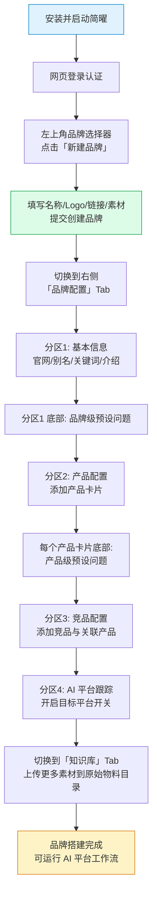

## 概述

本教程带你从零开始，在**简曜**中完成**第一个品牌的完整搭建**：从安装应用、登录账号，到创建品牌、补全基本信息、配置产品与竞品、设置预设问题、上传素材到知识库。读完本文，你将得到一个具备完整画像的品牌，可以立即用于 AI 平台监测与内容生成。

简曜把品牌的生命周期拆成两个阶段：

- **创建品牌**：只需四项轻量字段（名称 / Logo / 链接 / 素材文件）即可落地品牌记录，降低首次使用门槛。
- **品牌配置**：在右侧面板「品牌配置」Tab 内补全完整画像，分为**基本信息、产品配置、竞品配置、AI 平台跟踪**四个分区，并在基本信息与产品分区内嵌入预设问题矩阵。

本教程会完整走通这两个阶段，并在最后把额外素材上传到知识库。

### 端到端流程

---

## 前置条件

- 已按 [安装指南](https://docs.genaura.bianjie.ai/zh/getting-started/01-installation) 在 macOS 或 Windows 上安装简曜并完成首次启动。
- 已在简曜 Web 控制台拥有账号（或可在登录页注册）。
- 建议先浏览 [界面总览](https://docs.genaura.bianjie.ai/zh/getting-started/04-interface-overview)，了解三栏工作区与右侧 7 个 Tab 的布局。

---

## 操作步骤

### 步骤 1：安装并启动应用

按 [安装指南](https://docs.genaura.bianjie.ai/zh/getting-started/01-installation) 下载并安装对应平台的安装包，首次启动后未登录状态下会自动跳转到登录页。

### 步骤 2：登录账号

1. 在登录页点击「使用网页登录」按钮，系统会拉起默认浏览器跳转到 Web 控制台。
2. 在浏览器中完成登录或注册。
3. 登录成功后，桌面端会自动获取授权并进入工作区。

详细流程参见 [登录与账户](https://docs.genaura.bianjie.ai/zh/getting-started/02-login-account)。

### 步骤 3：创建品牌

1. 在工作区**左上角品牌选择器**中点击展开品牌列表。
2. 列表底部点击「新建品牌」按钮，按钮右侧会显示当前品牌数量与上限（如 `0/1`）。
   > 品牌数量上限默认为 1。达到上限时按钮会置灰并提示「已达到品牌数量上限」，悬停时可查看「还可创建 N 个品牌」。
3. 在弹出的「新建品牌」对话框中填写以下字段： 
   | 字段 | 是否必填 | 说明 |
   | --- | :-: | --- |
   | Logo | 否 | 点击虚线框或拖拽图片上传，建议正方形 PNG/JPG，大小不超过 2MB |
   | 品牌名称 | 是 | 顶部输入框，placeholder 为「品牌名称（必填）」 |
   | 品牌网页与社交链接 | 否 | 标签式输入，按 Enter / 逗号 / 空格确认；粘贴多链接会自动拆分并校验去重 |
   | 品牌白皮书与素材文件 | 否 | 点击浏览或拖拽上传，支持 Markdown、TXT、DOCX、PDF，单文件不超过 20MB |
   - 对话框副标题为「上传品牌资料，即刻开始诊断」。
   - 链接格式无效时会提示「请输入有效的网页链接（例如：example.com 或 https://example.com）」，**重复时会提示「该链接已在列表中」。**
   - 素材文件仅支持 Markdown、TXT、DOCX、PDF，单文件超过 20MB 会即时提示超限。
   - 对话框底部提示：「关于品牌诊断：提供越丰富的品牌足迹和物料，诊断结果越精准」。
4. 点击底部「新建品牌」按钮提交。
   > 创建品牌时填写的素材文件会自动导入到知识库的「原始物料与素材」目录中，可在右侧面板「知识库」Tab 中查看。
5. 创建成功后对话框自动关闭，新建的品牌自动切换为当前活跃品牌。

> 创建品牌对话框**没有**「简介」「行业」等字段——这些信息会在下一步「品牌配置」中维护。详见 [品牌模型](https://docs.genaura.bianjie.ai/zh/concepts/01-brand-model) 中「创建品牌与品牌配置」的字段差异对照。

### 步骤 4：进入品牌配置 Tab

1. 在右侧面板点击「**品牌配置**」Tab（右侧面板自左至右 7 个 Tab：知识库 / AI 洞察 / AI 信源 / AI 情感 / 品牌配置 / 定时任务 / 浏览器）。
2. 品牌配置面板顶部标题为「品牌配置」，下方纵向排列四个分区：
   | 分区 | 名称 | 是否嵌入预设问题 |
   | --- | --- | :-: |
   | ① | 基本信息 | 品牌级预设问题（底部子区域） |
   | ② | 产品配置 | 产品级预设问题（每个产品卡片底部） |
   | ③ | 竞品配置 | 否 |
   | ④ | AI 平台跟踪 | 否 |

### 步骤 5：配置基本信息

1. 在「基本信息」分区右上角点击「编辑」按钮，打开「编辑品牌配置」对话框。
2. 填写以下字段：
   | 字段 | 是否必填 | 校验规则 | 长度上限 |
   | --- | :-: | --- | --- |
   | 品牌名称 | 是 | 不能为空 | 50 |
   | 品牌官网 | 否 | 多个用逗号分隔，逐条校验 URL 格式 | 200 |
   | 品牌别名 | 否 | 标签式输入，按 Enter 添加；不能与品牌名称相同 | 64 |
   | 品牌关键词 | 是 | 标签式输入，按 Enter 添加；不能为空 | 64 |
   | 品牌介绍 | 否 | 自由文本 | 2000 |
   - Logo 可在此对话框中更换（点击 Logo 区域重新上传）。
   - 品牌关键词是 AI 平台搜索工作流检索时的**核心匹配词**，建议填写品牌在 AI 对话中最可能被提及的称谓。
3. 点击底部「保存」按钮。校验失败时会以 toast 提示具体原因（如「品牌关键词不能为空」「请输入正确的网址格式」「别名不能与品牌名称相同」）。

### 步骤 6：配置产品

1. 在「产品配置」分区右上角点击「添加产品」按钮（产品数达到 5 个上限时按钮自动置灰）。
2. 在弹出的「添加产品」对话框中填写：
   | 字段 | 是否必填 | 长度上限 |
   | --- | :-: | --- |
   | 产品名称 | 是 | 50 |
   | 产品官网 | 否 | 200 |
   | 产品别名 | 否 | 64（标签式） |
   | 产品关键词 | 是 | 64（标签式） |
   | 产品介绍 | 是 | 2000 |
3. 点击「确定」保存。产品卡片会出现在列表中，展示名称、别名、官网链接、介绍与关键词标签。
4. 鼠标悬停在产品卡片上，右侧会出现「编辑」与「删除」按钮（删除需二次确认）。
5. 重复上述步骤添加更多产品（最多 5 个）。

> 没有产品时会显示「暂无产品数据」占位。

### 步骤 7：配置竞品

1. 在「竞品配置」分区右上角点击「添加竞品」按钮（上限 5 个）。
2. 在弹出的「添加竞品」对话框中填写：
   | 字段 | 是否必填 | 长度上限 |
   | --- | :-: | --- |
   | 竞品名称 | 是 | 50 |
   | 竞品官网 | 否 | 200 |
   | 相关产品 | 否 | 128（标签式，输入产品名后按 Enter 添加） |
   - 「相关产品」存的是该品牌下产品的**名称**，仅用于在竞品卡片上展示关联关系。
3. 点击「确定」保存。竞品卡片会展示名称、官网与关联产品标签。
4. 鼠标悬停在竞品卡片上，可点击「编辑」或「删除」按钮修改或删除。

> 竞品分区**不嵌入预设问题**——问题矩阵的设计目标是「让 AI 平台回答用户关心的品牌/产品问题」，竞品仅作为对比参照对象。

### 步骤 8：配置预设问题（问题矩阵）

预设问题不是独立分区，而是以**内联编辑器**的形式嵌在「基本信息」与「产品配置」分区内。每个问题包含两个字段：

- **问题类型**（下拉选择）：推荐类 / 对比类 / 评价类
- **问题内容**（文本输入，最长 500 字符）

#### 8.1 添加品牌级问题

1. 在「基本信息」分区底部的「提问矩阵」子区域，点击「添加问题」按钮。
2. 列表顶部出现内联编辑器：左侧选择问题类型，右侧输入问题内容。
3. 按 **Enter** 保存，按 **Esc** 取消，失焦时若内容非空会自动保存。
4. 已保存的问题以卡片形式列出，左侧标注类型（推荐类 / 对比类 / 评价类），悬停后可编辑或删除（删除需二次确认）。

#### 8.2 添加产品级问题

1. 在「产品配置」分区中，每个产品卡片底部都有独立的「提问矩阵」子区域。
2. 点击该子区域的「添加问题」按钮，同样以内联编辑器录入。
3. 产品级问题绑定到对应产品，品牌级问题绑定到当前品牌。

#### 数量上限

预设问题总数上限为 **15 条**（品牌级问题 \+ 所有产品级问题的**合计上限**）。新增前若已达上限，会以 toast 提示「提问数量已达上限（15 条），请先删除已有问题后再添加」并拦截新增。

> 没有预设问题时显示「暂无问题」；问题数达到 5 条时，列表会自动启用滚动。

### 步骤 9：配置 AI 平台跟踪

在分区 ④「AI 平台跟踪」中，开启你希望对该品牌生效的 AI 平台搜索工作流开关。该分区描述文案为：「开启的平台将用于执行品牌问答搜索任务（影响 AI 平台数据采集）」。

可跟踪的 5 个 AI 平台为：DeepSeek、通义千问、豆包、Kimi、腾讯元宝。开启后，对应的搜索工作流才会采集该品牌的搜索结果与引用来源。

> 同一品牌最多同时开启 3 个平台。新品牌首次打开时，系统会自动开启 DeepSeek、豆包、通义千问这 3 个平台；你可以按需手动调整。文心一言平台会显示「敬请期待」徽章，开关不可点击。

工作流运行机制详见 [AI 平台工作流](https://docs.genaura.bianjie.ai/zh/how-to/11-ai-platform-workflows)。

### 步骤 10：上传素材到知识库

创建品牌时上传的素材已自动导入到知识库「原始物料与素材」目录。如需补充更多素材，可通过知识库导入对话框上传。

1. 切换到右侧面板「**知识库**」Tab。
2. 系统会为每个品牌自动创建 7 个系统目录：
   | 系统目录 | 用途 |
   | --- | --- |
   | 品牌画像 | 品牌定位、核心价值、视觉与语调规范等 |
   | 产品信息 | 产品功能特点、核心卖点、产品白皮书等 |
   | 竞品分析 | 竞争对手调研、竞品对比分析等 |
   | GEO 内容 | 生成的 GEO 推广文章、社媒文案等输出物 |
   | 分析报告 | 系统生成的品牌分析报告、行业研究报告等 |
   | 原始物料与素材 | 用户上传的原始文档、参考资料、网页剪藏等 |
   | 经验与案例 | 爆款案例、行业最佳实践、文案模版等 |
3. 点击导入入口，打开「导入知识」对话框，提供两个 Tab：
   - **上传文件**：选择本地文件批量上传，支持 Markdown、TXT、DOCX、PDF，单文件不超过 20MB。导入完成后展示成功/失败摘要，支持单文件重试。
   - **导入网页**：输入网页 URL，应用抓取网页正文内容后导入。
4. 默认导入目标为「原始物料与素材」目录；若在某个子目录下触发导入，则导入到该目录。
5. 导入完成后，文件可在知识库中查看、编辑（文本类）或预览（PDF / DOCX 等）。

> 扫描件 PDF 暂不支持解析，导入时会提示「目前暂不支持扫描件 PDF，请上传可编辑的文档」。CSV / Excel / 图片等类型只能在文件编辑器中预览，不能导入知识库。

详细操作参见 [知识库管理](https://docs.genaura.bianjie.ai/zh/how-to/08-knowledge-base)。

---

## 进阶用法

### 一次性上传多个素材文件

创建品牌对话框与知识库导入对话框都支持**多文件批量上传**：

- 创建品牌时：点击素材区虚线框选择多个文件，或直接拖拽多个文件到虚线框。
- 知识库导入时：选择多个文件后点击「开始导入」，应用会逐个解析并汇总成功/失败数量。

粘贴多链接时（创建品牌对话框的链接输入框），应用会自动按空白/逗号拆分并逐条校验去重，无需逐个 Enter。

### 利用别名扩大检索匹配范围

品牌与产品都支持「别名」字段。别名用于扩大 AI 平台检索的匹配范围——例如品牌官方名称为「GenAura」，可添加别名「基因光环」「GenAura AI」等，让 AI 平台工作流在用户使用不同称谓时都能命中。注意别名不能与品牌名称相同。

### 预设问题的类型选择策略

- **推荐类**：适合「帮我推荐一个适合 X 场景的 Y 产品」这类问句，用于监测品牌是否被 AI 推荐。
- **对比类**：适合「X 和 Y 哪个更好」这类问句，用于监测品牌与竞品的对比表现。
- **评价类**：适合「X 产品怎么样」这类问句，用于监测品牌整体口碑。

合理搭配三种类型，可以全方位覆盖用户在 AI 平台上的提问场景。

### 品牌搭建完成后下一步

完成本教程后，品牌已具备完整画像，可以：

- 运行 [AI 平台工作流](https://docs.genaura.bianjie.ai/zh/how-to/11-ai-platform-workflows) 采集各平台搜索结果。
- 在 [AI 洞察](https://docs.genaura.bianjie.ai/zh/how-to/14-insight) 中查看品牌指数与综合指标。
- 跟进 [机会与风险](https://docs.genaura.bianjie.ai/zh/how-to/07-opportunities-risks) 自动识别的待办。
- 进入下一篇教程 [执行一次完整品牌监测](https://docs.genaura.bianjie.ai/zh/tutorials/02-brand-monitoring)。

---

## 常见问题

### Q1：创建品牌时填的官网链接在品牌配置里看不到？

创建品牌时填的官网链接会作为品牌记录的初始官网保存，进入品牌配置 Tab 的「基本信息」分区点击「编辑」即可看到并修改。Logo 同理——创建时上传的 Logo 会在基本信息中展示。

### Q2：创建品牌时上传的素材文件去哪了？

素材文件会自动导入到该品牌知识库的「原始物料与素材」系统目录下，可在右侧面板「知识库」Tab 中查看。素材文件**不会**出现在品牌配置 Tab 中。

### Q3：预设问题最多能加多少个？是每个品牌/产品各 30 个吗？

不是。30 条是**品牌级问题 \+ 所有产品级问题的合计上限**。新增问题前若已达上限会拦截并提示。

### Q4：竞品为什么不能加预设问题？

预设问题的设计目标是「让 AI 平台回答用户关心的品牌/产品问题」，竞品仅作为对比参照对象，因此竞品分区不嵌入问题子区域。竞品与产品的关联通过「相关产品」字段（存产品名称）展示。

### Q5：品牌数量上限是多少？可以创建很多品牌吗？

品牌数量上限默认为 3。达到上限时「新建品牌」按钮会置灰并提示「已达到品牌数量上限」，按钮右侧会显示「当前数量/上限」。

### Q6：上传 PDF 文件导入失败提示「暂不支持扫描件」？

应用通过文本解析处理 PDF，扫描件 PDF（图片型 PDF）无法提取文本，会被识别并提示「目前暂不支持扫描件 PDF，请上传可编辑的文档」。请使用可复制文本的 PDF，或先将扫描件 OCR 转换为文本/Word 后再上传。

### Q7：品牌配置里的字段填错了怎么修改？

- 基本信息：在「基本信息」分区点击「编辑」按钮重新打开对话框修改。
- 产品/竞品：鼠标悬停在对应卡片上，点击右侧「编辑」按钮修改，或点击「删除」按钮删除后重新添加。
- 预设问题：悬停在问题卡片上，点击「编辑」内联修改，或删除后重新添加。

---

## 相关文档

- 前置阅读：
  - [安装指南](https://docs.genaura.bianjie.ai/zh/getting-started/01-installation)
  - [登录与账户](https://docs.genaura.bianjie.ai/zh/getting-started/02-login-account)
  - [界面总览](https://docs.genaura.bianjie.ai/zh/getting-started/04-interface-overview)
- 概念理解：
  - [品牌模型](https://docs.genaura.bianjie.ai/zh/concepts/01-brand-model)（创建品牌 vs 品牌配置的字段差异、数量上限与长度限制汇总）
  - [AI 平台工作流](https://docs.genaura.bianjie.ai/zh/how-to/11-ai-platform-workflows)
- 操作指南：
  - [品牌管理](https://docs.genaura.bianjie.ai/zh/how-to/01-brand-management)（品牌创建/切换/删除）
  - [品牌配置](https://docs.genaura.bianjie.ai/zh/how-to/02-brand-config)（四分区与问题矩阵详解）
  - [知识库管理](https://docs.genaura.bianjie.ai/zh/how-to/08-knowledge-base)（导入/搜索/编辑/发送到对话）
- 下一步教程：
  - [执行一次完整品牌监测](https://docs.genaura.bianjie.ai/zh/tutorials/02-brand-monitoring)

---

> 最后更新：2026-08-06 | 对应版本：v1.2.0